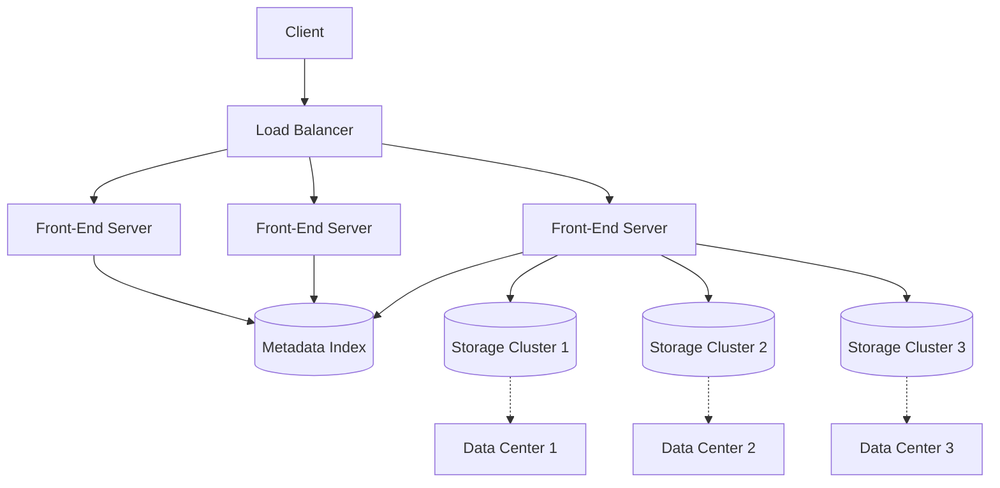
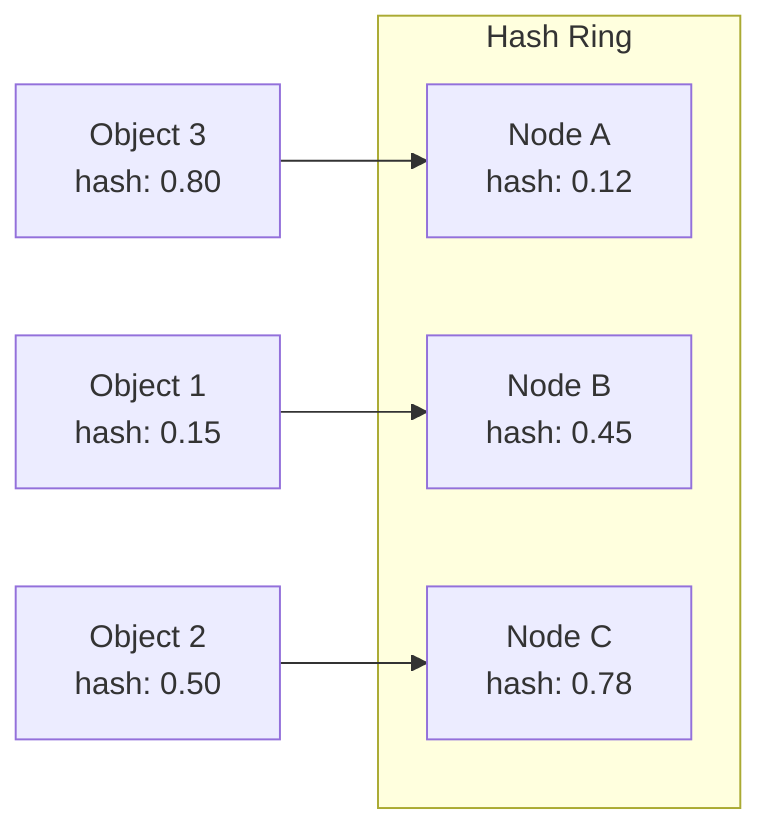

# Chapter 1: Amazon S3 - The Art of Eleven Nines

> *How do you build a system so reliable that losing data is essentially impossible?*

---

## The Problem Statement

### The Business Problem

Imagine you're a startup in 2006. You need to store files—user uploads, backups, logs. You have two options:

1. **Buy servers with hard drives**: Capital expense, ops burden, capacity planning nightmares
2. **Hope someone builds storage-as-a-service**: This didn't exist yet

Amazon solved this by asking: *What if storage was as easy as an API call?*

S3 launched in March 2006 with a simple promise:
- Store any amount of data
- Pay only for what you use
- Never lose a byte

That last promise—**never lose data**—is the core engineering challenge we'll explore.

### The Naive Implementation

Let's design S3 ourselves. First attempt:

```
User uploads file → Save to server disk → Return success
User downloads file → Read from server disk → Return file
```

**Why this breaks:**

1. **Hard drives fail**: Consumer drives fail at 1-2% per year. Enterprise drives at 0.5%. At 1 million drives, that's 5,000-20,000 failures annually—about 50 per day.

2. **Servers fail**: Power supplies, motherboards, network cards. Roughly 2-5% annual failure rate per server.

3. **Data centers fail**: Fire, flood, power grid failure, fiber cuts. Rare but catastrophic.

At YouTube's scale (~1 billion hours of video), a naive approach would lose content equivalent to a small library every single day.

### What S3 Actually Promises

Amazon S3 guarantees **99.999999999% durability**—that's eleven nines.

Let's make this concrete:
- Store 10 million objects
- Expected loss over 10,000 years: **1 object**
- Or: Store 1 trillion objects for a year, expect to lose 10

This isn't marketing. It's a mathematical property of the system design.

---

## Core Architecture

### High-Level View



### Request Flow: PUT Object

When you upload a file to S3:

1. **DNS Resolution**: `bucket.s3.amazonaws.com` resolves to a regional load balancer

2. **Authentication**: Request signature (AWS Signature v4) is verified

3. **Front-End Processing**:
   - Parse bucket name, object key
   - Check permissions (IAM, bucket policies)
   - Determine which storage cluster(s) will hold this object

4. **Placement Decision**:
   - Hash the object key using consistent hashing
   - Select primary and replica locations across availability zones

5. **Write to Storage**:
   - Write to multiple storage nodes in parallel
   - Wait for quorum acknowledgment (typically 2 of 3)
   - Only then return success to client

6. **Metadata Update**:
   - Record object location in the index
   - This is the "commit point"—object now exists

### Infrastructure Reality

**Per Region (estimates based on public information):**
- 3+ Availability Zones (physically separate data centers)
- Each AZ: thousands of storage servers
- Each server: 12-36 hard drives, 100TB+ raw capacity per server
- Total per region: exabytes of storage capacity

**Storage Server Specs (typical):**
- 2 CPUs, 64-128GB RAM
- 36 x 16TB HDDs (or mix of HDD/SSD for different tiers)
- 25Gbps network connectivity
- Designed for sequential I/O (optimized for throughput, not IOPS)

**Network Topology:**
- Spine-leaf architecture within each data center
- Redundant fiber links between AZs (typically 3+ independent paths)
- Round-trip latency between AZs: 1-2ms within a region
- Traffic between AZs is fully encrypted

---

## Deep Dive: The Clever Bits

### How Eleven Nines Works: The Math

Let's derive the durability guarantee from first principles.

**Assumptions:**
- Hard drive annual failure rate (AFR): 1%
- Replication factor: 3 (each object stored 3 times)
- Failure detection time: 1 hour
- Repair time: 6 hours (time to copy data to replacement)

**Probability of losing an object:**

For all 3 copies to fail simultaneously before repair:
- P(1st copy fails) = 1% = 0.01
- P(2nd copy fails in same 6-hour window) ≈ 0.01 × (6/8760) = 0.00000684
- P(3rd copy fails in same 6-hour window) ≈ 0.00000684 × (6/8760) = 0.0000000047

That's roughly 1 in 200 million—way better than eleven nines. But wait.

**Correlated failures complicate this:**
- Rack failure takes out multiple drives
- Power failure affects entire AZ
- Software bugs can corrupt data on all replicas

**S3's response: Failure domain isolation**

S3 doesn't just replicate 3 times—it replicates across:
- Different physical drives
- Different servers
- Different racks
- Different availability zones

This turns correlated failures into independent events, preserving the math.

### Consistent Hashing: Where Does My Object Live?

With millions of storage nodes, S3 needs to quickly determine:
1. Where to write a new object
2. Where to read an existing object
3. How to rebalance when nodes are added/removed

**Traditional hashing fails:**
```
node = hash(object_key) % num_nodes
```
If `num_nodes` changes from 100 to 101, 99% of objects need to move. Chaos.

**Consistent hashing solution:**



Each node gets a position on a conceptual ring (0 to 1). Each object hashes to a point on the ring and is stored on the next node clockwise.

**When a node is added:**
- Only objects between the previous node and the new node migrate
- On average: 1/N of objects move (where N = number of nodes)
- With 1000 nodes, adding one affects only 0.1% of objects

**Virtual nodes improvement:**
Each physical node gets multiple positions on the ring (e.g., 100 virtual nodes per physical node). This:
- Distributes load more evenly
- Makes rebalancing smoother
- Handles heterogeneous hardware (more virtual nodes for bigger servers)

### Erasure Coding: Beyond Simple Replication

For large objects, S3 uses erasure coding instead of simple replication.

**The problem with replication:**
3 copies means 3x storage cost. For petabytes, that's millions of dollars.

**Erasure coding concept:**
Split data into chunks, add redundancy chunks using math (Reed-Solomon codes).

Example (simplified):
- Split 10 MB object into 10 chunks of 1 MB each
- Generate 4 parity chunks (using XOR and polynomial math)
- Store 14 chunks across 14 different nodes
- Any 10 of the 14 chunks can reconstruct the original

**Storage efficiency:**
- Replication: 3x overhead (store 30 MB for 10 MB)
- Erasure coding (10+4): 1.4x overhead (store 14 MB for 10 MB)

**The tradeoff:**
- Replication: Fast reads (any copy works), simple
- Erasure coding: Slower reads (need multiple chunks), compute overhead

S3 uses:
- Replication for small objects and hot data
- Erasure coding for large objects and cold storage (Glacier)

---

## Failure Modes & Recovery

### Scenario 1: Hard Drive Failure

**Detection:**
- Background scrubbing: Continuously read and verify all data
- If a block can't be read, mark drive as degraded
- Detection time: minutes to hours

**Recovery:**
- Identify all objects with replicas on the failed drive
- For each object, copy from another replica to a new drive
- Prioritize objects with fewer remaining replicas

**Infrastructure detail:**
- A 16TB drive at 150 MB/s takes ~30 hours to fully copy
- S3 uses parallel recovery across many drives
- Goal: Restore full replication within 6 hours

**What's lost:**
- If only one drive fails: Nothing (other replicas exist)
- If multiple drives in same erasure coding group fail simultaneously: Possible data loss (extremely rare)

### Scenario 2: Availability Zone Failure

**The 2017 S3 Outage: A Case Study**

On February 28, 2017, S3 in `us-east-1` went down for 4 hours. Thousands of websites broke.

**What happened:**
1. An engineer was debugging a billing subsystem
2. They intended to remove a few servers
3. A typo in the command removed too many servers
4. These servers were part of the metadata index
5. Without the index, S3 couldn't find any objects
6. The remaining system started failing health checks
7. Cascading failures took down more subsystems

**Why the blast radius was so large:**
- S3's internal services depended on... S3
- The dashboard to monitor S3 was hosted on... S3
- Recovery playbooks were stored on... S3

**Lessons learned:**
- Minimum capacity safeguards: Can't remove servers below a threshold
- Dependency isolation: Internal tools no longer depend on production S3
- Slower recovery procedures: Restart subsystems slowly to avoid thundering herd

### Scenario 3: Silent Data Corruption

The scariest failure: data corrupts but the system doesn't notice.

**Causes:**
- Bit rot: Random bit flips from cosmic rays (rare but real at scale)
- Firmware bugs: Drive firmware reports success but wrote garbage
- Software bugs: Application logic corrupts data before writing

**S3's defenses:**

1. **Content checksums**: Every object has MD5/SHA-256 hash
   - Computed on upload, verified on every read
   - Mismatch = corruption detected

2. **End-to-end integrity**: Client can provide expected checksum
   - S3 verifies before acknowledging upload
   - Catches corruption in transit

3. **Background scrubbing**: Periodically read all data and verify checksums
   - Run during low-traffic periods
   - If corruption found, restore from replica

---

## Scale Numbers & Mental Models

### S3 by the Numbers

| Metric | Value | Context |
|--------|-------|---------|
| Objects stored | 280+ trillion | As of 2024 |
| Requests/second | 100+ million | Peak global |
| Data stored | Exabytes | Multiple regions |
| Durability | 99.999999999% | 11 nines |
| Availability | 99.99% | 4 nines (by design, lower than durability) |

### Mental Model: The Library Analogy

Think of S3 as an infinitely large library:

- **Objects** = Books
- **Buckets** = Sections (Fiction, Non-Fiction, etc.)
- **Keys** = Book titles (unique within a section)
- **Storage classes** = How accessible the book is (on display, in archive, off-site)

The librarian (S3's front-end) maintains a card catalog (metadata index). Every book has multiple copies in different buildings (availability zones). Even if one building burns down, you can still get your book.

### Latency Budget for GET Object

```
Total target: 100ms (first byte)

DNS resolution:      5ms (cached)
TCP + TLS handshake: 30ms (one round trip)
Request to S3:       10ms
S3 authentication:   2ms
S3 metadata lookup:  10ms
S3 disk seek:        5-15ms (SSD) or 10-30ms (HDD)
First byte response: 10ms
Network transit:     20ms

Total: ~80-100ms for first byte
```

For large objects, throughput matters more than latency:
- Single stream: 50-100 MB/s
- Multi-part upload (parallel streams): 1+ GB/s possible

---

## Historical Evolution

### 2006: The Beginning

**v1 Architecture:**
- Single region (us-east-1)
- Simple key-value store
- No versioning, no lifecycle policies
- Max object size: 5 GB

**Infrastructure:**
- A few hundred servers
- Basic replication (3 copies, same data center)
- Simple consistent hashing

### 2010: Going Global

**Key additions:**
- Multiple regions worldwide
- Reduced Redundancy Storage (2 copies, lower cost)
- Server-side encryption

**Infrastructure evolution:**
- Cross-region replication
- Dedicated network backbone between regions
- Erasure coding for cold storage

### 2015: Enterprise Features

**New capabilities:**
- S3 Transfer Acceleration (CloudFront edge for uploads)
- Event notifications (trigger Lambda on upload)
- Cross-region replication
- Lifecycle policies

**Infrastructure:**
- Integration with AWS Lambda (data centers physically co-located)
- Edge locations for acceleration
- Smarter tiering based on access patterns

### 2020+: Intelligence and Performance

**Recent additions:**
- S3 Intelligent Tiering (automatic cost optimization)
- S3 Express One Zone (single-digit millisecond latency)
- S3 Object Lambda (transform data on retrieval)

**Current infrastructure:**
- Purpose-built hardware for different tiers
- NVMe-based storage for performance tier
- Machine learning for access pattern prediction

---

## Key Takeaways

1. **Durability comes from math, not magic**: Replication across failure domains, combined with rapid detection and repair, achieves eleven nines.

2. **Consistent hashing enables scale**: Without it, adding capacity would require massive data migration.

3. **Erasure coding trades compute for storage**: For large, cold data, the math is worth it.

4. **Dependencies are dangerous**: S3's biggest outage was caused by internal circular dependencies, not hardware failure.

5. **Availability and durability are different**: S3 prioritizes never losing your data over always being accessible. Your object survives even if S3 is temporarily unreachable.

---

## Further Reading

- [Amazon S3 Durability Deep Dive](https://aws.amazon.com/s3/faqs/) - Official AWS documentation
- [Summary of the Amazon S3 Service Disruption](https://aws.amazon.com/message/41926/) - The 2017 outage postmortem
- [Dynamo: Amazon's Highly Available Key-value Store](https://www.allthingsdistributed.com/files/amazon-dynamo-sosp2007.pdf) - Foundational paper (many concepts used in S3)

---

*Next chapter: [Apache Kafka - The Distributed Commit Log](../02-kafka/README.md)*
