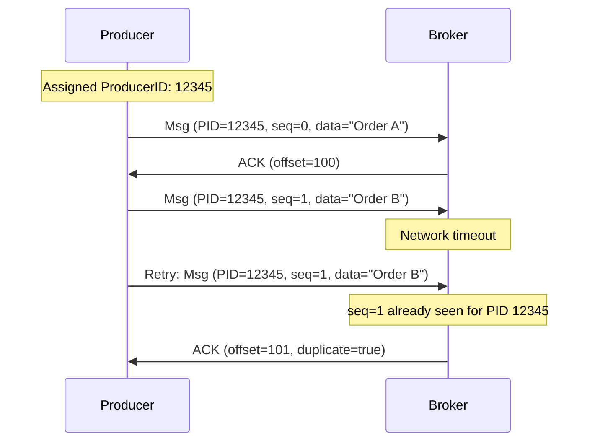
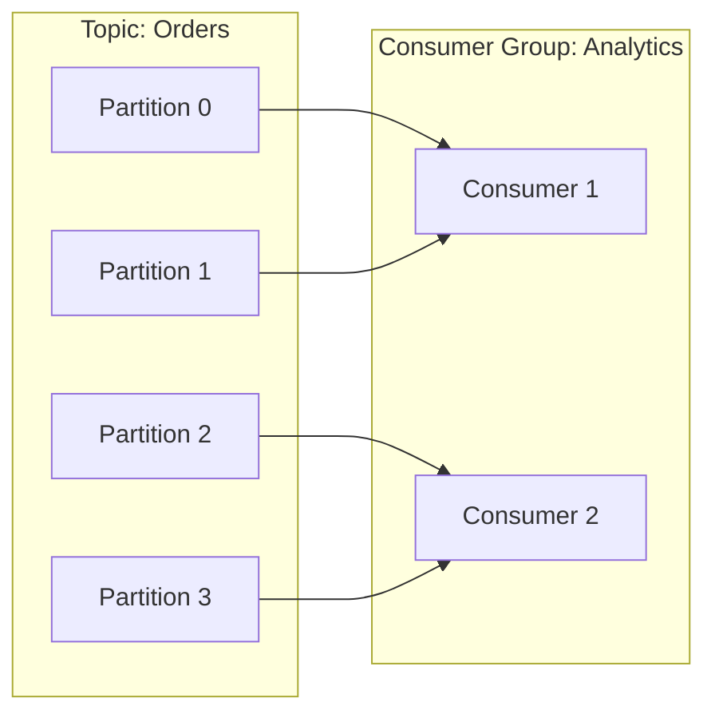
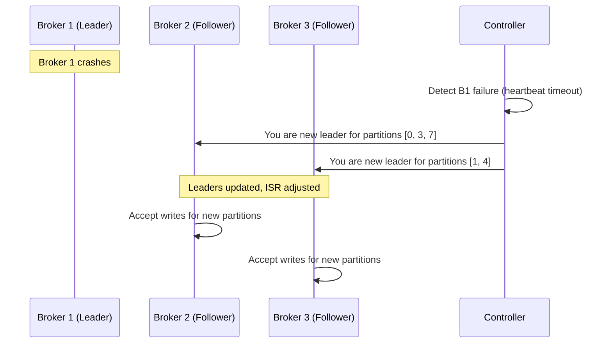

# Chapter 2: Apache Kafka - The Distributed Commit Log

> *How do you build a messaging system that never loses a message, processes millions per second, and keeps everyone in sync?*

---

## The Problem Statement

### The Business Problem

Imagine you're running a food delivery app. Every time a customer places an order:

- The **payment service** needs to know (charge the card)
- The **restaurant service** needs to know (start cooking)
- The **delivery service** needs to know (match a driver)
- The **analytics service** needs to know (track metrics)
- The **notification service** needs to know (send confirmation)

That's 5 downstream services from a single event.

### The Naive Implementation

```
Order Service:
  on order_placed:
    call payment_service.charge()
    call restaurant_service.notify()
    call delivery_service.match()
    call analytics_service.track()
    call notification_service.send()
    return success
```

**Why this breaks at scale:**

1. **Coupling**: Adding a 6th service means changing order service code, testing, deploying.

2. **Latency accumulation**: If each call takes 100ms, the order takes 500ms minimum. User waits.

3. **Availability coupling**: If notification service is down, does the order fail? Absurd—we're failing orders because we can't send emails.

4. **Traffic spikes**: Diwali sale: 50,000 orders/minute. That's 250,000 API calls/minute just for fan-out. Payment service probably can't handle that.

5. **No replay**: Analytics service was down for an hour. Those orders are gone forever from metrics.

### What We Need

A **message broker** that:
- Decouples producers from consumers
- Handles traffic spikes (buffer during surges)
- Persists messages (replay if needed)
- Scales horizontally (add capacity without downtime)
- Never loses a message (durability guarantees)

LinkedIn built Kafka in 2011 to solve exactly this at scale: 1+ trillion messages per day.

---

## Core Architecture

### The Fundamental Abstraction: The Log

Kafka's core insight: **a distributed, append-only log** solves all these problems.

```
Topic: "orders"
Partition 0: [msg1] [msg2] [msg3] [msg4] [msg5] ...
                0      1      2      3      4    → offset

Partition 1: [msg1] [msg2] [msg3] ...
                0      1      2    → offset

Partition 2: [msg1] [msg2] [msg3] [msg4] ...
                0      1      2      3    → offset
```

Key concepts:
- **Topic**: A category of messages (e.g., "orders", "user-events")
- **Partition**: An ordered, immutable sequence of messages
- **Offset**: A message's position in its partition
- **Segment**: Physical files on disk (partitions split into segments)

### High-Level Architecture

```mermaid
flowchart TB
    subgraph Producers
        P1[Order Service]
        P2[User Service]
    end

    subgraph Kafka Cluster
        subgraph Broker 1
            P0L[Partition 0<br/>Leader]
            P2F[Partition 2<br/>Follower]
        end
        subgraph Broker 2
            P0F[Partition 0<br/>Follower]
            P1L[Partition 1<br/>Leader]
        end
        subgraph Broker 3
            P1F[Partition 1<br/>Follower]
            P2L[Partition 2<br/>Leader]
        end
    end

    subgraph Consumers
        C1[Analytics Service]
        C2[Notification Service]
    end

    subgraph Coordination
        ZK[ZooKeeper/KRaft]
    end

    P1 --> P0L
    P2 --> P1L
    P0L --> C1
    P1L --> C1
    P2L --> C1
    P0L --> C2
    P1L --> C2
    P2L --> C2

    P0L <-.-> P0F
    P1L <-.-> P1F
    P2L <-.-> P2F

    ZK <--> Broker 1
    ZK <--> Broker 2
    ZK <--> Broker 3
```

### Request Flow: Producing a Message

1. **Client initialization**:
   - Producer connects to any broker, gets cluster metadata
   - Metadata includes: all topics, partitions, which broker leads each partition

2. **Partition selection**:
   - If message has key: `partition = hash(key) % num_partitions`
   - If no key: Round-robin or sticky partitioning

3. **Send to leader**:
   - Producer sends directly to the partition leader (not through a proxy)
   - Message batched with others for efficiency

4. **Replication**:
   - Leader writes to its local log
   - Followers pull from leader (not pushed)
   - Once enough replicas acknowledge, leader responds to producer

5. **Acknowledgment**:
   - Producer receives offset where message was written
   - This offset is the message's permanent address

### Infrastructure Reality

**Typical production cluster:**
- 10-100+ brokers (depending on throughput needs)
- Each broker: 24-64 cores, 64-256 GB RAM, 10-20 TB SSD/HDD
- Network: 10-25 Gbps per broker
- Storage: 80%+ of disk for data, rest for OS/logs

**Per-broker capacity:**
- Throughput: 200-500 MB/s (depends on message size, replication)
- Messages: 200,000-1,000,000/second (smaller messages = more throughput)
- Storage: Days to weeks of retention

**Network topology:**
- Brokers spread across racks (rack awareness)
- Replication traffic: Within data center (low latency)
- Client traffic: Load balanced across brokers

---

## Deep Dive: The Clever Bits

### 1. Why Sequential I/O Changes Everything

Kafka's secret weapon: **sequential disk writes are fast**.

**Random I/O vs Sequential I/O:**
- Random SSD read: 0.1 ms (but limited IOPS)
- Sequential SSD read: 500-3000 MB/s
- Random HDD read: 10 ms
- Sequential HDD read: 100-200 MB/s

**Kafka's approach:**
- Always append to end of log (never modify in place)
- Read from specific offset forward (never random access)
- This means cheap HDDs can outperform expensive SSDs for random workloads

**The page cache bonus:**
- Linux caches recently accessed disk pages in memory
- Kafka writes go: Producer → Page Cache → Disk (async)
- Consumer reads often hit page cache (especially for recent messages)
- Result: Most reads never touch disk at all

**Infrastructure implication:**
Kafka brokers should have lots of RAM, but not for JVM heap—for page cache. A broker with 64 GB RAM might have:
- JVM heap: 6 GB (Kafka doesn't need much)
- Page cache: 50+ GB (this is your hot data cache)

### 2. Exactly-Once Semantics: The Holy Grail

**The problem with "at-least-once":**

```
Producer sends message
Broker receives, writes, but response is lost
Producer retries (it thinks message was lost)
Broker receives again, writes duplicate
Consumer sees duplicate message
```

At-least-once guarantees no loss, but allows duplicates. For financial transactions, that's unacceptable.

**Kafka's exactly-once solution: Producer ID + Sequence Numbers**



**How it works:**
1. Producer gets a unique Producer ID (PID) on initialization
2. Each message from that producer has a sequence number
3. Broker tracks: {PID → last sequence number} per partition
4. If broker sees same {PID, sequence} twice, it deduplicates

**The transactional layer:**
For exactly-once across multiple partitions:
- Producer starts transaction
- Sends messages to multiple partitions
- Commits transaction atomically
- Either all messages are visible, or none

**Infrastructure cost:**
- Extra memory per broker (tracking PIDs)
- Extra latency (transaction coordination)
- But: correctness for financial systems, no application-level dedup needed

### 3. Consumer Groups: Parallel Processing

**The scaling challenge:**
One consumer can only read so fast. A single partition might produce 100 MB/s. How do you scale?

**Consumer groups:**


**Rules:**
- Each partition goes to exactly one consumer in the group
- Each consumer can handle multiple partitions
- Adding consumers = rebalancing partitions
- Max useful consumers = number of partitions

**Rebalancing: The "Stop-the-World" Problem**

When a consumer joins or leaves:
1. All consumers stop processing
2. Coordinator reassigns partitions
3. All consumers resume from last committed offset

**The pain:**
- During rebalance: Zero progress
- With 100 partitions and 20 consumers: Can take 30+ seconds
- If consumers frequently restart: Constant rebalancing

**Solutions evolved:**
- **Static membership**: Assign consumer IDs, skip rebalance on quick restart
- **Incremental cooperative rebalancing**: Only affected partitions stop
- **Consumer best practices**: Heartbeat tuning, graceful shutdown

---

## Failure Modes & Recovery

### Scenario 1: Broker Failure

**Detection (with ZooKeeper):**
- Each broker maintains a session with ZooKeeper
- If heartbeat missed for `session.timeout.ms` (default 18s), broker marked dead
- Controller (a special broker) is notified

**Detection (with KRaft - newer):**
- Quorum of controller nodes track broker health
- No external ZooKeeper dependency
- Generally faster failure detection

**Recovery:**


**What happens to in-flight messages:**
- Messages not acknowledged when broker died: Lost (from producer's perspective)
- Producer gets error, should retry
- With `acks=all` and `min.insync.replicas=2`: No data loss if another replica has it

### Scenario 2: Network Partition

**The split-brain risk:**
Broker can't reach ZooKeeper but is still running. Is it dead?

**Kafka's approach:**
- If broker can't reach ZooKeeper, it stops accepting writes
- "I'd rather be unavailable than inconsistent"
- Producers get errors, retry to new leader

**With KRaft (no ZooKeeper):**
- Raft consensus means a quorum must agree on leader
- Network partition = minority side can't elect leader
- Same outcome: Minority side is unavailable

### Scenario 3: Disk Full

**What happens:**
- Log append fails
- Broker stops accepting messages for affected partitions
- Producers get error

**Prevention:**
- Log retention: Delete old segments after time/size limit
- Compaction: For compacted topics, keep only latest value per key
- Monitoring: Alert well before disk full

**Recovery:**
- Increase retention deletion
- Add disk capacity
- Move partitions to other brokers

---

## Scale Numbers & Mental Models

### LinkedIn's Kafka (public numbers, circa 2020)

| Metric | Value |
|--------|-------|
| Messages/day | 7+ trillion |
| Messages/second (peak) | 10+ million |
| Data written/day | 30+ PB |
| Clusters | 100+ |
| Brokers | 4,000+ |

### Mental Model: The Write-Ahead Log

Database veterans will recognize Kafka as a distributed write-ahead log (WAL):

| Database Concept | Kafka Equivalent |
|-----------------|------------------|
| WAL | Topic partition |
| WAL entry | Message |
| LSN (Log Sequence Number) | Offset |
| Replication to standby | Follower replication |
| PITR (Point-in-Time Recovery) | Consumer offset reset |

The key insight: If a WAL is the source of truth in a database, why not make a distributed WAL the source of truth for your entire system?

### Latency Budget

**Producer (acks=all, replication.factor=3):**
```
Network to broker:           5-10ms
Write to page cache:         <1ms
Wait for replication:        5-20ms (depends on replica lag)
Acknowledgment to producer:  5-10ms
───────────────────────────────────
Total:                       15-40ms
```

**Consumer (caught up):**
```
Poll request to broker:      5-10ms
Fetch from page cache:       <1ms (hot data)
Response to consumer:        5-10ms
───────────────────────────────────
Total:                       10-20ms
```

**Consumer (reading old data):**
```
Poll request to broker:      5-10ms
Fetch from disk:             10-50ms (depends on disk, size)
Response to consumer:        5-20ms
───────────────────────────────────
Total:                       20-80ms
```

---

## Historical Evolution

### 2011: Birth at LinkedIn

**Original problem:**
- LinkedIn had multiple data pipelines
- Each was point-to-point (source to destination)
- N sources and M destinations = N×M pipelines
- Nightmare to maintain

**v1 Kafka:**
- Basic pub/sub with persistence
- ZooKeeper for coordination
- Producer-side batching
- At-least-once delivery only

**Infrastructure:**
- Handful of brokers
- Simple replication
- Retention: Hours to days

### 2012-2015: Open Source and Adoption

**Key additions:**
- Replication (originally Kafka was single-copy!)
- Consumer groups with offset management
- Log compaction (keep latest per key)
- Mirror Maker (cross-cluster replication)

**Infrastructure scale:**
- Hundreds of brokers
- Multi-data-center deployments
- Retention: Days to weeks

### 2016-2018: Stream Processing

**Kafka Streams introduction:**
- Process streams without external framework
- Exactly-once semantics (finally!)
- KSQL for SQL over streams

**Infrastructure evolution:**
- Thousands of brokers at large deployments
- Tiered storage experiments (offload old data to S3)
- Confluent Cloud launches (managed Kafka)

### 2019-Present: KRaft and Beyond

**ZooKeeper removal (KRaft):**
- ZooKeeper was operational burden
- Limited scalability (metadata in ZK)
- KRaft: Kafka's own Raft-based consensus
- Simpler operations, faster controller failover

**Infrastructure today:**
- Production clusters: 100+ brokers common
- Tiered storage: GA in Confluent, reducing costs
- Cloud-native: Kubernetes operators, managed services

---

## Key Takeaways

1. **Sequential I/O is the key insight**: Append-only logs let Kafka use disk efficiently, often faster than "faster" random-access systems.

2. **Exactly-once is possible but complex**: Producer IDs + sequence numbers + transactions = no duplicates, but with overhead.

3. **Consumer groups enable parallelism**: But rebalancing is the Achilles heel—design for it.

4. **Replication is asynchronous by default**: `acks=all` gives durability but costs latency. Choose based on your consistency needs.

5. **Page cache is your friend**: Size your broker RAM for page cache, not JVM heap.

---

## Further Reading

- [The Log: What every software engineer should know](https://engineering.linkedin.com/distributed-systems/log-what-every-software-engineer-should-know-about-real-time-datas-unifying) - Jay Kreps' foundational blog post
- [Kafka: a Distributed Messaging System for Log Processing](http://notes.stephenholiday.com/Kafka.pdf) - Original paper
- [KIP-500: Replace ZooKeeper with a Self-Managed Metadata Quorum](https://cwiki.apache.org/confluence/display/KAFKA/KIP-500%3A+Replace+ZooKeeper+with+a+Self-Managed+Metadata+Quorum) - KRaft design
- [Exactly-once Semantics are Possible: Here's How Kafka Does It](https://www.confluent.io/blog/exactly-once-semantics-are-possible-heres-how-apache-kafka-does-it/) - Deep dive on EOS

---

*Next chapter: [URL Shortener - Simplicity at Scale](../03-url-shortener/README.md)*
