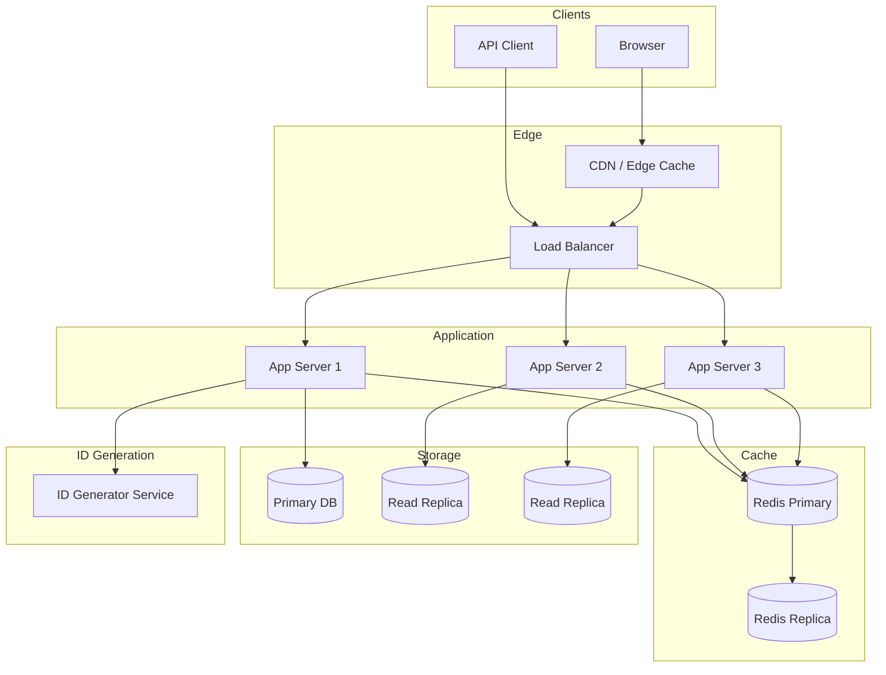

# Chapter 3: URL Shortener - Simplicity at Scale

> *The classic system design interview question. Simple on the surface, surprisingly deep underneath.*

---

## The Problem Statement

### The Business Problem

Long URLs are ugly:
```
https://www.amazon.com/dp/B09V3KXJPB?ref=cm_sw_r_cp_ud_dp_ABCD1234EFGH5678&th=1
```

Short URLs are shareable:
```
https://bit.ly/3xYz123
```

A URL shortener does one thing: maps short codes to long URLs.

But at scale, this simple service handles:
- **Billions of links created**
- **Hundreds of billions of redirects per year**
- **Millisecond latency requirements** (nobody waits for a redirect)
- **High availability** (broken links = angry users)

### The Naive Implementation

```
Database table:
| short_code | long_url                    | created_at |
|------------|-----------------------------| -----------|
| abc123     | https://amazon.com/dp/...   | 2024-01-15 |

Create short URL:
  short_code = random_string(7)
  INSERT INTO urls (short_code, long_url)
  return "https://short.ly/" + short_code

Redirect:
  SELECT long_url FROM urls WHERE short_code = ?
  HTTP 301 Redirect to long_url
```

**Why this works for a while:**
- Simple to understand
- Single database handles modest traffic
- Random strings have low collision probability

**Why this breaks at scale:**

1. **Database bottleneck**: At 10,000 redirects/second, your single MySQL instance is sweating. At 100,000/second, it's dead.

2. **Collision handling**: Random 7-character strings have 62^7 = 3.5 trillion combinations. Sounds huge, but with billions of URLs, you need collision handling. `INSERT` failing on duplicate is expensive.

3. **Read/Write ratio**: For every 1 URL created, there might be 1,000+ redirects. This extreme read/write ratio (1000:1) changes everything.

4. **Analytics**: "How many times was my link clicked?" Simple question, but counting at scale is hard.

### Scale Reference Points

**Bitly (public numbers, ~2020):**
- 600+ million links created
- 10+ billion clicks per month
- ~4,000 clicks per second average, 20,000+ peak

**TinyURL:**
- Operating since 2002
- Billions of links in database
- No expiration = infinite storage growth

---

## Core Architecture

### High-Level View



### Request Flow: Create Short URL

1. **API Request**: `POST /shorten {"url": "https://..."}`

2. **Validation**:
   - Is it a valid URL?
   - Is it safe? (not malware, not phishing)
   - Has this URL been shortened before? (optional dedup)

3. **Generate Short Code**:
   - Get unique ID from ID generator
   - Convert to base62 string

4. **Store Mapping**:
   - Write to primary database
   - Optionally write to cache immediately

5. **Return**: `{"short_url": "https://short.ly/abc123"}`

### Request Flow: Redirect

1. **Request**: `GET /abc123`

2. **Cache Check**:
   - Check Redis for `abc123`
   - If found, skip database

3. **Database Lookup** (cache miss):
   - Query read replica
   - Populate cache for future requests

4. **Analytics** (async):
   - Log click to analytics pipeline (Kafka)
   - Don't block the redirect

5. **Redirect**: HTTP 301 or 302 to long URL

### Infrastructure Sizing

**For 100 million daily redirects:**

```
Redirects/second (average): 100M / 86400 = ~1,150
Peak (3x average): ~3,500 redirects/second

Read latency budget: 50ms total
- Network: 10ms
- Cache lookup: 1ms
- Database (cache miss): 5ms
- Response: 5ms
- Buffer: 29ms

Cache hit ratio target: 95%+
Database queries/second: 3,500 × 0.05 = 175 (easily handled)
```

**Server requirements:**
- Application servers: 3-5 instances (for redundancy, not capacity)
- Redis: 1 primary + 1 replica, 16GB RAM (stores 100M+ mappings)
- Database: 1 primary + 2 read replicas

---

## Deep Dive: The Clever Bits

### 1. ID Generation Strategies

The short code is the heart of the system. How do you generate unique, short, random-looking codes?

**Option A: Random String**
```
short_code = random.choice("a-zA-Z0-9", length=7)
if exists(short_code):
    retry
```

*Pros:* Unpredictable (security), uniform distribution
*Cons:* Collision handling expensive at scale, not sequential (bad for database indexes)

**Option B: Auto-Increment + Base62**
```
id = database.auto_increment()  # 1, 2, 3, ...
short_code = base62_encode(id)  # 1→"1", 62→"10", 3844→"100"
```

*Pros:* No collisions, sequential (good for indexes)
*Cons:* Predictable (security concern), single point of failure (DB)

**Option C: Snowflake ID**
```
| 1 bit unused | 41 bits timestamp | 10 bits machine ID | 12 bits sequence |
```

*Pros:* Distributed generation, sortable by time, no coordination needed
*Cons:* 64-bit number → 11+ characters in base62

**Option D: Pre-Generated ID Pool**
```
ID Service pre-generates ranges:
- Server 1 gets IDs 1-1,000,000
- Server 2 gets IDs 1,000,001-2,000,000
- When range exhausted, request new range
```

*Pros:* No coordination per request, simple
*Cons:* Wasted IDs on server crash, requires central coordinator

**Bitly's approach:** Counter-based with encoding tricks to make URLs look random.

### 2. Base62 Encoding: The Math

Why base62? Because `a-z` (26) + `A-Z` (26) + `0-9` (10) = 62 URL-safe characters.

**Length vs. Capacity:**

| Length | Combinations | Enough for... |
|--------|--------------|---------------|
| 6 | 56 billion | 56B unique URLs |
| 7 | 3.5 trillion | 3.5T unique URLs |
| 8 | 218 trillion | 218T unique URLs |

7 characters is the sweet spot for most services.

**Encoding algorithm:**
```
encode(12345678):
  12345678 / 62 = 199124, remainder 10 → 'a' (if 0-9→digits, 10-35→lowercase)
  199124 / 62 = 3211, remainder 42 → 'G' (36-61→uppercase)
  3211 / 62 = 51, remainder 49 → 'N'
  51 / 62 = 0, remainder 51 → 'P'
  Result: "PNGa" (read remainders backwards)
```

### 3. 301 vs 302 Redirects: Why It Matters

**HTTP 301 (Moved Permanently):**
- Browser caches the redirect
- Next click goes directly to destination, bypassing your server
- Better for users (faster)
- Bad for analytics (you don't see repeat clicks)

**HTTP 302 (Moved Temporarily):**
- Browser doesn't cache
- Every click hits your server
- Worse for users (extra round trip)
- Good for analytics (you see everything)

**Bitly's choice:** 301 with a twist
- Use 301 for speed
- Track via pixel/beacon on destination page (if you control it)
- Or: Use 302 for links needing click tracking

### 4. Handling Hot URLs

**The problem:**
A viral tweet links to `short.ly/xyz`. Millions of clicks in an hour.

**Without preparation:**
- Cache gets hammered
- Cache miss? Database gets hammered
- Database fails? Everyone sees errors

**Solution layers:**

1. **CDN edge caching**:
   - Popular URLs cached at edge (Cloudflare, Fastly)
   - 90%+ of requests never reach your servers
   - TTL: 5 minutes (balance between speed and flexibility)

2. **Application-level caching**:
   - Redis with high memory allocation
   - LRU eviction keeps hot URLs in memory
   - Hot URLs naturally stay cached

3. **Database read replicas**:
   - Cache misses distributed across replicas
   - No single point of failure

4. **Rate limiting**:
   - Per-IP limits prevent abuse
   - Per-URL limits prevent DoS via hot URL

---

## Failure Modes & Recovery

### Scenario 1: ID Generator Failure

**Detection:**
- Application servers can't get new IDs
- Create requests fail
- Monitoring alerts on error rate

**Impact:**
- New URL creation stops
- Redirects continue working (read path unaffected)

**Recovery strategies:**

*If using pre-generated ranges:*
- Each app server has a local buffer of IDs
- Buffer lasts through short outages
- Long outage: Switch to backup ID generator

*If using Snowflake-style:*
- Each server generates independently
- No single point of failure
- Server clock drift is the main risk

### Scenario 2: Cache Failure (Redis Down)

**Detection:**
- Connection failures to Redis
- Latency spike (all requests hit database)
- Database CPU spikes

**Impact:**
- Latency increases from 5ms to 50ms
- Database may become overloaded
- At high traffic, cascading failure possible

**Recovery:**
```
Automatic failover:
1. Redis Sentinel detects primary failure
2. Promotes replica to primary (1-30 seconds)
3. Application reconnects to new primary

Manual recovery:
1. Redirect traffic to read replicas
2. Repair or replace failed Redis
3. Warm cache with hot URLs before cutover
```

**Prevention:**
- Use Redis Cluster for higher availability
- Application-level circuit breaker (serve from DB if cache unhealthy)
- Cache warming on startup

### Scenario 3: URL Expiration Cleanup

**The problem:**
TinyURL doesn't expire links—ever. They have URLs from 2002 still working.
Your business model includes expiration. How do you clean up?

**Naive approach:**
```
DELETE FROM urls WHERE expires_at < NOW()
```
Running on millions of rows = table lock = downtime.

**Better approach:**
```
Batch deletion:
1. SELECT 1000 expired URLs
2. DELETE those 1000
3. Sleep 100ms
4. Repeat
```
Slow but doesn't lock the table.

**Best approach:**
- Partition by time (monthly tables)
- Drop entire partitions for old data
- Instantaneous, no row-level work

---

## Scale Numbers & Mental Models

### Mental Model: The Library Card Catalog

Think of a URL shortener as a card catalog in a library:

- **Short code** = Card catalog number
- **Long URL** = Book location on shelf
- **Create** = Add a new card
- **Redirect** = Look up the card, go to the shelf
- **Analytics** = Tally marks on the card

The card catalog must be:
- Fast to look up (indexed)
- Never lose a card (durable)
- Handle everyone looking up the same bestseller (hot keys)

### Napkin Math

**Storage calculation:**
```
Per URL:
- short_code: 7 bytes
- long_url: 200 bytes (average)
- metadata: 50 bytes (created_at, user_id, etc.)
- Total: ~260 bytes per URL

1 billion URLs:
- Raw data: 260 GB
- With indexes: ~400 GB
- With replication (3x): 1.2 TB
```

**Traffic calculation:**
```
1 billion clicks/month:
- Average: 385 clicks/second
- Peak (5x): ~2,000 clicks/second

With 95% cache hit rate:
- Database: 100 queries/second
- Easily handled by modest hardware
```

**Bandwidth:**
```
Redirect response: ~500 bytes (headers + 301 + location)
2,000 redirects/second × 500 bytes = 1 MB/second
Trivial for modern networks
```

---

## Historical Evolution

### Early 2000s: TinyURL Era

**TinyURL (2002):**
- Simple PHP + MySQL
- No expiration (still running those old URLs)
- No analytics
- Single server initially

**Infrastructure:**
- Probably one beefy server
- MySQL with good indexes
- Maybe some basic caching

### Late 2000s: Bitly and Enterprise Features

**Bitly (2008):**
- Custom short domains
- Analytics dashboard
- API for programmatic creation
- Enterprise features

**Architecture evolution:**
- Horizontal scaling (multiple app servers)
- Redis for caching
- Separate analytics pipeline
- CDN for performance

### 2010s: Commoditization

**Market changes:**
- URL shorteners became free and abundant
- Link shortening built into platforms (Twitter's t.co)
- Security concerns (hiding malicious URLs)

**Technical evolution:**
- Link safety scanning (Google Safe Browsing API integration)
- Better analytics (click geography, referrers, devices)
- A/B testing short links

### 2020s: Modern Stack

**Current best practices:**
- Edge computing (Cloudflare Workers, Lambda@Edge)
- Global distribution with single-digit millisecond latency
- Real-time analytics via stream processing
- Machine learning for spam detection

---

## Key Takeaways

1. **Read/write ratio is destiny**: 1000:1 read/write means optimize for reads aggressively. Caching is not optional.

2. **ID generation is the core decision**: Random vs. sequential vs. distributed—each has tradeoffs. Choose based on your scale and predictability needs.

3. **301 vs. 302 is a business decision**: Speed vs. analytics. There's no right answer without knowing requirements.

4. **Simplicity is a feature**: This system can be built by one engineer in a weekend. Don't over-engineer. Add complexity only when metrics demand it.

5. **Hot keys will happen**: Viral content exists. Design for it from day one.

---

## Further Reading

- [How We Built URL Shortening at Bitly](https://word.bitly.com/post/28558800777/how-we-build-bitly) - Bitly engineering blog
- [System Design: Design a URL Shortener](https://www.educative.io/courses/grokking-the-system-design-interview) - Grokking the System Design Interview (classic resource)
- [Building a URL Shortener with Lambda@Edge](https://aws.amazon.com/blogs/networking-and-content-delivery/implementing-a-url-shortener-with-lambda-at-edge/) - Modern serverless approach

---

*Next chapter: [WhatsApp - Two Billion Users, 50 Engineers](../../part-2-realtime-communication/04-whatsapp/README.md)*
