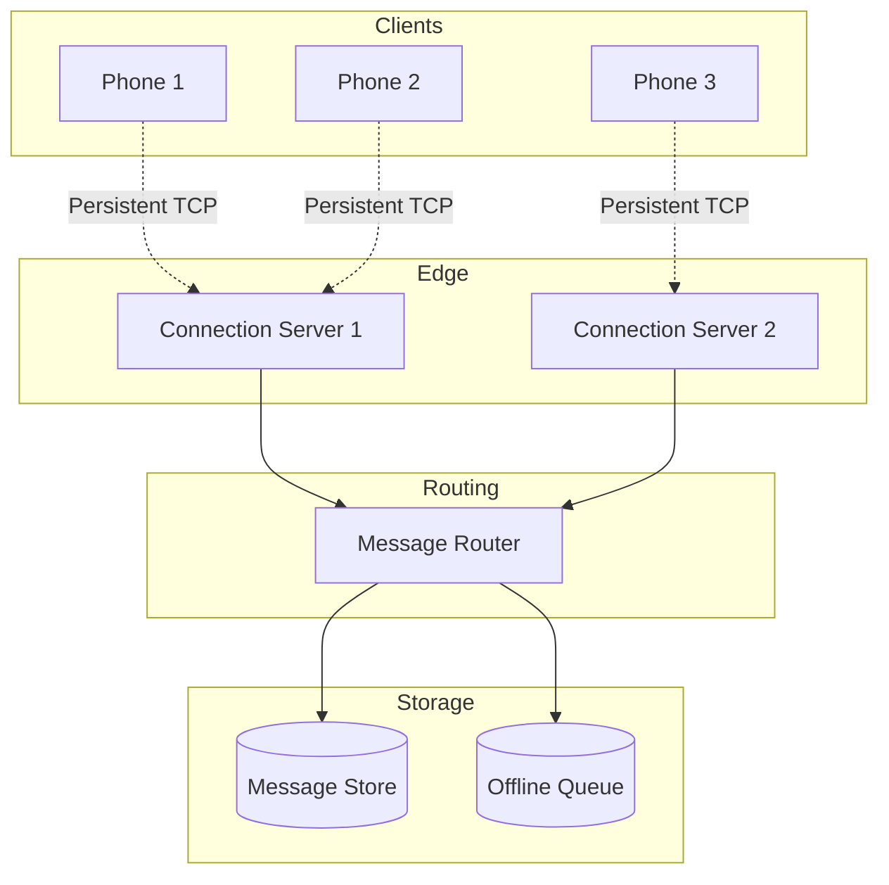
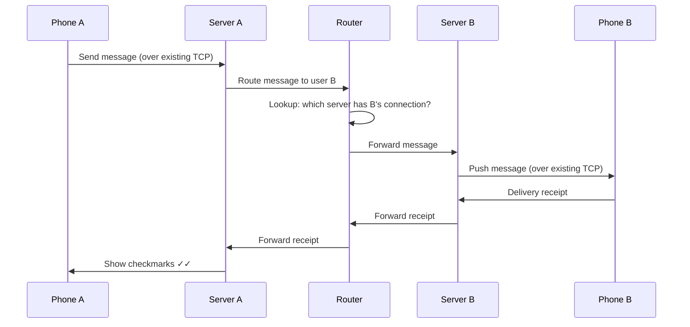
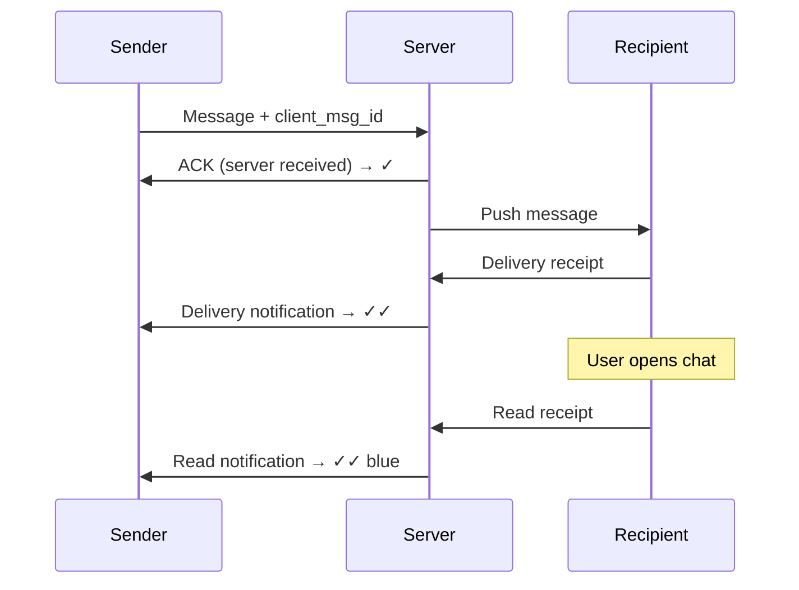
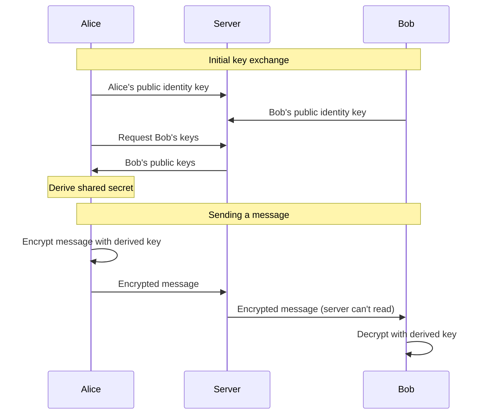

# Chapter 4: WhatsApp - Two Billion Users, 50 Engineers

> *How did a team of 50 engineers build a messaging system for 2 billion users? The answer lies in making unconventional technology choices.*

---

## The Problem Statement

### The Business Problem

WhatsApp promised something radical in 2009: free messaging that just works. No SMS fees, no carrier lock-in, works on any phone with internet.

The requirements:
- Messages delivered reliably (never lose a message)
- Real-time delivery (< 1 second latency)
- Work on terrible networks (2G, flaky WiFi)
- End-to-end encrypted (nobody, not even WhatsApp, can read messages)
- Support billions of users with minimal infrastructure

### The Naive Implementation

```
Client sends message:
  HTTP POST to server
  Server writes to database
  Server pushes to recipient via polling/SSE
  Recipient acknowledges
```

**Why this breaks at scale:**

1. **HTTP overhead**: Each message requires a full HTTP request. Headers alone are 500+ bytes. For a "hello" message of 5 bytes, you're 99% overhead.

2. **Connection limits**: HTTP connections are expensive. Polling every second = 1 request/second/user. At 1 billion users, that's 1 billion requests/second. Absurd.

3. **Latency**: Polling at 1-second intervals means average delivery latency of 500ms just from polling—before network latency. Real-time chat needs < 100ms.

4. **Battery drain**: Constantly opening connections kills mobile batteries. Users will uninstall.

### WhatsApp's Scale (public numbers, 2024)

| Metric | Value |
|--------|-------|
| Monthly active users | 2+ billion |
| Daily messages | 100+ billion |
| Peak concurrent connections | 1+ billion |
| Messages/second (estimated) | 1+ million |
| Engineering team (at acquisition) | ~50 people |

---

## Core Architecture

### The Key Insight: Persistent Connections

Instead of HTTP polling, WhatsApp maintains **persistent TCP connections** between every client and the server.



### Why TCP, Not HTTP?

| Aspect | HTTP | Persistent TCP |
|--------|------|----------------|
| Connection overhead | Per-request (handshake, headers) | Once at startup |
| Idle cost | Polling required | Single keepalive byte every 30s |
| Message overhead | 500+ bytes headers | 2-3 bytes framing |
| Battery impact | High (constant activity) | Minimal (socket idle) |
| Push latency | Polling interval | Instant (already connected) |

### The Erlang Choice

WhatsApp's servers are written in **Erlang**, an obscure language from 1986 designed for telephone switches.

**Why Erlang?**

1. **Lightweight processes**: Erlang processes are ~300 bytes each. You can run millions on one machine. Each connection = one process.

2. **Per-process garbage collection**: No stop-the-world GC. When a process GCs, only that process pauses. Critical for real-time.

3. **Hot code reload**: Update code without restarting. Deploy to production with zero downtime.

4. **Built for concurrency**: Actor model where processes communicate via message passing. Perfect fit for a messaging app.

**The numbers (2012 data):**
- 2 million connections per server
- Single server handling 2.5 million messages/second in tests
- Achieved with commodity hardware

### Request Flow: Sending a Message



### Infrastructure Details

**Connection servers (2016 estimates):**
- ~550 servers globally
- FreeBSD (not Linux—WhatsApp found it handled connections better at scale)
- Custom-tuned BEAM VM (Erlang's runtime)
- 2+ million connections per server

**Why FreeBSD over Linux?**

WhatsApp engineers found FreeBSD's network stack handled millions of concurrent connections more efficiently. Key differences:
- `kqueue` vs `epoll` (different event notification APIs)
- TCP connection handling tuning options
- Network buffer management

**Server specs (estimated):**
- 24+ cores
- 256+ GB RAM
- 10+ Gbps network
- SSD storage for offline message queue

**Memory per connection:**
- Erlang process: ~2-3 KB
- TCP buffers: ~10 KB
- Application state: ~1 KB
- Total: ~15 KB × 2 million = 30 GB per server just for connections

---

## Deep Dive: The Clever Bits

### 1. Message Delivery Guarantees

WhatsApp shows checkmarks for message status:
- ✓ (one gray): Sent to server
- ✓✓ (two gray): Delivered to recipient's device
- ✓✓ (two blue): Read by recipient

**How does this work?**



**Client message ID:**
Each message has a client-generated ID. This enables:
- Deduplication (if client retries)
- Ordering (messages from same sender sorted by ID)
- Receipt correlation (server links receipts to messages)

**What if recipient is offline?**

```
1. Server stores message in offline queue (database)
2. Server sets TTL (e.g., 30 days)
3. When recipient connects:
   - Server pushes queued messages
   - Recipient acknowledges each
   - Server deletes from queue
```

**Failure scenario: Server crashes after receiving message, before storing?**

This is a data loss risk. WhatsApp's approach:
- Write to persistent queue before acknowledging to sender
- If server crashes mid-write, sender doesn't see ✓
- Sender retries, message gets stored
- Result: At-least-once delivery (possible duplicates, never lost)

### 2. The XMPP Decision (and Un-decision)

Early WhatsApp used **XMPP** (Extensible Messaging and Presence Protocol), an open standard for chat.

**XMPP advantages:**
- Well-understood protocol
- Existing libraries in many languages
- Federation support (different servers can interoperate)

**Why WhatsApp moved away:**

1. **Verbose**: XMPP is XML-based. A simple message:
   ```xml
   <message to="user@server" type="chat">
     <body>Hello</body>
   </message>
   ```
   That's 80+ bytes for a 5-byte message.

2. **Presence overhead**: XMPP broadcasts "online" status to all contacts. With 500 contacts, going online = 500 messages.

3. **Feature bloat**: XMPP has many features WhatsApp didn't need, but clients/servers still had to handle.

**WhatsApp's custom protocol:**
- Binary (not XML)
- Minimal framing (2-3 bytes per message)
- Optimized for mobile (assumes unreliable networks)
- Port 443 (looks like HTTPS to firewalls, but isn't)

### 3. End-to-End Encryption: The Signal Protocol

In 2016, WhatsApp rolled out end-to-end encryption (E2EE) for all messages using the **Signal Protocol**.

**Key properties:**
- WhatsApp servers cannot decrypt messages
- Each message has a unique key
- Past messages can't be decrypted even if keys are compromised (forward secrecy)

**How it works (simplified):**



**The Double Ratchet:**
The key isn't static. After each message exchange, both parties "ratchet" forward:
- New keys derived from old keys
- Old keys are deleted
- Compromise of current key doesn't expose past messages

**Infrastructure impact:**
- Key exchange at connection time (extra round trips)
- Encryption/decryption CPU overhead on client
- Server can't compress or deduplicate (all messages look random)
- Server can't filter spam by content

### 4. Handling Groups

Group messages amplify complexity:
- 1 message to 100-person group = 100 deliveries
- Each recipient might be on a different server
- Delivery receipts come from 100 people

**WhatsApp's approach: Client-side fan-out**

```
Sender encrypts message 100 times (once per recipient)
Sends 100 encrypted messages to server
Server distributes to respective connection servers
```

**Why not server-side fan-out?**
With E2EE, server can't encrypt. Only sender has keys for each recipient.

**The tradeoff:**
- Sending to 100-person group = upload 100 encrypted copies
- On bad networks, this is slow
- But: Server never sees plaintext, even for groups

---

## Failure Modes & Recovery

### Scenario 1: Connection Server Crashes

**Detection:**
- TCP connection drops (client detects immediately)
- Load balancer health checks fail
- Monitoring sees connection count drop

**Recovery:**
```
1. Client detects disconnection (TCP RST or timeout)
2. Client reconnects (different server via load balancer)
3. New server loads client's offline queue
4. Missed messages pushed to client
5. Client resumes normally
```

**What's lost?**
- Messages in-flight during crash might not have been persisted
- Sender would not see ✓, will retry
- Result: No message loss, possible duplicates

### Scenario 2: Message Store Database Overload

**Detection:**
- Write latency exceeds threshold
- Queue depth grows
- Timeout errors increase

**Recovery:**
- Shed load: Reject new writes temporarily (clients will retry)
- Scale out: Add database shards
- Fail over: Switch to replica if primary is sick

**WhatsApp's durability strategy:**
- Messages don't live in database forever
- Delivered messages deleted immediately
- Only offline queue persisted
- Reduces database size dramatically

### Scenario 3: Network Partition Between Data Centers

**The scenario:**
US West and US East data centers lose connectivity. User A is connected to US West, User B to US East.

**What happens:**
- Messages A→B queue in US West
- Messages B→A queue in US East
- Both see ✓ (one checkmark—server received)
- Neither sees ✓✓ until partition heals

**When partition heals:**
- Queued messages flow across
- Delivery receipts eventually arrive
- From user perspective: Delay, but no loss

---

## Scale Numbers & Mental Models

### Mental Model: The Post Office

Think of WhatsApp as a distributed post office:

| Post Office | WhatsApp |
|-------------|----------|
| Mailbox | Device |
| Letter | Message |
| PO Box (for held mail) | Offline queue |
| Carrier | Connection server |
| Sorting facility | Router |
| Return receipt requested | Delivery receipts |

The key insight: Mail doesn't live at the post office. It's either in transit or at the mailbox. WhatsApp's servers are routing, not storage.

### Latency Budget

```
End-to-end message delivery (both online):

Sender app processing:      5ms
Encryption:                 2ms
Upload to server:           20-100ms (network dependent)
Server routing:             5ms
Push to recipient server:   5ms
Download to recipient:      20-100ms
Decryption:                 2ms
Recipient app processing:   5ms
─────────────────────────────────────
Total:                      64-224ms
```

Real-world: 100-500ms is typical, depending on network quality.

### Resource Usage

**Per-message costs:**
- Network: 50-200 bytes (binary protocol + encryption overhead)
- Server CPU: ~0.1ms processing
- Storage: 0 bytes for delivered messages (deleted after delivery)

**Per-connection costs:**
- Server RAM: ~15 KB
- Bandwidth: 1 byte every 30 seconds (keepalive)
- No CPU when idle (Erlang scheduler sleeps the process)

---

## Historical Evolution

### 2009: The Beginning

**v1 Stack:**
- Erlang servers (the choice that lasted)
- XMPP protocol (later replaced)
- Single data center
- Focus: Reliability over features

**Scale:**
- Tens of thousands of users
- Small team (WhatsApp famously had ~50 engineers total by 2014)

### 2011-2013: Explosive Growth

**Key changes:**
- Custom binary protocol replacing XMPP
- Multi-data-center deployment
- Offline queue optimization
- Photo/video messaging

**Infrastructure:**
- Hundreds of servers
- Millions of concurrent connections

### 2014: Facebook Acquisition ($19B)

**Scale at acquisition:**
- 450 million monthly users
- 50 engineers
- Cost per user: ~$0.04/year in infrastructure

**The efficiency story:**
While competitors threw servers at the problem, WhatsApp's Erlang stack handled 2+ million connections per server.

### 2016: End-to-End Encryption

**The Signal Protocol rollout:**
- Gradual rollout over months
- Every message encrypted by default
- "If encryption is optional, it's not really private"

**Infrastructure impact:**
- Increased CPU on clients (encryption)
- Increased message size (overhead)
- Lost ability to filter spam by content
- Worth it for privacy

### 2020+: Modern WhatsApp

**Current features:**
- Voice/video calls
- WhatsApp Business
- Multi-device support
- Communities (large groups)

**Multi-device challenge:**
E2EE assumed one device. Multiple devices means:
- Each device has its own keys
- Messages encrypted to all devices
- Complexity multiplied by device count

---

## Key Takeaways

1. **Persistent connections beat polling**: Maintaining TCP connections seems expensive but is actually cheaper than the alternative at scale.

2. **Technology choice matters**: Erlang's lightweight processes enabled 2M connections per server. Java or Python would need fundamentally different architecture.

3. **Don't store what you don't need**: Messages deleted after delivery means the database holds only offline queue, not message history.

4. **Binary protocols beat text**: Moving from XML-based XMPP to binary protocol reduced bandwidth dramatically.

5. **End-to-end encryption is an architecture decision**: You can't add it later without rethinking fan-out, spam filtering, and moderation.

---

## Further Reading

- [WhatsApp Engineering: 1 Million is so 2011](https://blog.whatsapp.com/1-million-is-so-2011) - Early scaling blog post
- [How WhatsApp scaled to 1 billion users with only 50 engineers](https://www.wired.com/2015/09/whatsapp-serves-900-million-users-50-engineers/) - Wired article
- [Signal Protocol Technical Documentation](https://signal.org/docs/) - The encryption protocol
- [WhatsApp's Architecture Evolution](https://www.youtube.com/watch?v=vJwT5dqIrog) - Conference talk (estimated)

---

*Next chapter: [Slack - Enterprise Messaging](../05-slack/README.md)*
