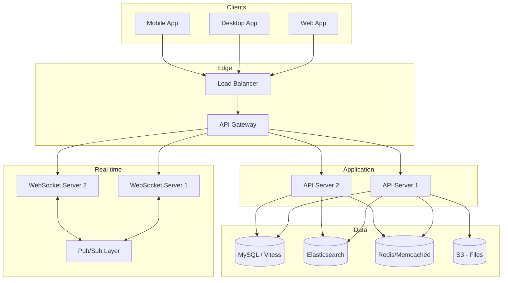
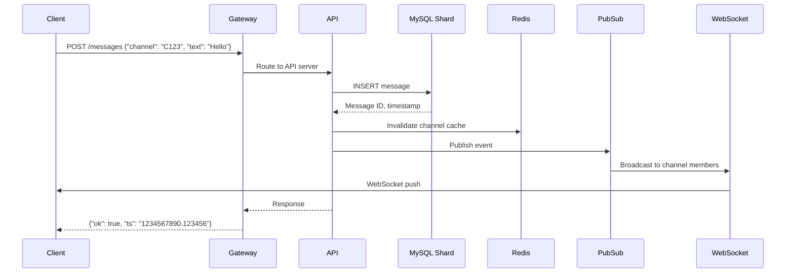
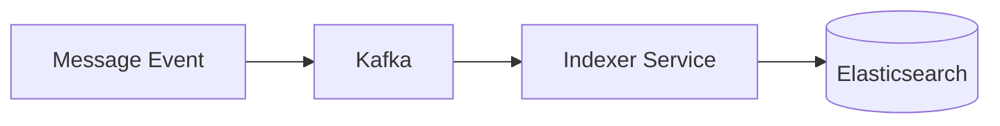
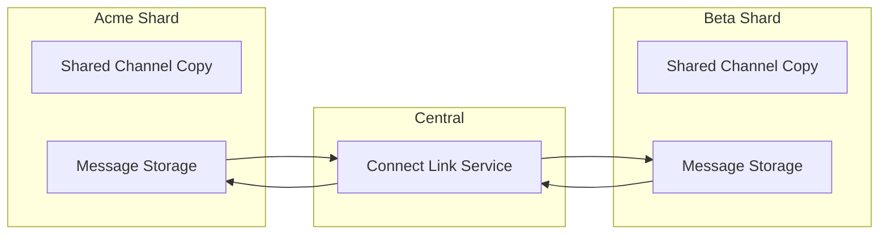

# Chapter 5: Slack - Enterprise Messaging at Scale

> *How do you build a messaging platform where reliability is a business requirement, not just a nice-to-have?*

---

## The Problem Statement

### The Business Problem

WhatsApp solves consumer messaging: "Did my message reach my friend?" Slack solves enterprise messaging: "Is my team aligned on this project?"

The requirements are different:
- **Searchable history**: Find the decision made 6 months ago
- **Integrations**: Bots, apps, workflows
- **Compliance**: Audit trails, data retention, e-discovery
- **Multi-channel presence**: See activity across hundreds of channels
- **Workspace isolation**: Company A can never see Company B's data

### The Naive Implementation

"It's just chat, right? Store messages in a database, push via WebSocket."

```
User sends message:
  INSERT INTO messages (channel_id, user_id, text, ts)
  Broadcast to all channel members via WebSocket

User loads channel:
  SELECT * FROM messages WHERE channel_id = ? ORDER BY ts DESC LIMIT 100
```

**Why this breaks for enterprise:**

1. **Hot channels**: #general in a 10,000-person company gets 1,000 messages/hour. One database row per message, queried by thousands of users.

2. **Search at scale**: "Find all messages mentioning 'budget' from last quarter." Full-text search across billions of messages.

3. **Rich content**: Messages have formatting, reactions, threads, attachments, link previews. Each is a mini-document, not a row.

4. **Workspace explosion**: 1 million+ workspaces, each with its own data isolation requirements. Can't shard by message_id—must shard by workspace.

### Slack's Scale (public numbers, 2023)

| Metric | Value |
|--------|-------|
| Daily active users | 20+ million |
| Paid workspaces | 200,000+ |
| Messages sent daily | 5+ billion |
| Connected apps | 2,500+ |

---

## Core Architecture

### High-Level View



### The Workspace Isolation Problem

Every Slack workspace must be isolated:
- Company A employees can never see Company B messages
- Even in shared channels, data isolation is maintained
- Compliance: Workspace data stays in designated region

**Slack's approach: Sharding by workspace**

```mermaid
flowchart LR
    subgraph Shard 1
        WS1[Workspace: Acme Corp]
        WS2[Workspace: Beta Inc]
    end
    subgraph Shard 2
        WS3[Workspace: Gamma LLC]
        WS4[Workspace: Delta Co]
    end
    subgraph Shard 3
        WS5[Workspace: Epsilon Ltd]
    end

    Router[Query Router] --> Shard 1
    Router --> Shard 2
    Router --> Shard 3
```

Workspace ID is in every query. The routing layer directs queries to the right shard.

### Request Flow: Sending a Message



### Infrastructure Details

**MySQL at Slack:**
- Slack uses **Vitess** for horizontal sharding
- Hundreds of MySQL shards
- Each shard: Primary + multiple replicas
- Sharding key: Workspace ID (team_id)

**Why MySQL, not NoSQL?**
- ACID transactions for message ordering
- Complex queries (search, filters)
- Relational model fits channels/users/messages
- Vitess solves scale without abandoning MySQL

**Elasticsearch for search:**
- Real-time indexing on message write
- Full-text search across all workspace messages
- Indexing latency: seconds (not real-time for very fresh messages)
- Separate cluster per large workspace, shared clusters for smaller ones

**WebSocket layer:**
- Persistent connections (like WhatsApp)
- One connection per client
- Connection servers are stateless (use Redis for presence)
- Pub/Sub for broadcasting (Redis or similar)

---

## Deep Dive: The Clever Bits

### 1. The Message Timestamp (ts)

Slack's messages are identified by a timestamp, not an auto-increment ID.

```
"ts": "1234567890.123456"
```

This is: Unix timestamp (seconds) + 6 decimal places (microseconds).

**Why timestamps?**

1. **Natural ordering**: Messages sort correctly by ts
2. **Distributed generation**: Any server can generate a ts without coordination
3. **Thread replies**: A thread's parent is identified by its ts
4. **Uniqueness**: microsecond precision + workspace isolation = practically unique

**The uniqueness problem:**
What if two messages have identical timestamps?

In practice, sub-microsecond collisions are rare. But Slack adds a sequence counter on collision:
```
1234567890.123456
1234567890.123457  ← collision avoidance
```

### 2. The Channel Model

Slack has multiple channel types, each with different performance characteristics:

| Type | Visibility | Membership | Scale Challenge |
|------|------------|------------|-----------------|
| Public | Anyone in workspace | Self-join | 10,000s of members |
| Private | Invite only | Invite only | Permission checks |
| DM | Two people | Fixed | Many DMs per user |
| Group DM | 3-9 people | Invite only | Membership sync |
| Shared | Cross-workspace | Complex | Data isolation |

**The #general problem:**
A 10,000-person company's #general channel:
- 10,000 members to notify on each message
- Each member might have multiple connected devices
- Peak hours: 100+ messages/minute

**Solution: Tiered delivery**
```
Immediate push:
  - Users actively viewing #general
  - Desktop notifications enabled

Batched push (every 5 seconds):
  - Users with channel muted
  - Mobile in background

No push:
  - Channel muted + mentions disabled
  - Notify only on @mention
```

### 3. Search Architecture

Finding messages in a workspace with 10 million messages:

**The indexing pipeline:**


Every message write triggers an index event. The indexer:
1. Enriches message (resolve user mentions, channel names)
2. Tokenizes text (handles emoji, URLs, code blocks)
3. Writes to Elasticsearch

**Search latency budget:**
```
Query parsing:           5ms
Elasticsearch query:     50-200ms (depends on complexity)
Result enrichment:       20ms (fetch user/channel details)
─────────────────────────────────
Total:                   75-225ms
```

**The recency problem:**
Message indexed 2 seconds ago might not be in search yet (ES eventual consistency).

**Solution:**
- Search returns "messages up to 5 seconds ago"
- For very recent messages, fall back to database query
- UX: "Searching..." → "Also checking recent messages..."

### 4. Slack Connect: Cross-Workspace Channels

A channel shared between Acme Corp and Beta Inc.

**The challenge:**
- Messages from Acme must be visible in Beta's workspace
- But Acme's data cannot leak beyond the shared channel
- Each workspace has its own shard

**Solution: Message mirroring**



When Acme user posts:
1. Message stored in Acme's shard
2. Replicated to Link service
3. Written to Beta's shard (as if from Acme)
4. Both workspaces see the message in their local channel

**The trust model:**
- Each workspace controls its own copy
- Leaving the shared channel = delete your copy
- Compliance: Each company retains data according to its policies

---

## Failure Modes & Recovery

### Scenario 1: MySQL Shard Failure

**Detection:**
- Vitess query router sees increased latency/errors
- Health checks fail
- Alerting triggers

**Impact:**
- Workspaces on that shard are degraded
- Messages can't be sent/read
- Other shards unaffected (blast radius contained)

**Recovery:**
```
Automatic failover:
1. Vitess detects primary failure
2. Promotes replica to primary (seconds)
3. Query router updates routing
4. Writes resume

Data at risk:
- Transactions in-flight during crash
- Replication lag window (typically < 1 second)
```

### Scenario 2: WebSocket Layer Outage

**The scenario:**
WebSocket servers crash. Users can't receive real-time updates.

**What still works:**
- API calls (send messages, read history)
- Messages are stored correctly
- Just not pushed in real-time

**User experience:**
- Messages appear when you manually reload
- "Connection lost, reconnecting..."

**Recovery:**
- WebSocket servers restart
- Clients reconnect (exponential backoff)
- Missed messages fetched on reconnect

**Why this is acceptable:**
Slack can degrade to "email mode" (refresh to see updates) without data loss. Inconvenient but not catastrophic.

### Scenario 3: Search Index Lag

**The scenario:**
Elasticsearch cluster is overloaded. Indexing lag grows to 5 minutes.

**Impact:**
- Recent messages not searchable
- Users searching for "the message John just sent" get frustrated

**Mitigations:**
- Real-time search for very recent messages (query database directly)
- "Results may not include messages from the last few minutes"
- Auto-scaling indexer fleet based on queue depth

---

## Scale Numbers & Mental Models

### Mental Model: The Office Building

Think of Slack like an office building:

| Physical Office | Slack |
|-----------------|-------|
| Building | Workspace |
| Floor | Public channel |
| Conference room | Private channel |
| Desk chat | DM |
| Intercom | Mentions |
| Security desk | Permissions |
| File cabinet | Search |

The key insight: Each company (workspace) has their own "building" that never connects to another building—except through a formal "shared conference room" (Slack Connect).

### Latency Budget

**Send message (optimistic):**
```
Client to gateway:       10ms
Gateway processing:      5ms
API server logic:        10ms
MySQL write:             5ms
Pub/Sub publish:         5ms
WebSocket broadcast:     5ms
─────────────────────────────────
Total:                   40ms (before client sees it)
```

**Load channel history:**
```
Client to gateway:       10ms
Cache check (hit):       2ms
Response:                10ms
─────────────────────────────────
Total (cache hit):       22ms

Cache miss, database:
MySQL query:             20ms
Cache populate:          5ms
─────────────────────────────────
Total (cache miss):      50ms
```

### Resource Sizing

**Per-workspace estimates:**
- Average messages/day: 10,000 (varies wildly)
- Storage/year: ~10 GB (messages + metadata)
- Active users: 100-10,000

**Per-message storage:**
- Message text: 100-500 bytes (average)
- Metadata: 200 bytes (user, channel, ts, edits)
- Reactions: 50 bytes per reaction
- Files: Stored in S3, reference in DB

---

## Historical Evolution

### 2013: The Beginning

**Origin story:**
Slack started as an internal tool at Tiny Speck (a game company). The game failed, but the chat tool was good.

**v1 Stack:**
- PHP backend (later migrated)
- MySQL for storage
- AWS infrastructure
- Polling-based updates (later WebSocket)

### 2015-2017: Enterprise Features

**Key additions:**
- Enterprise Grid (workspace of workspaces)
- Compliance and eDiscovery
- SSO/SAML integration
- Advanced search operators

**Architecture evolution:**
- Move to Java/PHP hybrid
- Vitess for MySQL sharding
- Dedicated Elasticsearch clusters

### 2018-2020: Scale Challenges

**The famous outages:**
- Multiple high-profile outages
- Database bottlenecks
- WebSocket layer overload

**Responses:**
- "Project Libra" reliability improvements
- More aggressive caching
- Better shard balancing
- Chaos engineering adoption

### 2021+: Modern Slack

**Salesforce acquisition (2020):**
- Integration with Salesforce ecosystem
- Slack Connect expansion
- New infrastructure investments

**Current focus:**
- Slack Huddles (audio/video)
- Workflow automation
- AI features (Slack GPT)
- Multi-region deployment

---

## Key Takeaways

1. **Workspace isolation is fundamental**: Unlike consumer chat, enterprise chat must guarantee data isolation. This influences every architecture decision.

2. **Sharding by customer is natural**: Workspace-based sharding aligns with business requirements (data isolation) and technical needs (query patterns).

3. **Search is a separate system**: Real-time messaging and full-text search have different requirements. Build them as separate, connected systems.

4. **Graceful degradation matters**: When WebSockets fail, Slack becomes slower but not broken. Design for partial failures.

5. **The channel model creates hot spots**: #general in a large company is a fundamentally different problem than a 5-person DM. Design for both.

---

## Further Reading

- [Scaling Slack - The Good, the Bad, and the Distributed](https://slack.engineering/) - Slack Engineering Blog
- [How Slack Built Shared Channels](https://slack.engineering/how-slack-built-shared-channels/) - Slack Connect architecture
- [Migrating Slack's Caching Infrastructure](https://slack.engineering/migrating-our-caching-infrastructure/) - Caching evolution
- [Data Consistency on Slack](https://slack.engineering/caching-at-slack/) - Consistency challenges

---

*Next chapter: [YouTube & Vitess - Sharding MySQL at Scale](../../part-3-content-at-scale/06-youtube-mysql/README.md)*
