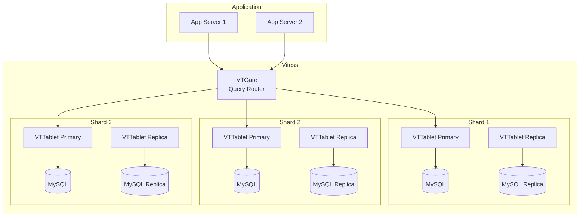
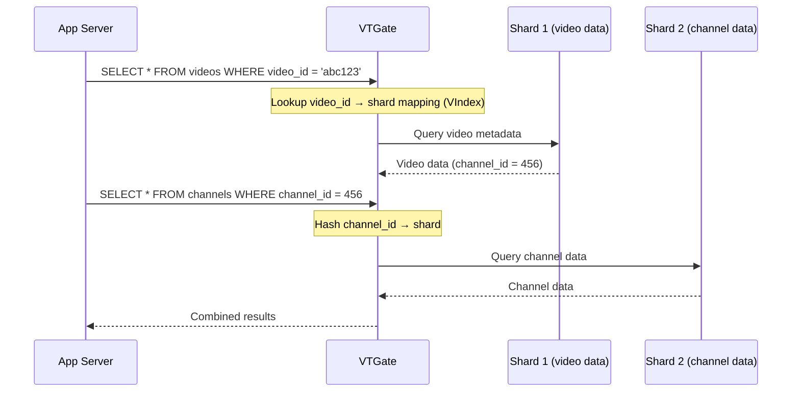
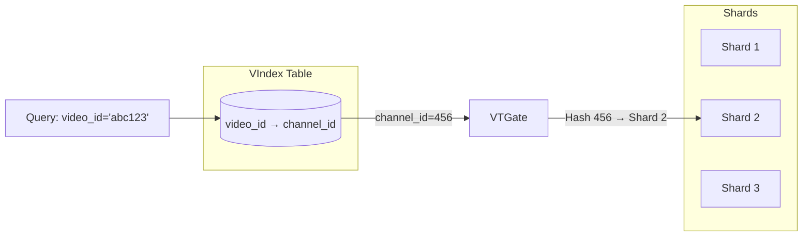
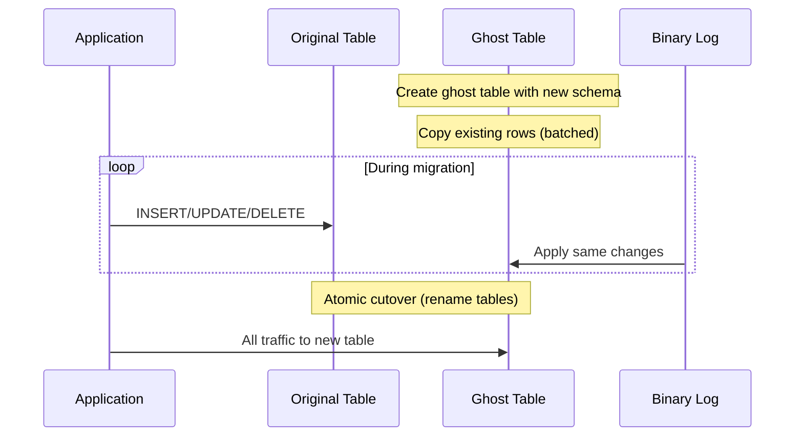
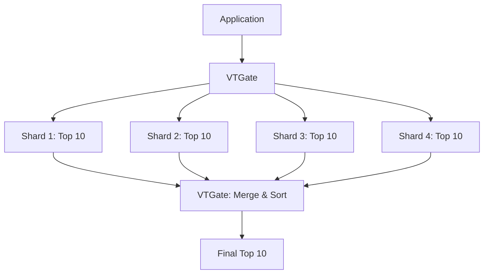
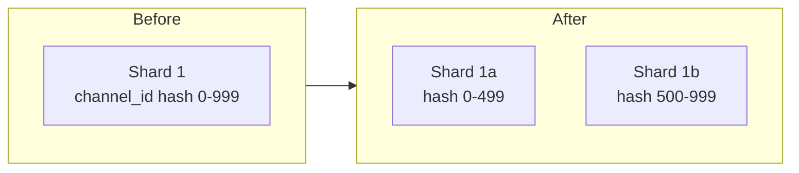

# Chapter 6: YouTube & Vitess - Sharding MySQL at Scale

> *How does YouTube serve 800 million videos using... MySQL? The answer is Vitess, and it's more clever than you'd think.*

---

## The Problem Statement

### The Business Problem

YouTube has:
- 800+ million videos
- 2+ billion logged-in users per month
- 500+ hours of video uploaded every minute
- Metadata for everything: titles, descriptions, views, likes, comments

Every video page requires:
- Video metadata (title, description, uploader)
- View count (real-time or near-real-time)
- Related videos (recommendations)
- Comments (sorted, paginated)
- Channel info (subscriber count, other videos)

### The Naive Implementation

"Just use a database."

```sql
CREATE TABLE videos (
  video_id BIGINT PRIMARY KEY,
  channel_id BIGINT,
  title VARCHAR(500),
  description TEXT,
  upload_date TIMESTAMP,
  view_count BIGINT,
  INDEX (channel_id)
);
```

**Why this breaks:**

1. **Size**: 800 million rows. A single MySQL instance can handle maybe 100 million rows efficiently. Beyond that, queries slow down.

2. **Write throughput**: Every video view increments view_count. At 1 billion views/day, that's 11,500 writes/second to this table alone.

3. **Query patterns conflict**:
   - "Get video by ID" → Index on video_id
   - "Get all videos by channel" → Index on channel_id
   - "Get trending videos" → Full table scan? Too slow.

4. **Schema changes**: Want to add a column? ALTER TABLE on 800 million rows takes hours/days and locks the table.

### Why Not NoSQL?

Many systems solve this by abandoning SQL. YouTube chose differently:

**SQL advantages:**
- Transactions (ACID guarantees)
- Complex queries (JOINs, aggregations)
- Decades of tooling and expertise
- Relational model fits the data well

**The decision:**
Keep MySQL, but make it scale horizontally. That's Vitess.

---

## Core Architecture

### What Is Vitess?

Vitess is a database clustering system for horizontal scaling of MySQL. It provides:

- **Sharding**: Distribute data across multiple MySQL instances
- **Query routing**: Send queries to the right shard(s)
- **Connection pooling**: Handle millions of connections efficiently
- **Online schema changes**: Alter tables without downtime



### Key Components

**VTGate**: The query router
- Accepts MySQL protocol connections
- Parses SQL, determines which shard(s) to query
- Aggregates results from multiple shards
- To the application, it looks like a single MySQL

**VTTablet**: The shard manager
- One per MySQL instance (primary or replica)
- Handles replication, health checks
- Enforces query rules and timeouts
- Manages schema changes

**VSchema**: The sharding configuration
- Defines which column is the sharding key
- Defines secondary indexes (VIndex)
- Rules for cross-shard queries

### Sharding Strategy

**How do you shard videos?**

**Option 1: Shard by video_id**
```
Shard 1: video_id 1-100,000,000
Shard 2: video_id 100,000,001-200,000,000
...
```

*Problem*: "Get all videos by channel X" requires querying ALL shards.

**Option 2: Shard by channel_id**
```
Shard 1: channel_id hash 0-999
Shard 2: channel_id hash 1000-1999
...
```

*Problem*: MrBeast has 300 million subscribers. His shard is 10x busier than others.

**YouTube's solution: Shard by channel_id hash + handle hot channels specially**

The hash distributes channels pseudo-randomly. Even large channels are spread across the hash space. For extremely hot channels (top 0.1%), separate caching and read replicas handle the load.

### Request Flow: Load Video Page



### Infrastructure Reality

**YouTube's Vitess deployment (estimated):**
- Hundreds of MySQL shards
- Each shard: 1 primary + 2-5 replicas
- Replicas in different availability zones
- Total storage: Petabytes

**Per-shard specs:**
- 32-64 cores
- 256-512 GB RAM
- NVMe SSDs (low latency)
- InnoDB buffer pool: ~80% of RAM

**Why so much RAM?**
MySQL performance depends on having the "working set" in memory. For video metadata, that's frequently accessed videos. Hot data in RAM = fast queries.

---

## Deep Dive: The Clever Bits

### 1. VIndex: Secondary Indexes Across Shards

**The problem:**
Videos are sharded by channel_id. But you need to find a video by video_id.

Without a secondary index:
```
Query: WHERE video_id = 'abc123'
VTGate: "I don't know which shard has this video"
Action: Query ALL shards, merge results
```

At 100 shards, that's 100 queries for one video. Unacceptable.

**VIndex solution:**



The VIndex is a separate table mapping video_id → channel_id. Stored in its own shard(s), heavily cached.

**Query flow:**
1. Check VIndex: video_id 'abc123' → channel_id 456
2. Hash channel_id 456 → Shard 2
3. Query only Shard 2

Result: 2 queries instead of 100.

**VIndex types:**
- **Unique**: One row per key (like above)
- **Non-unique**: Multiple rows (e.g., all videos with tag "music")
- **Functional**: Computed from the value (e.g., hash of string)

### 2. Online Schema Changes

**The nightmare scenario:**
You need to add a column to a 800-million-row table.

```sql
ALTER TABLE videos ADD COLUMN category_id INT;
```

Traditional MySQL:
- Locks table for the entire operation
- Copies all data to new structure
- Hours to days of downtime

**Vitess gh-ost integration:**



**How it works:**
1. Create a new table with the new schema
2. Copy rows from old table to new table (in batches)
3. Meanwhile, capture all changes via binary log replication
4. Apply changes to new table in real-time
5. When caught up, atomically swap table names

**No downtime. No locking. Schema change while serving traffic.**

### 3. Cross-Shard Queries

**The query:**
"Show me the top 10 most-viewed videos this week."

This requires scanning all shards and aggregating.



**VTGate's strategy:**
1. Send query to all shards in parallel
2. Each shard returns its local top 10
3. VTGate merges and re-sorts
4. Returns final top 10

**The math:**
- 100 shards × 10 rows each = 1,000 rows to merge
- Merge is O(n log k) where k = result size
- Total time ≈ slowest shard + merge time

**When cross-shard is expensive:**
- Large result sets (can't push LIMIT to shards for some queries)
- Complex aggregations (COUNT DISTINCT across shards is hard)
- JOINs across sharding keys (requires scatter-gather)

**YouTube's approach:**
- Design schema to minimize cross-shard queries
- Materialize common aggregations (e.g., daily view counts)
- Use Vitess for transactional data, separate systems (BigQuery) for analytics

### 4. Shard Splitting

**The scenario:**
A shard grows too large (250 GB+, 500M+ rows). Time to split.



**Vitess resharding process:**
1. Create new shards (1a, 1b) as replicas of shard 1
2. Filter replication: 1a only gets hash 0-499, 1b only 500-999
3. When caught up, update VTGate routing
4. Writes go to new shards, reads migrate gradually
5. Decommission old shard 1

**Online. No downtime. Traffic shifts gradually.**

**When to split:**
- Shard size > 250 GB (queries slow down)
- QPS exceeds single-instance capacity
- One shard consistently hot (uneven load)

---

## Failure Modes & Recovery

### Scenario 1: Shard Primary Failure

**Detection:**
- VTTablet health check fails
- Replication lag alerts
- Query timeouts increase

**Automatic failover:**
```
1. Vitess detects primary is unhealthy
2. Selects most up-to-date replica
3. Promotes replica to primary (GTID-based)
4. Updates routing in VTGate
5. Old primary fenced (prevented from accepting writes)
```

**Time to recover:**
- Detection: 1-10 seconds
- Promotion: 5-30 seconds
- Total: Under 1 minute typical

**Data at risk:**
- Transactions committed on old primary but not yet replicated
- With semi-synchronous replication: No data loss
- With async replication: Up to 1 second of transactions

### Scenario 2: VTGate Failure

**Impact:**
- That VTGate instance stops routing queries
- Load balancer detects failure
- Traffic shifts to other VTGate instances

**Recovery:**
Stateless. Just restart or let load balancer route around it.

**Why VTGate is stateless:**
- No data stored locally
- All routing info from topology service (etcd/ZooKeeper)
- Any VTGate can handle any query

### Scenario 3: Inconsistent Replica

**The scenario:**
A replica falls behind by 1 hour. Reads from it return stale data.

**Detection:**
- Replication lag monitoring
- VTTablet reports lag to VTGate

**Response:**
```
if replica_lag > 5 seconds:
    VTGate stops routing reads to this replica
    Traffic goes to other replicas or primary

if all replicas lagging:
    Serve from primary (accept higher load)
    Alert on-call engineer
```

**Root causes:**
- Slow query on replica blocking replication
- Network issue between primary and replica
- Disk I/O saturation on replica

---

## Scale Numbers & Mental Models

### Mental Model: The Library with Many Branches

Think of Vitess as a library system:

| Library System | Vitess |
|----------------|--------|
| Branch library | Shard |
| Card catalog | VIndex |
| Central computer | VTGate |
| Book (copy) | Replica |
| Interlibrary loan | Cross-shard query |

Want a book? The central system (VTGate) looks up which branch (shard) has it. If you need books from multiple branches, it coordinates.

### Capacity Planning

**Single MySQL limits:**
- Rows: ~100 million (performance degrades beyond)
- Table size: ~500 GB
- QPS: ~10,000 (depends on query complexity)
- Connections: ~5,000 (connection pooling helps)

**Shard sizing guideline:**
- Target: 100 GB per shard
- Rows: 50-100 million per shard
- Plan to split before hitting limits

**For 800 million videos:**
- At 100M rows/shard: 8 shards minimum
- With replication (1 primary + 2 replicas): 24 MySQL instances
- With overhead and growth buffer: 30-50 instances

### Latency Budget

**Simple query (by sharding key):**
```
VTGate parse & route:    1ms
Network to shard:        2ms
MySQL query (cached):    1ms
Network return:          2ms
VTGate response:         1ms
─────────────────────────────
Total:                   7ms
```

**VIndex lookup query:**
```
VTGate parse:            1ms
VIndex lookup:           5ms (another shard query)
Route to correct shard:  7ms
─────────────────────────────
Total:                   13ms
```

**Scatter-gather (all shards):**
```
VTGate parse:                    1ms
Parallel query to 100 shards:    50ms (slowest shard)
Merge results:                   10ms
─────────────────────────────────
Total:                           61ms
```

---

## Historical Evolution

### 2011: Birth at YouTube

**The problem:**
- YouTube running on MySQL
- Growing pains: sharding needed
- Manual sharding in application code is error-prone

**v1 Vitess:**
- Query routing layer
- Connection pooling
- Manual shard management

### 2012-2015: Production Hardening

**Key additions:**
- Automatic failover
- Online schema changes (gh-ost integration)
- VIndex for secondary indexes
- Resharding automation

**Scale:**
- Hundreds of shards at YouTube
- Open-sourced in 2014

### 2016-2018: Cloud Native

**CNCF graduation:**
- Kubernetes integration
- Helm charts
- Operator pattern

**Adoption:**
- Slack, Square, HubSpot, GitHub
- PlanetScale (hosted Vitess)

### 2020+: Modern Vitess

**Recent features:**
- Gen4 query planner (smarter routing)
- VReplication (powerful data migration)
- Better MySQL 8.0 support
- Vitess as managed service (PlanetScale, Google Cloud SQL)

---

## Key Takeaways

1. **You don't have to abandon SQL for scale**: Vitess proves horizontal scaling is possible with relational databases. You keep ACID, transactions, and SQL.

2. **Sharding key choice is critical**: The wrong choice means cross-shard queries everywhere. The right choice means most queries hit one shard.

3. **VIndex solves the secondary index problem**: Without it, queries not on the sharding key scatter to all shards.

4. **Online schema changes are a killer feature**: ALTER TABLE without downtime is worth the Vitess complexity alone.

5. **The application sees one database**: VTGate abstracts sharding. Applications don't know (or care) how many shards exist.

---

## Further Reading

- [Vitess.io Documentation](https://vitess.io/docs/) - Official Vitess documentation
- [Scaling MySQL at YouTube](https://www.youtube.com/watch?v=midJ6b1LkA0) - Conference talk on Vitess origin
- [How Slack Uses Vitess](https://slack.engineering/scaling-datastores-at-slack-with-vitess/) - Real-world deployment
- [PlanetScale Blog](https://planetscale.com/blog) - Practical Vitess insights

---

*Next chapter: [Spotify - Streaming Audio to Billions](../07-spotify/README.md)*
