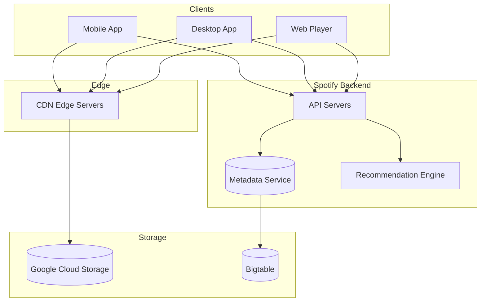
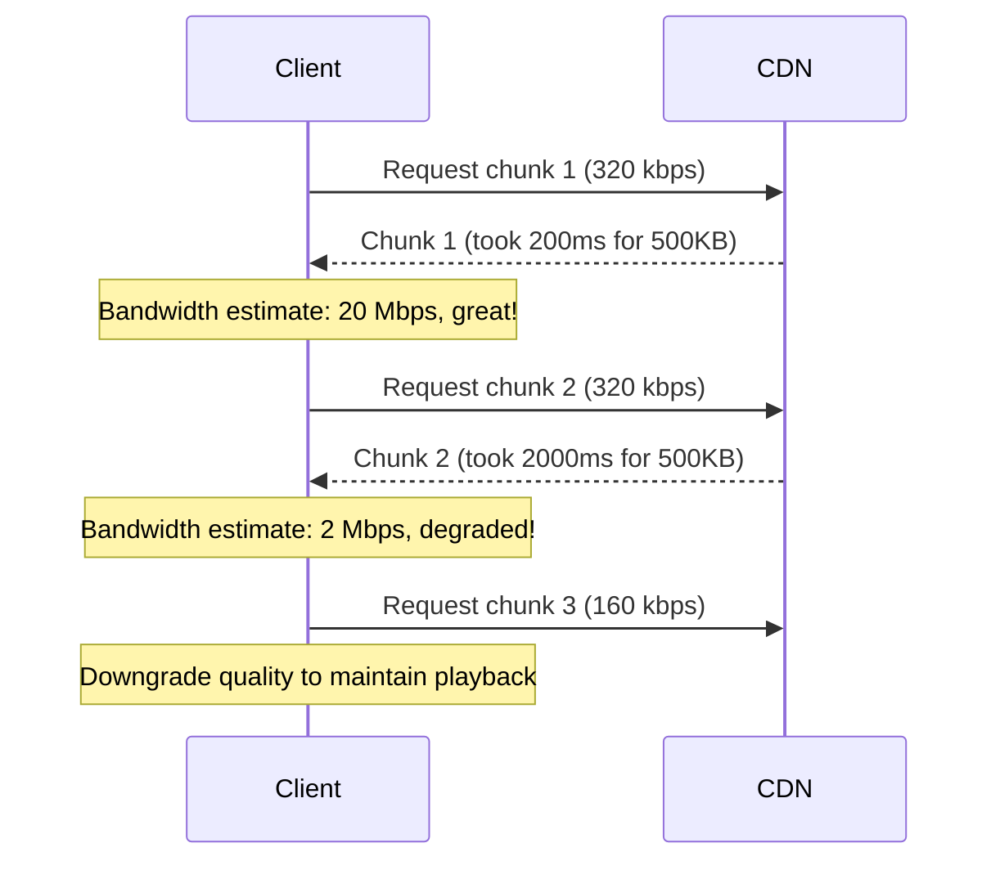
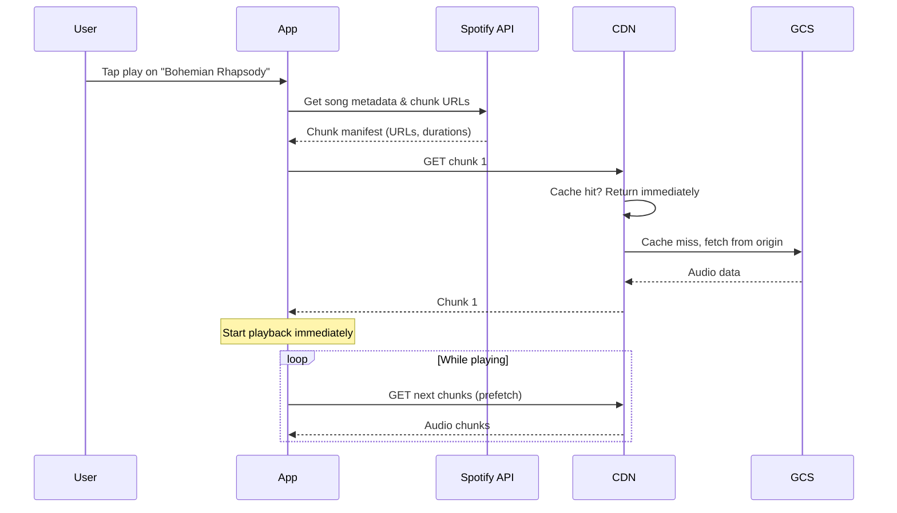
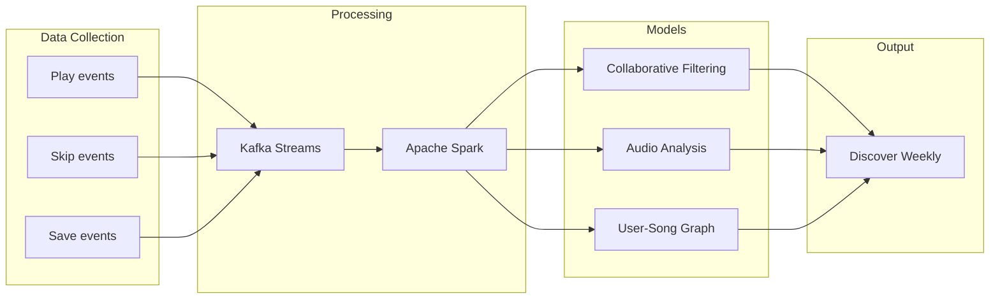
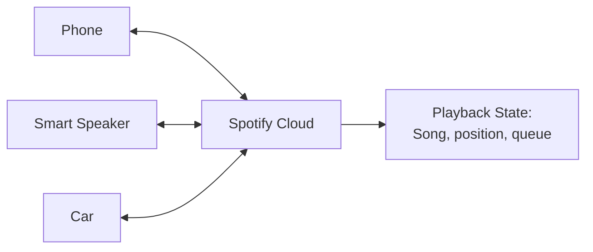

# Chapter 7: Spotify - Streaming Audio to Billions

> *How do you serve 100 million songs to 500 million users, with instant playback and offline support?*

---

## The Problem Statement

### The Business Problem

Spotify's promise:
- Any song, instantly (no download wait)
- Works on terrible networks (commute, airplane mode)
- Personalized recommendations (Discover Weekly)
- Seamless device switching (phone to speaker to car)

The technical challenge:
- 100+ million songs
- 500+ million users
- Petabytes of audio files
- Milliseconds to start playback

### The Naive Implementation

"Store MP3s, serve them via HTTP."

```
Client: GET /songs/abc123.mp3
Server: Return 5 MB file
Client: Play after download completes
```

**Why this breaks:**

1. **Latency**: A 5 MB song at 10 Mbps takes 4 seconds to download. Users expect instant playback.

2. **Bandwidth waste**: User listens for 30 seconds and skips. You served 5 MB, they used 500 KB.

3. **Offline**: No internet = no music. Unacceptable for commuters.

4. **Network variability**: User's bandwidth drops from 10 Mbps to 100 Kbps (tunnel). Music stops.

5. **Storage**: 100 million songs × 5 MB = 500 TB just for audio. Plus multiple quality levels.

### Spotify's Scale (public numbers, 2024)

| Metric | Value |
|--------|-------|
| Monthly active users | 600+ million |
| Premium subscribers | 240+ million |
| Tracks available | 100+ million |
| Daily streams | 1+ billion |
| Countries | 180+ |

---

## Core Architecture

### High-Level View



### The Chunking Solution

Spotify doesn't serve whole songs. It serves **chunks**.

```
Song: "Bohemian Rhapsody" (5:55)
Chunks: [0-10s] [10-20s] [20-30s] ... [350-355s]
Each chunk: ~500 KB (depends on quality)
```

**Benefits:**
- Start playback after first chunk (~200ms)
- Only download what's needed (skip = stop downloading)
- Adaptive quality per chunk (bandwidth changes)
- Cache frequently-played chunks at edge

### Adaptive Bitrate Streaming

**Quality levels:**
| Quality | Bitrate | Bandwidth needed | Use case |
|---------|---------|------------------|----------|
| Low | 24 kbps | 30 kbps | Saving data |
| Normal | 96 kbps | 120 kbps | Mobile default |
| High | 160 kbps | 200 kbps | WiFi |
| Very High | 320 kbps | 400 kbps | Premium, HiFi |

**How it works:**


**The algorithm:**
1. Measure download time for each chunk
2. Estimate available bandwidth
3. Select quality level that downloads faster than playback speed
4. Buffer 10-30 seconds ahead for smoothness

### Request Flow: Play a Song



### Infrastructure Details

**Google Cloud Platform:**
- Spotify migrated from owned data centers to GCP (2016-2018)
- Storage: Google Cloud Storage (GCS) for audio files
- Compute: Google Kubernetes Engine (GKE)
- Data: BigQuery for analytics, Bigtable for metadata

**CDN strategy:**
- Google Cloud CDN for global distribution
- Possibly Fastly or custom CDN for hot markets
- Edge locations: 100+ globally
- Cache hit rate for popular songs: 95%+

**Storage breakdown (estimated):**
```
100 million songs × 4 quality levels = 400 million files
Average file size: 5 MB
Total storage: 2 PB (raw audio)
Plus: Album art, podcasts, metadata = 5+ PB total
```

---

## Deep Dive: The Clever Bits

### 1. Offline Sync: Smart Caching

**The problem:**
User wants to listen offline (flight, subway, no data). What songs to cache?

**The naive approach:**
Let user manually select songs to download. Problem: Users download 100 songs, listen to 10.

**Spotify's approach: Predictive caching**

```
Signals:
- Recently played songs
- Saved/liked songs
- Playlist songs in order
- Time of day patterns (commute playlist at 8 AM)
- Location patterns (gym playlist when near gym)

Cache priority:
1. Currently playing queue
2. Songs played 3+ times this month
3. Saved songs not yet cached
4. Predicted next plays

Storage budget:
- Free tier: 3 GB cache
- Premium: 10 GB cache
- Podcasts: Separate budget
```

**The smart part:**
Cache is opportunistic. On WiFi? Pre-download likely songs. On cellular? Only download current playback. Battery low? Reduce prefetch.

### 2. Audio Codec Evolution

**The codec journey:**

| Era | Codec | Why |
|-----|-------|-----|
| 2008 | Ogg Vorbis | Open source, good quality |
| 2016 | AAC (for some content) | Better iOS compatibility |
| 2021 | HE-AAC v2 | Better quality at low bitrates |

**Why Ogg Vorbis originally?**
- No licensing fees (unlike MP3)
- Better quality than MP3 at same bitrate
- Open source encoder/decoder

**The Ogg container:**
- Streaming-friendly (can start mid-file)
- Supports metadata (artist, album)
- Error resilient (corruption doesn't break whole file)

**Trade-off with AAC:**
- AAC: Better hardware support (iPhones decode in hardware)
- Ogg: Better for software decoding (Android, desktop)
- Spotify uses both, selecting based on device

### 3. Recommendation System: Discover Weekly

**The magic:**
Every Monday, 30 songs you've never heard but will probably love.

**The data pipeline:**



**Three signal types:**

1. **Collaborative filtering:**
   "Users who liked Song A also liked Song B."
   Millions of users = powerful patterns.

2. **Audio analysis:**
   Neural networks analyze audio features (tempo, key, energy).
   "You like fast songs with guitar."

3. **Natural language processing:**
   Analyze blog posts, reviews, playlists about songs.
   "This song is described as 'summer vibes'—you play 'summer' playlists."

**Infrastructure:**
- Daily batch job (Spark) processes billions of events
- Personalized models updated weekly
- Playlist generated Monday 00:00 UTC per timezone
- 100+ million personalized playlists generated in hours

### 4. Connect: Seamless Device Switching

**The scenario:**
Playing on phone. Walk into living room. Transfer to smart speaker. No interruption.

**How Spotify Connect works:**



**The protocol:**
1. All devices report to cloud (MQTT or similar)
2. Cloud maintains authoritative playback state
3. When you switch, new device fetches state and resumes
4. Old device becomes remote control

**Challenges:**
- **Latency**: State sync must be fast (< 1 second)
- **Conflict**: What if two devices try to play different songs?
- **Offline**: What if the phone loses connection mid-transfer?

**Solution:**
- Optimistic updates (assume success)
- Last-writer-wins for conflicts
- Graceful degradation (offline device continues independently)

---

## Failure Modes & Recovery

### Scenario 1: CDN Cache Miss Storm

**The scenario:**
New album drops (Taylor Swift). 50 million users try to play at midnight.

**The problem:**
- Album not in cache (new content)
- All requests go to origin
- Origin overloaded

**Mitigations:**

1. **Pre-warming:**
   - For known releases, push to CDN edge before launch
   - Cache populated before demand

2. **Request coalescing:**
   - 1000 requests for same file hit CDN simultaneously
   - CDN sends ONE request to origin
   - All 1000 requesters wait for same response

3. **Staggered release:**
   - Release at midnight per timezone
   - Spreads load over 24 hours

### Scenario 2: Playback Stuttering

**The scenario:**
User on train. Network bandwidth fluctuating wildly.

**Detection:**
- Buffer level drops below threshold
- Download speed < playback speed

**Response:**
```
Buffer < 5 seconds:
  → Downgrade quality immediately
  → Increase prefetch aggressiveness

Buffer empty:
  → Pause playback
  → Show "buffering" indicator
  → Attempt reconnection

Network unavailable:
  → Switch to offline cache if available
  → "No internet connection" message
```

**Client-side buffering strategy:**
- Target buffer: 30 seconds ahead
- Minimum buffer to start: 2 seconds
- Quality upgrade threshold: 60 seconds buffer

### Scenario 3: Metadata Service Outage

**The scenario:**
Can't fetch song metadata. Search returns nothing.

**Impact:**
- Can't browse or search catalog
- Currently playing continues (client has metadata)
- Offline content works

**Graceful degradation:**
- Client caches recent metadata (albums, playlists)
- Show cached content first
- "Some features unavailable" banner
- Retry metadata fetch in background

---

## Scale Numbers & Mental Models

### Mental Model: The Radio Station

Think of Spotify as a personal radio station:

| Radio | Spotify |
|-------|---------|
| Song library | 100M tracks on GCS |
| DJ | Recommendation algorithm |
| Radio transmitter | CDN |
| Antenna | Your device's network |
| Recorder (for replay) | Offline cache |

The key insight: Unlike radio (broadcast), Spotify is unicast to millions. CDN caching makes this economical.

### Bandwidth Math

**Per-stream cost:**
```
Premium user listening (320 kbps):
- Per hour: 320 kbps × 3600s / 8 = 144 MB
- Per month (30 hours): 4.3 GB

Active user base: 300 million
Monthly streams: 300M × 30 hours = 9 billion hours
Bandwidth: 9B hours × 144 MB = 1.3 exabytes/month
```

At $0.01/GB, that's $13 million/month just for bandwidth. CDN caching reduces this dramatically.

### Latency Budget

**Time to first audio:**
```
App tap to API:         50ms
API processing:         20ms
Metadata response:      30ms
CDN request:            20ms
CDN response (chunk 1): 100ms (first byte)
Audio decode:           10ms
──────────────────────────────
Total:                  ~230ms to start playback
```

Premium experience: Music starts in under 500ms.

---

## Historical Evolution

### 2006-2008: The P2P Era

**Original architecture:**
- Peer-to-peer (P2P) music delivery
- Users' computers served content to each other
- Reduced bandwidth costs dramatically

**Why P2P:**
- CDNs were expensive in 2008
- Legal music streaming was new
- Leverage user bandwidth

**Infrastructure:**
- Small central catalog
- P2P overlay network
- Falls back to servers when no peers

### 2011-2014: Mobile Takes Over

**The shift:**
- Mobile apps launched
- Mobile doesn't work well with P2P (battery, data costs)
- Gradual move to CDN-based delivery

**Key changes:**
- Offline mode for premium
- Adaptive bitrate streaming
- Mobile-first data efficiency

### 2016-2018: Google Cloud Migration

**The migration:**
- From owned data centers to GCP
- Took 2+ years
- 100+ engineering teams involved

**Why migrate:**
- Scale beyond own data center capacity
- Global presence (GCP in more regions)
- Focus engineering on product, not infrastructure

**Challenges:**
- Migrating petabytes of data
- Rewriting services for cloud-native
- Maintaining service during migration

### 2020+: Podcasts and Beyond

**The platform evolution:**
- Podcasts: 5+ million podcasts
- Audiobooks: New content type
- Live audio: Greenroom (discontinued)
- AI DJ: Personalized radio with AI commentary

**Technical implications:**
- Podcast files are larger (1+ hour episodes)
- Different caching strategy (less relistening)
- Speech-specific codecs and compression

---

## Key Takeaways

1. **Chunking is essential for streaming**: Serving whole files fails at scale. Chunks enable instant playback, efficient bandwidth, and adaptive quality.

2. **CDN economics drive architecture**: At Spotify's scale, bandwidth costs dominate. High cache hit rates are essential for profitability.

3. **Offline is a first-class citizen**: Predictive caching makes offline feel magical, not like a fallback mode.

4. **Recommendations are infrastructure**: The data pipeline for Discover Weekly processes billions of events. Recommendations at scale require serious engineering.

5. **Migration to cloud is hard but worth it**: Spotify's GCP migration took years but enabled global scale and faster feature development.

---

## Further Reading

- [How Spotify Uses Google Cloud](https://cloud.google.com/customers/spotify) - Google Cloud case study
- [Spotify's Event Delivery System](https://engineering.atspotify.com/2020/07/event-delivery/) - Data pipeline architecture
- [The Magic That Makes Spotify's Discover Weekly So Damn Good](https://engineering.atspotify.com/2015/09/spotifys-discover-weekly-how-machine-learning-finds-your-new-music/) - Recommendation system
- [Spotify Engineering Blog](https://engineering.atspotify.com/) - Ongoing technical posts

---

*Next chapter: [Google Docs - Real-time Collaboration](../08-google-docs/README.md)*
