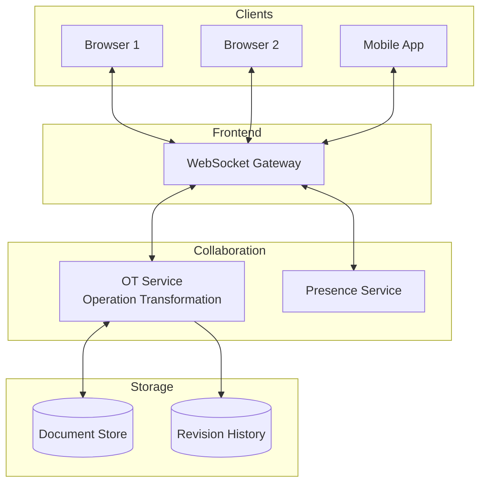
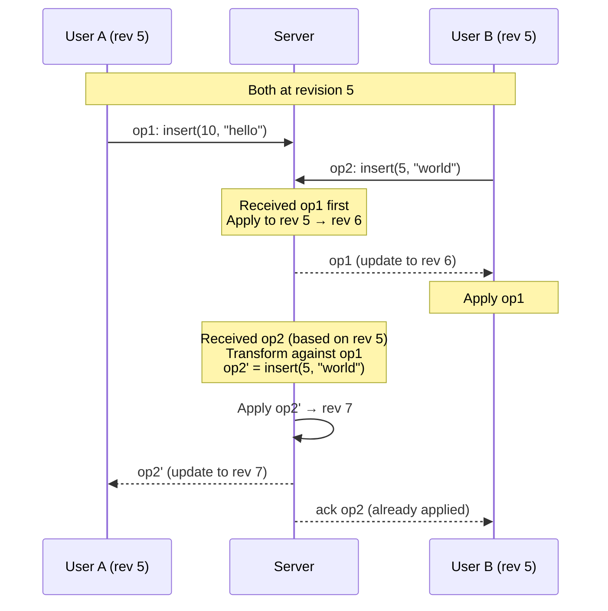
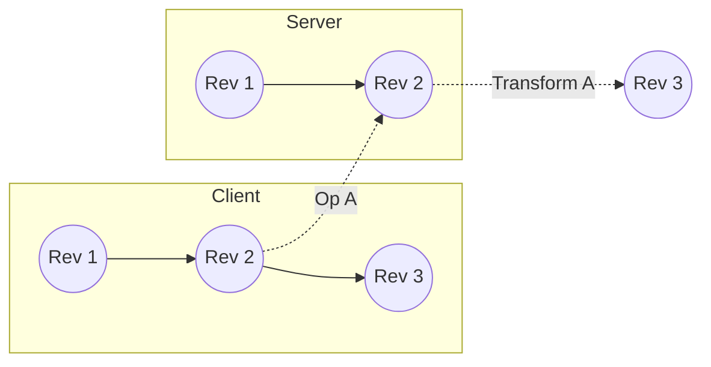
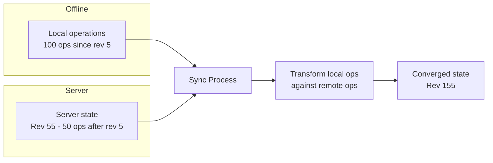

# Chapter 8: Google Docs - Real-time Collaboration

> *How do multiple people edit the same document simultaneously without conflicts?*

---

## The Problem Statement

### The Business Problem

Before Google Docs (2006):
- Email a Word document to 5 people
- Receive 5 different edited versions
- Manually merge changes
- Repeat until deadline

Google Docs' promise:
- Everyone edits the same document
- Changes appear instantly
- No version conflicts
- Works offline, syncs when back online

### The Naive Implementation

**Option 1: File locking**
```
User A opens document → Document locked
User B tries to open → "Document in use by User A"
```

Problem: Collaboration is impossible.

**Option 2: Last-writer-wins**
```
User A edits paragraph 1
User B edits paragraph 2
User B saves last
→ User A's changes are lost
```

Problem: Work gets lost.

**Option 3: Full sync after each keystroke**
```
User A types 'H'
→ Send entire document to server
→ Server broadcasts to all users
→ Everyone gets the full document
```

Problem: At 100 characters/minute × 10 users, you're sending gigabytes of data for a single session.

### The Real Challenge

The core problem: **Concurrent edits at the same location**.

```
Document: "Hello World"
User A: Insert "Beautiful " at position 6 → "Hello Beautiful World"
User B: Insert "New " at position 6 → "Hello New World"

What should the result be?
- "Hello Beautiful New World"? (merge both)
- "Hello New Beautiful World"? (opposite order)
- "Hello Beautiful World"? (only A's change)
```

The answer must be **deterministic**—all users must converge to the same result.

---

## Core Architecture

### High-Level View



### The Operational Transformation (OT) Approach

Google Docs uses **Operational Transformation**, not CRDTs (more on this later).

**The key insight:**
Don't send documents. Send **operations**.

```
Operation = {
  type: "insert" | "delete",
  position: number,
  content: string (for insert),
  length: number (for delete),
  author: user_id,
  revision: number
}
```

**Example:**
```
Document v1: "Hello"

User A operation: insert(5, " World") → "Hello World"
User B operation: insert(5, " There") → "Hello There"

Both start from v1. How do we merge?
```

### The Transform Function

When two operations conflict, we **transform** one to account for the other.

```
transform(op1, op2) → (op1', op2')

where:
  apply(apply(doc, op1), op2') == apply(apply(doc, op2), op1')
```

**Example transform:**
```
Doc: "Hello" (length 5)
Op A: insert(5, " World") — at position 5, insert " World"
Op B: insert(5, " There") — at position 5, insert " There"

A goes first:
  Doc after A: "Hello World"
  Transform B: insert(5, " There") → insert(5, " There")
  Doc after B': "Hello There World"

B goes first:
  Doc after B: "Hello There"
  Transform A: insert(5, " World") → insert(11, " World")
  Doc after A': "Hello There World"

Both paths converge to: "Hello There World"
```

**Wait, why did B stay at position 5 but A moved to 11?**

The transform function is not symmetric. When A inserts at position 5 and B also inserts at position 5:
- A gets to keep its position (first in some ordering)
- B must shift by the length of A's insert

The "ordering" is determined by user ID or timestamp—a consistent tiebreaker.

### Request Flow: Editing a Document



### Infrastructure Details

**Document storage:**
- Each document has a unique ID
- Current content stored in a document store (likely Bigtable or Spanner)
- Full revision history stored separately (compressed)

**Operation processing:**
- Operations serialized through a single queue per document
- Guarantees ordering (no concurrent writes to same document state)
- The OT server is the "source of truth" for operation order

**Presence and cursors:**
- Separate service for real-time presence
- Each user's cursor position broadcast via WebSocket
- Lower consistency requirements (eventual is fine)

**Scale estimate:**
- Millions of documents with concurrent editors
- Each active document: 1-50 concurrent users
- Operations per document: 1-100 per second (typing speed)

---

## Deep Dive: The Clever Bits

### 1. The Jupiter Protocol

Google Docs uses a variant of OT called the **Jupiter protocol** (from the 1995 Jupiter collaboration system).

**The state space:**
Each client and server maintains a **state vector**:
```
Client state: (client_sent, server_received)
Server state for client: (server_sent, client_received)
```

**Why the state vector matters:**

```
Client sends op1, op2, op3 without waiting for acks
Server might receive them as op1, op3, op2 (network reordering)

State vector ensures:
- Operations applied in sent order
- Client doesn't re-apply its own ops when broadcast back
```

**The transformation bridge:**



When client is at revision 3 but server only knows revision 2, the server must transform incoming operations across the gap.

### 2. CRDTs: The Alternative Approach

**CRDT** (Conflict-free Replicated Data Type) is an alternative to OT.

**Key difference:**
- **OT**: Transform operations to resolve conflicts
- **CRDT**: Design data structure so all operations commute (order doesn't matter)

**CRDT example (LSeq/RGA):**
```
Each character has a unique, ordered ID:
  "Hello" = [(id1,'H'), (id2,'e'), (id3,'l'), (id4,'l'), (id5,'o')]

Insert between id2 and id3:
  New character gets id: between(id2, id3) → id2.5
  "Hello" → [(id1,'H'), (id2,'e'), (id2.5,'X'), (id3,'l'), ...]
```

**Why Google chose OT over CRDTs:**

| Aspect | OT | CRDT |
|--------|----|----|
| Complexity | Simpler operations | Complex IDs, tombstones |
| Memory | Compact | Can grow unbounded (deleted chars remembered) |
| Server role | Central coordinator | Can be peer-to-peer |
| History | Easy to reconstruct | Need to track all tombstones |
| Maturity (2006) | Well-understood | Still being researched |

**The tide is shifting:**
Modern apps like Figma use CRDTs. For peer-to-peer scenarios (no server), CRDTs are necessary.

### 3. Cursor Synchronization

**The problem:**
User A's cursor is at position 50. User B inserts 10 characters at position 20. Where is A's cursor now?

**Solution:**
Cursors are transformed just like text operations.

```
Cursor A at position 50
Operation: insert(20, "Hello ")  // 6 characters

Transform cursor:
  Position 50 > 20 (insert position)
  New cursor position: 50 + 6 = 56
```

**Cursor presence protocol:**
```
Every 100ms (or on change):
  Client → Server: {cursor_position, selection_start, selection_end}
  Server → All clients: {user_id, color, name, position}
```

**Why cursors are separate from OT:**
- Cursors are ephemeral (not persisted)
- Lower consistency requirements (eventual is fine)
- Higher frequency (moves constantly)
- Lost cursor update is not critical

### 4. Offline Mode and Sync

**The scenario:**
User goes offline on airplane. Edits document for 2 hours. Reconnects.

**The challenge:**
Document has diverged. 100 operations offline, 50 operations from other users online.

**The solution:**



**Step by step:**
1. Client reconnects, sends: "I'm at revision 5, here are my 100 operations"
2. Server: "I'm at revision 55. Here are operations 6-55"
3. Client transforms its 100 operations against the 50 server operations
4. Client sends transformed operations to server
5. Server applies them, reaching a converged state
6. All clients now at same revision

**The complexity:**
Transforming 100 operations against 50 operations = up to 5,000 transforms. Can be slow for long offline periods.

**Google's approach:**
- Checkpoints: Periodically save document snapshots
- Collapse operations: Merge many small operations into fewer large ones
- Conflict resolution UI: For severe conflicts, show the user

---

## Failure Modes & Recovery

### Scenario 1: WebSocket Disconnection

**Detection:**
- Heartbeat timeout (typically 30 seconds)
- Explicit disconnect event

**Client behavior:**
```
On disconnect:
  1. Continue accepting local edits (queue operations)
  2. Show "offline" indicator
  3. Attempt reconnection (exponential backoff)

On reconnect:
  1. Send queued operations
  2. Receive missed operations
  3. Transform and merge
  4. Update UI
```

**What's at risk:**
- Operations during disconnect are local-only
- If browser crashes, unsent operations are lost
- Mitigation: IndexedDB persistence of pending operations

### Scenario 2: OT Server Overload

**The scenario:**
A document has 100 concurrent editors (company-wide meeting notes).

**The problem:**
- 100 users typing at 5 characters/second = 500 operations/second
- Each operation must be serialized (one at a time per document)
- OT transform time adds up

**Mitigations:**

1. **Operation batching:**
   - Client batches keystrokes (e.g., every 200ms)
   - "insert(5,'H'), insert(6,'e'), insert(7,'l')" → "insert(5,'Hel')"

2. **Document partitioning:**
   - Treat separate paragraphs as independent regions
   - Operations in different regions can be parallel

3. **Rate limiting:**
   - If document exceeds X ops/second, queue incoming
   - Latency increases, but system stays stable

### Scenario 3: Data Corruption

**The scenario:**
A bug in OT causes documents to diverge. User A sees one thing, User B sees another.

**Detection:**
- Periodic checksum verification
- Server broadcasts document hash after each N operations
- Client compares local hash to server hash

**Recovery:**
```
If checksum mismatch:
  1. Client requests full document from server
  2. Client discards local state
  3. Client replays recent local operations on fresh state
  4. Alert engineering (this is a serious bug)
```

**Prevention:**
- Extensive testing of transform functions
- Property-based testing: "For any two operations, transform converges"
- Formal verification of OT algorithms

---

## Scale Numbers & Mental Models

### Mental Model: The Newspaper Editor

Think of Google Docs like a newspaper editing room:

| Newspaper | Google Docs |
|-----------|-------------|
| Editor-in-chief | OT server (decides final order) |
| Copy editors | Users (make changes) |
| Editorial changes | Operations |
| Page proofs | Document revisions |
| "Hold the presses!" | Conflict resolution |

The editor-in-chief sees all changes and decides the order. Copy editors work simultaneously, but their changes are coordinated through the central authority.

### Operation Volume

**Per-document estimates:**
```
Active editors: 1-50 (typical: 2-5)
Keystrokes/minute/user: 200-400
Operations/minute (batched): 50-100 per user

Very active document (10 users):
  1,000 operations/minute
  60,000 operations/hour
  1 operation every 60ms
```

**Platform scale:**
```
Active documents: Millions
Operations/second globally: Millions
Storage: Petabytes of document history
```

### Latency Budget

**Local edit to remote visibility:**
```
Local operation generation:    5ms
Batch wait:                    100-200ms (batching keystrokes)
Upload to server:              50ms
OT processing:                 5ms
Broadcast to other clients:    50ms
Remote client apply:           5ms
──────────────────────────────────
Total:                         215-315ms
```

Real-world: Most collaborative edits appear within 300ms for users in same region.

---

## Historical Evolution

### 2006: Google Docs Launch

**Original stack:**
- Acquired Writely (a startup)
- Basic OT implementation
- Single data center
- Limited real-time (polling-based initially)

### 2010: Real-time Collaboration

**Key improvements:**
- True real-time via persistent connections
- Cursor synchronization
- Revision history
- Conflict resolution improvements

### 2014: Offline Mode

**The challenge:**
- Work without internet
- Sync when reconnected
- Don't lose work

**Solution:**
- Service workers for offline capability
- IndexedDB for local storage
- Sophisticated sync protocol

### 2018+: Modern Era

**Recent features:**
- Comments and suggestions workflow
- Version history with named versions
- Integration with Google Drive, Meet
- Smart compose (AI-powered suggestions)
- Markdown support

**Infrastructure evolution:**
- Multi-region deployment
- Enhanced OT for tables, images, embedded content
- Better performance for very large documents

---

## Key Takeaways

1. **Operations, not documents**: Send small deltas, not full content. This is fundamental to real-time collaboration.

2. **OT is subtle but essential**: The transform function must satisfy strict mathematical properties or documents diverge.

3. **Central coordinator simplifies**: Google Docs uses a central server to order operations. Peer-to-peer alternatives (CRDTs) are more complex.

4. **Offline is hard**: Syncing after long offline periods requires careful operation transformation and conflict resolution.

5. **Cursors are separate**: Presence/cursors have different consistency requirements than document content.

---

## Further Reading

- [Google Wave and Operational Transformation](https://svn.apache.org/repos/asf/incubator/wave/whitepapers/operational-transform/operational-transform.html) - Technical whitepaper
- [Real-time Collaborative Editing: Jupiter, CRDTs, and OT](https://www.youtube.com/watch?v=S2Hp_1jqpY8) - Conference talk
- [CRDTs and the Quest for Distributed Consistency](https://www.youtube.com/watch?v=B5NULPSiOGw) - Martin Kleppmann
- [Building Collaborative Applications](https://www.figma.com/blog/how-figmas-multiplayer-technology-works/) - Figma's CRDT approach

---

*Next chapter: [Twitter Timeline - The Celebrity Problem](../../part-4-social-feeds/09-twitter-timeline/README.md)*
