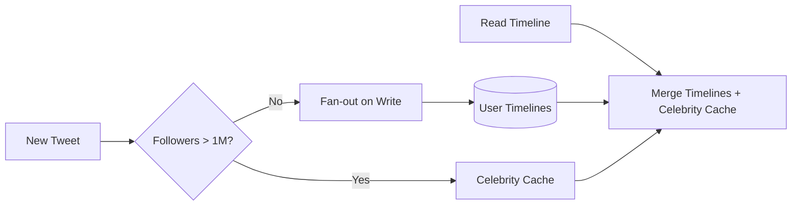
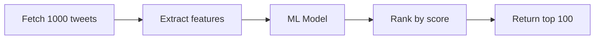

# Chapter 9: Twitter Timeline - The Celebrity Problem

> *How do you show everyone what Lady Gaga just tweeted, in real-time, without melting your servers?*

---

## The Problem Statement

### The Business Problem

Twitter's core promise:
- Follow interesting people
- See their tweets in your timeline
- In real-time (the platform for live events)

The scale:
- 500+ million tweets per day
- Some accounts have 100+ million followers
- Timeline must load in under 500ms

### The Naive Implementation

**Pull-based approach:**
```sql
SELECT * FROM tweets
WHERE user_id IN (SELECT following FROM follows WHERE follower = ?)
ORDER BY created_at DESC
LIMIT 100
```

**Why this breaks:**

1. **The IN clause from hell**: If you follow 1,000 people, this becomes:
   ```sql
   WHERE user_id IN (id1, id2, id3, ... id1000)
   ```
   Database performance degrades with large IN clauses.

2. **Hot accounts**: Lady Gaga has 85 million followers. When she tweets, 85 million timeline queries suddenly need to include her tweet. Database melts.

3. **Real-time expectations**: Users want new tweets immediately. Polling every 30 seconds means average latency of 15 seconds. Not "real-time."

4. **Fan-out math**:
   - 500 million tweets/day = 5,800 tweets/second
   - Average followers: 200
   - Timeline updates needed: 5,800 × 200 = 1.16 million/second

   And that's just average—celebrities skew this massively.

### Two Fundamental Approaches

| Approach | When | Pros | Cons |
|----------|------|------|------|
| **Fan-out on Read** | At read time | Simple writes | Slow reads, hot spots |
| **Fan-out on Write** | At write time | Fast reads | Slow/expensive writes |

Twitter's journey: Pull → Push → Hybrid.

---

## Core Architecture

### The Timeline Service

```mermaid
flowchart TB
    subgraph Write Path
        Tweet[New Tweet] --> FO[Fan-out Service]
        FO --> Q1[Redis Timeline 1]
        FO --> Q2[Redis Timeline 2]
        FO --> Q3[Redis Timeline N...]
    end

    subgraph Read Path
        Client[Client] --> TL[Timeline Service]
        TL --> Cache[(Redis)]
        TL --> Fallback[(MySQL)]
    end

    subgraph Merge
        TL --> Merge[Merge & Rank]
        Celeb[(Celebrity Tweets)] --> Merge
    end
```

### Fan-out on Write: The Early Design

When a user tweets:
1. Get list of followers
2. Write tweet ID to each follower's timeline cache
3. Each user has a Redis list of tweet IDs

```
User @jack follows: [@biz, @ev, @noah]
@biz tweets (tweet_id: 12345)

Fan-out:
  LPUSH timeline:jack 12345
  LPUSH timeline:other_follower_1 12345
  LPUSH timeline:other_follower_2 12345
  ... (repeat for all followers)
```

**Benefits:**
- Reading timeline = LRANGE (Redis list read) = milliseconds
- No complex queries at read time
- Timeline already sorted (Redis list maintains order)

**The problem: Celebrity fan-out**

```
@ladygaga tweets
→ Fan out to 85 million timelines
→ 85 million Redis writes
→ At 100,000 writes/second, takes 850 seconds (14+ minutes)
```

Users don't see @ladygaga's tweet for 14 minutes. That's not real-time.

### The Hybrid Approach

Twitter's solution: **Different strategies for different account types.**



**For regular accounts (< 1M followers):**
- Fan-out on write (fast for readers, manageable for writers)
- Tweet appears in followers' timelines immediately

**For celebrities (> 1M followers):**
- Don't fan out
- Store tweet in celebrity cache
- At read time, merge user's timeline with followed celebrities

**The merge operation:**
```
Timeline read for @jack (follows @ladygaga):
1. Get @jack's precomputed timeline (1000 tweets)
2. Get @ladygaga's recent tweets (10 tweets)
3. Merge-sort by timestamp
4. Return top 100
```

### Infrastructure Details

**Timeline cache (Redis):**
- Each user: Redis list of tweet IDs
- List size: ~800 tweets (trim older)
- Memory per user: ~10 KB
- Total: 400M users × 10 KB = 4 TB Redis

**Redis cluster:**
- Hundreds of Redis instances
- Sharded by user ID
- Each instance: 64-128 GB RAM
- Replication for failover

**Tweet storage:**
- Tweets stored in MySQL (Manhattan, later)
- Tweet ID → full tweet content
- Denormalized for fast reads

**The real numbers (2012 era):**
- 400,000+ tweets/minute
- Timeline reads: millions/second
- Redis cluster: 10s of TB RAM
- Fan-out delay (95th percentile): < 5 seconds

---

## Deep Dive: The Clever Bits

### 1. The 1% That Causes 99% of the Work

**Power law of followers:**
- 99% of users have < 1,000 followers
- 0.1% of users have > 1,000,000 followers
- That 0.1% causes majority of fan-out work

**The math:**
```
1 million regular users tweet
  Each has 200 followers average
  Total fan-out: 200 million writes

1 celebrity tweets
  85 million followers
  Total fan-out: 85 million writes

One celebrity tweet = 42% of a million regular tweets
```

**Twitter's threshold:**
Accounts above ~1M followers (or high fan-out rate) are treated as "heavy hitters" and handled differently.

### 2. Timeline Ranking: Not Just Chronological

**Original timeline:** Pure reverse-chronological. Simple.

**Modern timeline ("For You"):** Ranked by relevance.

**Ranking signals:**
- Recency (newer is better)
- Engagement (likes, retweets on this tweet)
- Author relationship (do you engage with this person?)
- Content type (images, links, polls)
- Negative signals (hidden, reported similar content)

**The ranking pipeline:**


**Infrastructure for ranking:**
- Feature store (precomputed features for tweets and users)
- ML model serving (TensorFlow, optimized for latency)
- A/B testing framework (which ranking model performs better?)

### 3. Tweet Deletion: The Consistency Challenge

**The problem:**
User deletes a tweet. It's been fanned out to 10 million timelines.

**Option 1: Eager deletion**
```
Delete tweet → Remove from 10 million timeline caches
```
Problem: Takes too long, and timeline caches are ephemeral anyway.

**Option 2: Lazy deletion**
```
Delete tweet → Mark as deleted in tweet store
Timeline read → Filter out deleted tweets
```
Problem: Need to check every tweet's deletion status.

**Twitter's approach: Hybrid**
1. Mark tweet as deleted (immediate)
2. Timeline reads check tweet store for deleted status (adds latency)
3. Background job eventually removes from caches (eventual cleanup)

**The grace period:**
- Deleted tweets may appear for seconds (cache lag)
- Twitter's UI: "This tweet was deleted"
- Legal: Deleted tweets may still exist in caches briefly

### 4. The "While You Were Away" Problem

**Scenario:**
User opens Twitter after 8 hours. Their timeline has moved on—the interesting tweets from 8 hours ago are buried.

**Solution: Summary tweets**
```
"While you were away, these tweets got lots of engagement:"
- Tweet from 6 hours ago (1000 likes from your network)
- Tweet from 5 hours ago (retweeted by someone you engage with)
```

**How it works:**
1. Track "last seen" timestamp per user
2. On return, query for high-engagement tweets since then
3. Compute "interest score" based on user's graph
4. Surface top N as "catch-up" section

---

## Failure Modes & Recovery

### Scenario 1: Fan-out Backlog

**The scenario:**
Breaking news event. Millions of tweets per minute. Fan-out queue backs up.

**Detection:**
- Queue depth monitoring
- Fan-out latency percentiles spike
- User complaints: "I can't see recent tweets"

**Response:**
```
Queue depth > threshold:
  1. Increase fan-out workers (auto-scale)
  2. Prioritize verified/high-engagement accounts
  3. Shed load: Delay fan-out for low-engagement tweets

Extreme case:
  1. Switch to pull-based for some users
  2. "Timeline may be delayed" banner
```

### Scenario 2: Redis Timeline Corruption

**The scenario:**
Redis node crashes. Timeline data for 1 million users is lost.

**Impact:**
- Those users see empty/stale timelines
- Not catastrophic: Timelines are caches, not source of truth

**Recovery:**
1. Failover to Redis replica (if available)
2. If no replica: Rebuild timelines from tweet store
3. Rebuild is slow—prioritize active users

**Rebuild process:**
```
For each affected user:
  1. Get list of accounts they follow
  2. Query recent tweets from those accounts
  3. Populate timeline cache
```

### Scenario 3: Celebrity Account Compromise

**The scenario:**
Celebrity account hacked. Attacker posts spam to 50 million followers.

**Immediate response:**
1. Lock account (stop new tweets)
2. Delete spam tweet
3. Lazy deletion means millions already saw it

**Fan-out damage:**
- Tweet already fanned out to millions
- Deletion is slower than creation
- Some users will see spam for minutes

**Prevention:**
- Anomaly detection: "This account usually tweets 5x/day, now 100x/hour"
- Rate limiting on high-follower accounts
- Login alerts for suspicious activity

---

## Scale Numbers & Mental Models

### Mental Model: The Newspaper Analogy

| Newspaper | Twitter |
|-----------|---------|
| Printing press | Tweet creation |
| Delivery trucks | Fan-out service |
| Your doorstep | Your timeline cache |
| Morning edition | Precomputed timeline |
| "Special edition" | Celebrity merge at read time |

The key insight: Traditional newspapers print one edition for everyone. Twitter prints a personalized edition for each user. Fan-out on write is like pre-printing and delivering your personalized paper. Fan-out on read is like going to the newsstand and asking them to assemble a custom paper just for you.

### Timeline Math

**Per-user timeline:**
```
Follows: 500 accounts average
Tweets/day from followed: 500 × 5 = 2,500 tweets
Timeline cache size: 800 tweets (12 hours typical)
Memory: 800 × 8 bytes (ID) = 6.4 KB per user
```

**Platform scale:**
```
Active users: 400 million
Timeline cache total: 400M × 10KB = 4 TB
Tweets/day: 500 million
Fan-out writes/day: 500M × 200 avg followers = 100 billion
Fan-out writes/second: 1.16 million
```

### Latency Budget

**Timeline read (cache hit):**
```
API gateway:              10ms
Timeline service:         5ms
Redis lookup:             2ms
Tweet hydration:          20ms (get full tweet content)
Ranking (if enabled):     30ms
Response serialization:   5ms
───────────────────────────
Total:                    72ms
```

**Tweet creation (small account):**
```
API gateway:              10ms
Write to tweet store:     10ms
Enqueue fan-out:          5ms
Fan-out (async):          200ms (background)
───────────────────────────
Visible to author:        25ms
Visible to followers:     ~200ms
```

---

## Historical Evolution

### 2006-2009: The Pull Era

**v1 Architecture:**
- MySQL database
- Timeline = SQL query at read time
- Worked for thousands of users

**The Fail Whale:**
- Twitter went down constantly
- "Twitter is over capacity"
- Pull-based couldn't handle growth

### 2010-2012: The Push Era

**Fan-out on Write introduced:**
- Timeline stored in memory (Memcached, then Redis)
- Tweets pushed to follower timelines
- Dramatically faster reads

**Infrastructure:**
- FlockDB for social graph (who follows whom)
- Redis cluster for timelines
- MySQL for tweet storage

### 2013-2016: The Hybrid Era

**The realization:**
Fan-out on write doesn't work for celebrities.

**The solution:**
- Tiered fan-out (celebrities handled differently)
- Timeline mixing (merge at read time)
- Introduction of ranking

### 2017+: The Algorithm Era

**"For You" timeline:**
- ML-ranked by default
- Chronological as optional
- Real-time engagement signals

**Infrastructure modernization:**
- Move from Ruby to Scala/Java
- Manhattan (Twitter's distributed database) replaces MySQL
- GraphQL for API

---

## Key Takeaways

1. **The celebrity problem is universal**: Any system with power-law distribution (few accounts with many followers) faces this. Fan-out on write breaks for the top 0.1%.

2. **Hybrid approaches win**: Neither pure push nor pure pull works at scale. The right answer is usually "both, depending on context."

3. **Timelines are caches, not sources of truth**: Tweets are stored separately. Timelines can be rebuilt. This separation is crucial for recovery.

4. **Deletion is harder than creation**: Fan-out happens once; deletion must undo fan-out across all replicas.

5. **Ranking changes everything**: Modern timelines aren't just reverse-chronological. Ranking introduces ML infrastructure and latency budgets.

---

## Further Reading

- [The Architecture Twitter Uses to Deal with 150M Active Users](https://www.infoq.com/presentations/Twitter-Timeline-Scalability/) - InfoQ presentation
- [Timelines at Scale](https://www.infoq.com/presentations/Twitter-Timelines-Scale/) - Raffi Krikorian at QCon
- [How Twitter Uses Redis to Scale](https://redis.io/blog/10-tips-for-using-redis-in-production/) - Redis case study
- [The Infrastructure Behind Twitter: Scale](https://blog.twitter.com/engineering) - Twitter Engineering Blog

---

*Next chapter: [Reddit - Votes, Hot Rankings, and Subreddits](../10-reddit/README.md)*
