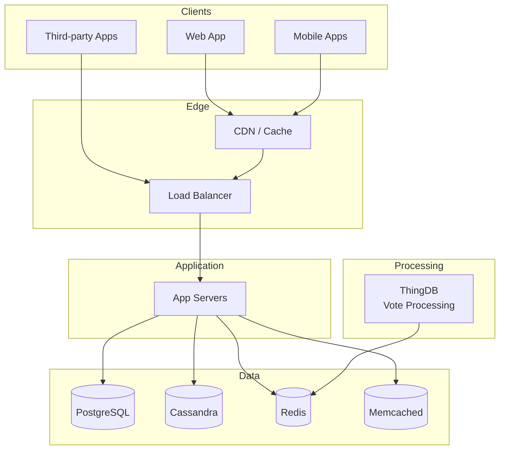
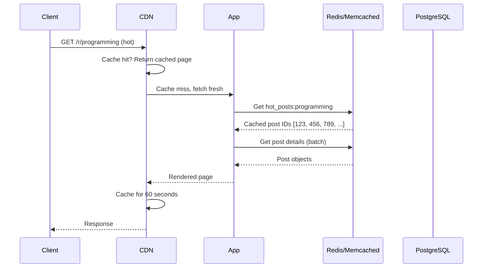
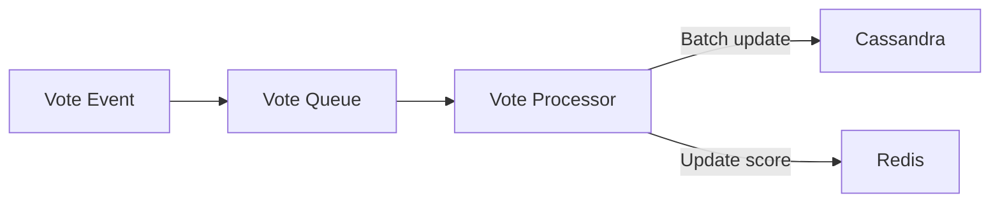

# Chapter 10: Reddit - Votes, Hot Rankings, and Subreddits

> *How do you rank millions of posts across thousands of communities in real-time?*

---

## The Problem Statement

### The Business Problem

Reddit's core mechanic: **community-based voting determines visibility.**

- Users submit posts to subreddits (communities)
- Other users upvote or downvote
- "Hot" posts rise to the top
- "New" posts start at the bottom

The challenge:
- 100,000+ active subreddits
- Millions of posts per day
- Vote counts changing constantly
- Rankings must update in near-real-time

### The Naive Implementation

```sql
SELECT * FROM posts
WHERE subreddit = 'programming'
ORDER BY (upvotes - downvotes) / age_hours DESC
LIMIT 25
```

**Why this breaks:**

1. **Constant recomputation**: Every vote changes the ranking. With 1,000 votes/second, you're recalculating constantly.

2. **Hot vs. New tension**: A 10-hour-old post with 1,000 upvotes vs. a 1-hour-old post with 100 upvotes. Which is "hotter"? The formula matters.

3. **Subreddit isolation**: r/funny has 50 million subscribers. r/obscurehobby has 500. Same ranking algorithm feels wrong.

4. **Vote manipulation**: Bots upvoting posts. How do you detect and prevent?

### Reddit's Scale (public numbers, 2024)

| Metric | Value |
|--------|-------|
| Daily active users | 70+ million |
| Monthly unique visitors | 1.5+ billion |
| Active subreddits | 100,000+ |
| Comments per day | 50+ million |
| Posts per day | 10+ million |

---

## Core Architecture

### High-Level View



### The "Thing" Model

Reddit's data model centers on "things"—a generic entity that can be a post, comment, subreddit, or user.

```python
class Thing:
    thing_id: str      # t3_abc123 (t3 = post, t1 = comment)
    author: str
    created_utc: int
    score: int         # upvotes - downvotes
    ups: int
    downs: int
```

**Why generic?**
- Same voting logic for posts and comments
- Same caching layer
- Same moderation tools
- Simplifies code

### The Hot Ranking Algorithm

Reddit's "hot" algorithm (open source, well-documented):

```python
def hot(ups, downs, created_utc):
    score = ups - downs
    order = log10(max(abs(score), 1))
    sign = 1 if score > 0 else -1 if score < 0 else 0
    seconds = created_utc - 1134028003  # Reddit epoch
    return round(sign * order + seconds / 45000, 7)
```

**What this means:**

| Votes | Hot score contribution |
|-------|----------------------|
| 10 | log₁₀(10) = 1 |
| 100 | log₁₀(100) = 2 |
| 1000 | log₁₀(1000) = 3 |
| 10000 | log₁₀(10000) = 4 |

- 10x more votes = +1 to score
- Each 12.5 hours of age = +1 to score (45000 seconds)
- A new post with 10 votes beats an old post with 100 votes (depending on age gap)

**The logarithm insight:**
Going from 10 to 100 votes has the same impact as going from 1,000 to 10,000. This prevents runaway posts from dominating forever.

### Request Flow: Loading r/programming



### Infrastructure Details

**Database evolution:**
- Early Reddit: Single PostgreSQL
- Grew to: PostgreSQL + Cassandra + Redis

**PostgreSQL for:**
- User accounts
- Subreddit metadata
- Relationships (follows, moderators)

**Cassandra for:**
- Vote data (high write volume)
- Append-only logs
- Horizontal scaling

**Redis for:**
- Hot rankings (sorted sets)
- Rate limiting
- Session data

**Memcached for:**
- Page caching
- Object caching
- Query result caching

---

## Deep Dive: The Clever Bits

### 1. Vote Counting: Eventual Consistency

**The problem:**
A popular post gets 100 votes/second. Updating the score in real-time would melt the database.

**The solution: Asynchronous vote processing**



**The tradeoffs:**
- Vote counts are eventually consistent (seconds of delay)
- Your own votes appear instantly (optimistic UI)
- Score in cache may differ from database briefly

**Why it's acceptable:**
- Users don't notice 5-second delay in vote counts
- Hot ranking doesn't need second-precision
- Reduces write load by 10-100x through batching

### 2. The "Top" Algorithm: Time Windows

**The question:**
What's "Top of all time" vs. "Top today" vs. "Top this hour"?

**Implementation:**
```
For each time window, maintain separate ranking:
- top:hour:subreddit:programming
- top:day:subreddit:programming
- top:week:subreddit:programming
- top:month:subreddit:programming
- top:year:subreddit:programming
- top:all:subreddit:programming
```

**How it works:**
1. Post gets upvoted
2. Update ranking in all relevant windows
3. Hourly job: Expire hour-old data, shift to day bucket
4. Daily job: Expire day-old data, shift to week bucket

**Storage efficiency:**
- Each window: Redis sorted set
- Only top 1000 posts per window per subreddit
- Old posts fall off naturally

### 3. Cross-Posting and Karma

**Cross-posting:**
Same post appears in multiple subreddits. How do votes work?

```
Post X cross-posted to r/A and r/B:
  r/A instance: 500 upvotes
  r/B instance: 200 upvotes
  Total karma for author: 700
```

**Karma:**
Reddit's reputation system—sum of upvotes across all posts/comments.

**Karma farming detection:**
- Accounts that only post, never comment
- Accounts that only post in karma-friendly subreddits
- Accounts that delete downvoted posts quickly
- Pattern: Karma farmers sell accounts for astroturfing

### 4. Subreddit-Specific Rules

**The challenge:**
Each subreddit has different moderation rules, post requirements, and culture.

**Technical implementation:**
```python
class Subreddit:
    posting_rules: {
        min_karma: 100,
        min_account_age: 30,  # days
        allowed_domains: ["youtube.com", "imgur.com"],
        title_min_length: 10,
        flair_required: true
    }
    automod_rules: [...]  # Custom moderation rules
```

**AutoModerator:**
- User-defined rules in YAML
- Runs on every post/comment
- Can auto-remove, flag, or flair content

**Example rule:**
```yaml
type: submission
title (includes): ["giveaway", "free"]
action: filter
action_reason: "Potential spam - manual review"
```

---

## Failure Modes & Recovery

### Scenario 1: Vote Brigading

**The scenario:**
A post is linked from another community. Thousands of users flood in to downvote (or upvote). Genuine community votes are drowned out.

**Detection:**
- Sudden vote velocity spike
- Votes from users not subscribed to the subreddit
- Referral sources from other communities

**Response:**
```
if vote_velocity > threshold:
    enable soft_vote_mode:
        - Votes counted but hidden from display
        - Delayed effect on ranking
        - Manual review by admins
```

**Prevention:**
- "No participation" mode (np.reddit.com)
- Warnings when following cross-community links
- Shadow-soft vote weighting (new users' votes count less)

### Scenario 2: Database Partition Split

**The scenario:**
PostgreSQL primary and replica lose sync. Writes go to primary, reads go to stale replica.

**Impact:**
- New posts invisible on subreddit pages
- Vote counts stale
- Users confused ("I posted but it's not there")

**Detection:**
- Replication lag monitoring
- Read-your-writes consistency checks
- User complaints

**Recovery:**
1. Identify lag source (network? slow query? disk?)
2. Fix root cause
3. Replica catches up
4. No data loss (replica is behind, not wrong)

### Scenario 3: Hot Ranking Cache Corruption

**The scenario:**
Redis node with hot rankings crashes. All subreddit frontpages need to be rebuilt.

**Impact:**
- Subreddit frontpages show stale/no content
- r/all shows stale content
- Moderators see incorrect post order

**Recovery:**
1. Failover to Redis replica (if available)
2. If no replica: Rebuild from PostgreSQL
3. Rebuild time: Minutes to hours (depending on subreddit size)

**Mitigation:**
- Eventual consistency: Show slightly stale, not nothing
- Pre-render top subreddits to CDN
- Degrade gracefully: Show "new" instead of "hot" during rebuild

---

## Scale Numbers & Mental Models

### Mental Model: The Newspaper With Infinite Sections

Think of Reddit as a newspaper with reader-ranked articles:

| Newspaper | Reddit |
|-----------|--------|
| Section (Sports, Politics) | Subreddit |
| Article | Post |
| Letter to Editor | Comment |
| Reader poll | Upvote/Downvote |
| Front page | r/all |
| Subscriber | Subreddit member |

The key insight: Each section (subreddit) is independently ranked. The front page (r/all) is a meta-ranking across all sections.

### Vote Processing Scale

**Per-second estimates:**
```
Active users: 1 million concurrent
Votes/minute/active_user: 1
Total votes/second: 16,600
Posts affected/second: ~3,300 (5 votes per post average)
```

**Batching impact:**
```
Without batching: 16,600 database writes/second
With 1-second batching: 3,300 batch updates/second
Reduction: 5x fewer writes
```

### Ranking Latency

**Frontpage load:**
```
CDN cache hit:                   10ms
CDN miss → App:                  50ms
Redis sorted set read:           2ms
Post hydration (cached):         10ms
Response serialization:          5ms
────────────────────────────────────
Total (cached):                  10ms
Total (uncached):                67ms
```

---

## Historical Evolution

### 2005-2008: The Lisp Era

**Original stack:**
- Written in Lisp (yes, really)
- Single server
- Homegrown everything

**Problems:**
- Scaling issues
- Hiring (not many Lisp programmers)
- Maintenance burden

### 2008: The Python Rewrite

**New stack:**
- Python (Pylons framework)
- PostgreSQL
- Memcached

**Why Python?**
- Larger talent pool
- Faster development
- Good enough performance with caching

### 2010-2015: The Scaling Era

**Additions:**
- Cassandra for votes
- Redis for rankings
- HAProxy for load balancing
- Message queues for async processing

**The Cassandra decision:**
Vote data was killing PostgreSQL. Cassandra's write-optimized design fit perfectly.

### 2016+: Modern Reddit

**Current architecture:**
- Kubernetes for orchestration
- GraphQL API
- React frontend (redesign)
- Substantial caching infrastructure
- Machine learning for recommendations

**Still PostgreSQL:**
Despite scale, PostgreSQL remains for core data. Proof that relational databases can scale with the right architecture.

---

## Key Takeaways

1. **Votes are eventual, not immediate**: At Reddit's scale, real-time vote counting is impossible. Batch and accept eventual consistency.

2. **Logarithmic scoring is brilliant**: The hot algorithm ensures diminishing returns—10x more votes doesn't give 10x more visibility.

3. **Subreddits are natural shards**: Each community can be processed relatively independently. Cross-community queries are rare.

4. **Cache everything**: Reddit's architecture is essentially "cache in front of cache in front of database." Most reads never hit the database.

5. **Community moderation scales**: Distributing moderation to volunteer subreddit mods lets Reddit scale content moderation to millions of posts.

---

## Further Reading

- [Reddit's Architecture (2023)](https://www.reddit.com/r/redditdev/comments/z5drrd/reddits_architecture/) - Official overview
- [How Reddit Scales](https://www.infoq.com/presentations/scaling-reddit/) - InfoQ presentation
- [Reddit Hot Algorithm Analysis](https://medium.com/hacking-and-gonzo/how-reddit-ranking-algorithms-work-ef111e33d0d9) - Deep dive on ranking
- [Cassandra at Reddit](https://www.datastax.com/blog/cassandra-reddit) - Vote processing

---

*Next chapter: [Bluesky - Decentralized Social](../11-bluesky/README.md)*
