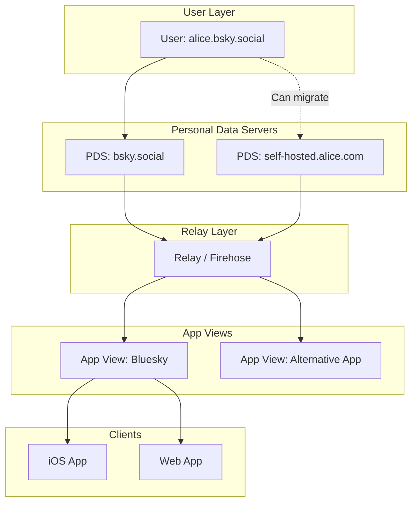
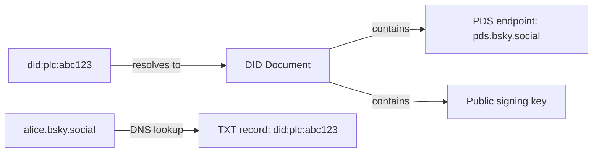
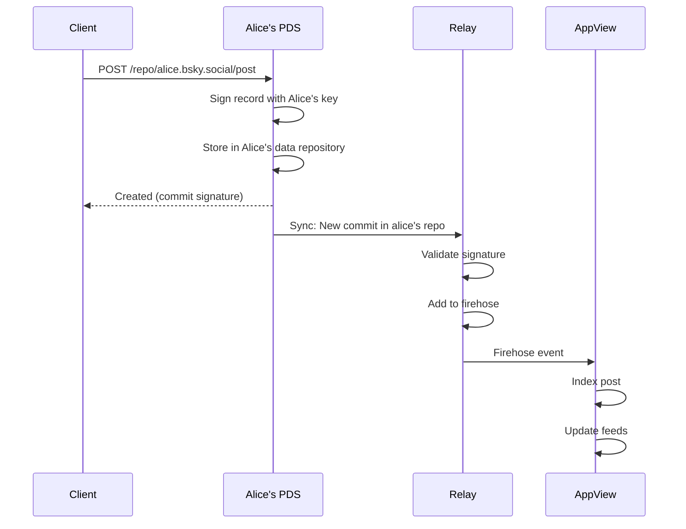
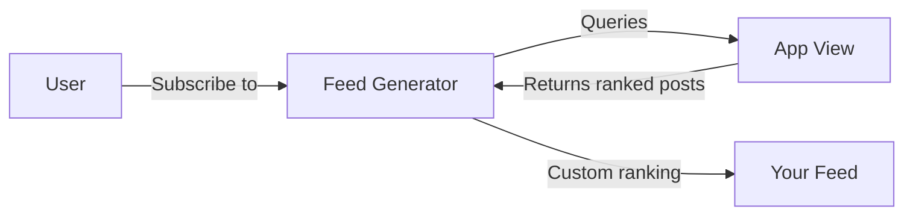
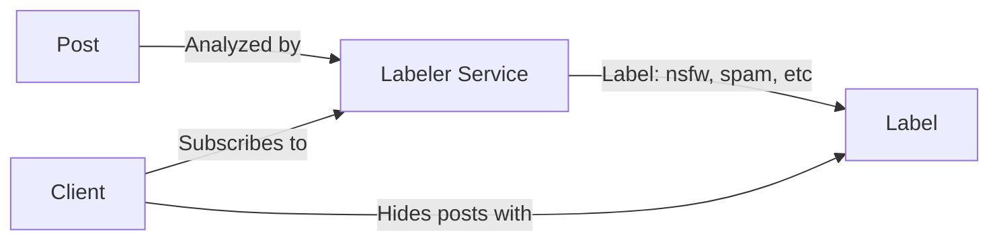

# Chapter 11: Bluesky - Decentralized Social

> *Can you build a social network where users truly own their identity and data?*

---

## The Problem Statement

### The Business Problem

The centralized social media dilemma:
- Twitter/X: One company controls who can post, who gets banned, what the algorithm shows
- Account suspension = lose your followers, history, identity
- Algorithm changes = your content becomes invisible overnight
- Platform dies = everything is lost

Bluesky's promise:
- **Portable identity**: Take your username and followers anywhere
- **Algorithm choice**: Pick which algorithm curates your feed
- **Data ownership**: Your posts live where you choose
- **Interoperability**: Different apps, same network

### The Technical Challenge

How do you build a decentralized social network that:
- Feels as fast as Twitter (millisecond-latency feeds)
- Scales to millions of users
- Allows moderation (without central authority)
- Is truly portable (not just "decentralized in name")

### Bluesky's Scale (2024)

| Metric | Value |
|--------|-------|
| Registered users | 10+ million |
| Daily active users | 1+ million |
| Posts per day | 10+ million |
| Federated servers | Hundreds |

Still small compared to Twitter, but proving the architecture works.

---

## Core Architecture

### The AT Protocol

Bluesky runs on the **AT Protocol** (Authenticated Transfer Protocol), a custom protocol for decentralized social networking.

**Key components:**



### Component Roles

**Personal Data Server (PDS):**
- Stores your posts, follows, likes
- You own it (or trust a provider)
- Publishes to the network
- Can be self-hosted

**Relay (Firehose):**
- Aggregates events from all PDSs
- Streams everything in real-time
- Anyone can run a relay
- The "backbone" of the network

**App View:**
- Consumes the firehose
- Indexes data for queries
- Runs feed algorithms
- Powers client applications

**Bluesky the company runs:**
- The main PDS (bsky.social)
- A relay
- The main App View
- The official apps

**But anyone can run their own.**

### Decentralized Identifiers (DIDs)

**The identity problem:**
On Twitter, you are @jack. If Twitter bans you, you lose @jack.

**Bluesky's solution: DIDs**

```
did:plc:z72i7hdynmk6r22z27h6tvur
```

This is your permanent identity. The username (alice.bsky.social) is just a human-readable alias.

**How DIDs work:**



**To verify "alice.bsky.social" posts:**
1. Look up DNS TXT record for alice.bsky.social
2. Get DID: `did:plc:abc123`
3. Resolve DID to document (via registry)
4. Document contains Alice's public key
5. Verify post signature against key

**Portability:**
If Alice moves to a new server:
1. Update DID document with new PDS endpoint
2. DNS points to same DID
3. All links to Alice's posts still work
4. Followers still follow Alice (the DID)

### Request Flow: Posting a Skeet



### Infrastructure Details

**Bluesky's current infrastructure (estimated):**
- Main PDS: Hundreds of thousands of accounts
- Relay: Processing all events from all PDSs
- App View: Indexing tens of millions of posts
- Running on cloud infrastructure (likely AWS/GCP)

**Self-hosting a PDS:**
- Single VPS can host hundreds of users
- Storage: ~100 MB per active user per year
- Bandwidth: Depends on activity level
- Software: Open source, actively developed

**Relay requirements:**
- High bandwidth (firehose of all events)
- Storage for recent history
- Fan-out to App Views
- More demanding than PDS

---

## Deep Dive: The Clever Bits

### 1. Data Repositories (Merkle Search Trees)

Each user's data is stored in a **Merkle Search Tree (MST)**, a data structure that combines:
- Efficient key-value lookups
- Cryptographic integrity (Merkle proofs)
- Efficient syncing (only transfer changes)

**Structure:**
```
Alice's Repository:
├── app.bsky.feed.post/3jt4k7...  (a post)
├── app.bsky.feed.post/3jt4k8...  (another post)
├── app.bsky.feed.like/3jt4k9...  (a like)
├── app.bsky.graph.follow/3jt4ka... (a follow)
└── (signed root: 0xabc123)
```

**Benefits:**
- Server can prove it hasn't tampered with data
- Sync between PDSs is efficient (only changed paths)
- Third parties can verify data authenticity

### 2. Lexicons: Schema-First Protocol

**The problem:**
If anyone can add data types, how do clients understand them?

**Solution: Lexicons**

```json
{
  "lexicon": 1,
  "id": "app.bsky.feed.post",
  "defs": {
    "main": {
      "type": "record",
      "description": "A post to a user's feed.",
      "key": "tid",
      "record": {
        "type": "object",
        "required": ["text", "createdAt"],
        "properties": {
          "text": {"type": "string", "maxLength": 300},
          "createdAt": {"type": "datetime"},
          "reply": {"type": "ref", "ref": "#replyRef"},
          "embed": {"type": "union", "refs": ["app.bsky.embed.images", ...]}
        }
      }
    }
  }
}
```

**How it works:**
- Lexicons are schemas (like JSON Schema)
- Each record type has a namespace (app.bsky.feed.post)
- Clients validate records against lexicons
- Third parties can define new lexicons (custom apps)

**Example custom lexicon:**
```
com.custom-app.chess.game
com.custom-app.chess.move
```
A chess app could define these, and any compatible client could render them.

### 3. Feed Generators: Algorithm Choice

**The revolutionary idea:**
You pick which algorithm curates your feed.

**How feed generators work:**



**Feed generator examples:**
- Chronological: Just your follows, reverse time order
- Engagement: Posts your follows liked
- Topic-based: Only posts about AI
- Mutuals-only: Only people who follow you back
- Custom algorithm: ML-ranked based on your behavior

**Implementation:**
```python
@feed_generator("at://alice.com/feed/my-cool-feed")
def generate_feed(request):
    # Query App View for candidate posts
    posts = app_view.search(
        follows=request.user_follows,
        since=request.cursor,
        limit=50
    )
    # Apply custom ranking
    ranked = my_ranking_algorithm(posts, request.user_context)
    return ranked
```

**Anyone can run a feed generator.** You trust it with your feed, but it doesn't get your data—it queries the public firehose.

### 4. Moderation: Labelers and Lists

**The moderation problem:**
No central authority means no central moderation. How do you handle harassment, spam, illegal content?

**Solution: Composable moderation**

**Labelers:**


- Labelers are services that tag content
- Users subscribe to labelers they trust
- Client hides/warns based on labels
- Multiple labelers can compete (different policies)

**Mute/Block lists:**
- Users create lists: "Accounts I've blocked"
- Lists can be shared: "Known spam accounts"
- Subscribe to a list = instant block of all accounts
- Community-curated moderation

**The result:**
No single entity decides what's allowed. Users choose their moderation providers, just like they choose their PDS.

---

## Failure Modes & Recovery

### Scenario 1: PDS Goes Offline

**The scenario:**
bsky.social (the main PDS) goes down. Millions of users affected.

**Impact:**
- Users on bsky.social can't post
- Their data is unavailable
- But: Users on other PDSs are unaffected
- Followers on other PDSs see stale data

**Recovery:**
1. bsky.social team fixes the issue
2. PDS comes back online
3. Syncs with relay (any missed events)
4. Normal operation resumes

**The portability promise:**
If bsky.social went down permanently, users could:
1. Export their data (if they prepared beforehand)
2. Import to new PDS
3. Update DID document
4. Followers automatically reconnect

**The catch:**
Most users haven't prepared. Portability exists but requires action.

### Scenario 2: Relay Splits

**The scenario:**
Two major relays disagree on which PDSs to include. Network forks.

**Impact:**
- Users on Relay A don't see users on Relay B
- Network fragmentation
- Confusion about "the real network"

**Prevention:**
- Relays typically include all valid PDSs
- No incentive to exclude (more data = more useful)
- App Views choose which relay(s) to use

**If it happens:**
- Similar to email: Different servers, interoperability depends on choice
- Users might need to specify which "network" they're on
- Unlikely in practice (no economic incentive)

### Scenario 3: Malicious Feed Generator

**The scenario:**
A popular feed generator starts promoting spam or harmful content.

**Impact:**
- Users subscribed to that feed see spam
- Trust in feed generators erodes

**Response:**
1. Users unsubscribe (easy, no lock-in)
2. Community warns others
3. App Views could delist (optional centralization)
4. Labelers could label the feed as untrustworthy

**The difference from Twitter:**
On Twitter, you can't escape the algorithm. On Bluesky, you switch feeds instantly.

---

## Scale Numbers & Mental Models

### Mental Model: Email for Social

Think of AT Protocol like email:

| Email | AT Protocol |
|-------|-------------|
| Email server (Gmail) | PDS (bsky.social) |
| Email address (alice@gmail.com) | Handle (alice.bsky.social) |
| SMTP (sending) | Relay/Firehose |
| IMAP (reading) | App View |
| Email client (Outlook) | Bluesky app |
| Spam filter | Labeler |

The key insight: Email is decentralized. Anyone can run a server. But most people use Gmail. Bluesky expects the same: Decentralized protocol, popular central providers.

### Data Scale

**Per-user storage:**
```
Posts (1 year, 10/day): 3,650 × 1KB = 3.6 MB
Likes (1 year, 50/day): 18,250 × 100B = 1.8 MB
Follows: 500 × 100B = 50 KB
Profile: 10 KB
Total: ~6 MB per active user per year
```

**Relay throughput:**
```
Users: 1 million active
Events/user/day: 100 (posts, likes, follows)
Total events/day: 100 million
Events/second: ~1,150
Each event: ~1 KB
Bandwidth: 1.15 MB/second (very manageable)
```

**At Twitter scale (500M users):**
```
Events/second: 575,000
Bandwidth: 575 MB/second
This requires serious infrastructure but is achievable.
```

### Latency Budget

**Post visibility:**
```
Client to PDS:              50ms
PDS processing:             10ms
PDS to Relay:               50ms (same region)
Relay to App View:          50ms
App View indexing:          100ms
──────────────────────────────────
Total:                      260ms until searchable
```

Slower than centralized Twitter, but still fast enough for most uses.

---

## Historical Evolution

### 2019-2021: bluesky Initiative

**Origins:**
- Jack Dorsey (then Twitter CEO) announced "bluesky"
- Goal: Develop a decentralized standard for social media
- Initially part of Twitter

**Research phase:**
- Studied existing protocols (ActivityPub, Secure Scuttlebutt, etc.)
- Identified limitations
- Designed AT Protocol

### 2022: Independent Company

**Bluesky Social PBC formed:**
- Spun out from Twitter
- Independent development
- Open source protocol

**Key decisions:**
- Not adopting ActivityPub (Mastodon's protocol)
- Building new protocol (AT Protocol)
- Focus on portability and algorithm choice

### 2023: Launch and Growth

**Public launch:**
- Invite-only beta (generated hype)
- Gradual rollout
- Open registration in 2024

**Adoption:**
- Tech early adopters
- Twitter refugees (policy changes)
- Journalists, researchers

### 2024+: Federation Begins

**Current state:**
- Multiple PDS operators emerging
- Feed generator ecosystem growing
- Labeler services launching
- Still heavily centered on bsky.social

**The test:**
Can it remain decentralized as it scales, or will it centralize like email (everyone on Gmail)?

---

## Key Takeaways

1. **Decentralization is a spectrum**: Bluesky is more decentralized than Twitter, less than some blockchain projects. The goal is practical decentralization, not ideological purity.

2. **DIDs enable true portability**: Your identity isn't your username or your server—it's a cryptographic identifier you control.

3. **Algorithm choice is revolutionary**: Letting users pick their feed algorithm is unprecedented at scale. It fundamentally changes the platform-user relationship.

4. **Moderation can be composable**: Instead of one policy for everyone, users can subscribe to moderation providers that match their values.

5. **The protocol is separate from the app**: Bluesky (the app) runs on AT Protocol. Others can build apps on the same protocol.

---

## Further Reading

- [AT Protocol Documentation](https://atproto.com/) - Official protocol docs
- [Bluesky Engineering Blog](https://bsky.social/about/blog) - Technical posts
- [DIDs (Decentralized Identifiers)](https://www.w3.org/TR/did-core/) - W3C specification
- [Comparison: AT Protocol vs ActivityPub](https://atproto.com/guides/faq) - Why not Mastodon?

---

*Next chapter: [Tinder - Geospatial Matching](../../part-5-matching-discovery/12-tinder/README.md)*
