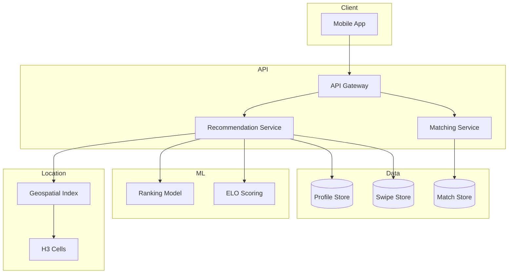
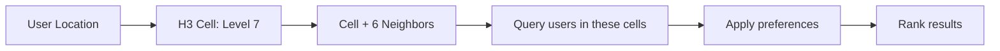
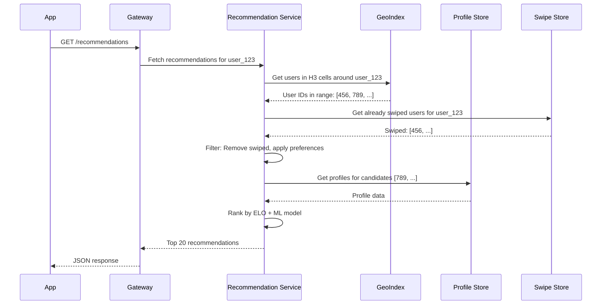
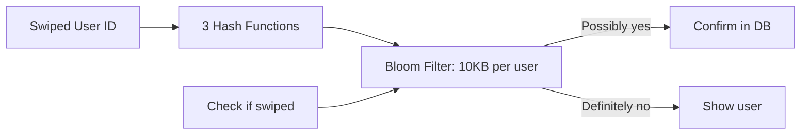

# Chapter 12: Tinder - Geospatial Matching at Scale

> *How do you show the right people to the right people, in the right order, within their desired distance?*

---

## The Problem Statement

### The Business Problem

Tinder's core mechanic:
- Show potential matches near you
- Swipe right (like) or left (pass)
- If both swipe right → match
- Simple, addictive, location-based

The technical challenges:
- Find users within X miles of current location
- Rank users (who to show first?)
- Handle swiping at scale (millions/day)
- Real-time matching when mutual interest

### The Naive Implementation

```sql
SELECT * FROM users
WHERE ST_Distance(location, my_location) < 50_miles
  AND gender = preferred_gender
  AND age BETWEEN preferred_min AND preferred_max
  AND id NOT IN (SELECT swiped_user FROM swipes WHERE user = me)
ORDER BY some_ranking
LIMIT 20
```

**Why this breaks:**

1. **Geospatial queries are expensive**: `ST_Distance` on millions of rows = slow. Even with spatial indexes, finding everyone within 50 miles is O(n) in dense cities.

2. **The "already swiped" filter grows**: After 1,000 swipes, the `NOT IN` clause has 1,000 entries. After 10,000, it's a performance nightmare.

3. **Everyone queries their neighbors**: In Manhattan, everyone searches the same area. Cache? Cache what? Everyone has different preferences.

4. **Location is constantly changing**: User moves 1 mile, and their nearby set changes. You can't cache effectively.

### Tinder's Scale (estimated, 2024)

| Metric | Value |
|--------|-------|
| Daily active users | 10+ million |
| Daily swipes | 2+ billion |
| Matches per day | 30+ million |
| Active in countries | 190+ |

---

## Core Architecture

### High-Level View



### Geospatial Indexing: The Core Problem

**How do you find all users within 50 miles?**

**Option 1: R-Tree (spatial index)**
- Tree structure for spatial data
- O(log n) queries for bounded regions
- Works, but complex to distribute

**Option 2: Geohash**
```
Geohash encodes lat/lng into a string:
  New York: 40.7128, -74.0060 → "dr5ru"
  Nearby point: 40.7130, -74.0058 → "dr5ru"
  Far point: 34.0522, -118.2437 → "9q5"

Nearby points have common prefixes.
Prefix length = precision level.
```

**Problem with geohash:**
At grid boundaries, nearby points have totally different hashes. User on one side of a cell boundary has different prefix than user 1 meter away on the other side.

**Option 3: H3 (Uber's hexagonal grid)**
- Hexagonal cells (no edge distortion)
- Hierarchical (zoom levels)
- Neighbors are well-defined
- Used by Uber, now used more broadly

### H3 Indexing Deep Dive

```
Earth divided into hexagonal cells:
Level 0: ~4 million km² per cell (continent-sized)
Level 7: ~5 km² per cell (city district)
Level 9: ~0.1 km² per cell (neighborhood)
Level 12: ~0.01 km² per cell (building-sized)
```

**How Tinder might use H3:**



**For a 10-mile radius search:**
1. Compute user's H3 cell (level 7 = ~5 km²)
2. Get the "disk" of cells within 10 miles (maybe 50 cells)
3. Query each cell for users
4. Merge results, apply filters, rank

**Why this is fast:**
- Cell membership is O(1) to compute
- Index by cell → O(1) lookup
- No spatial math during query, just hash lookups

### Request Flow: Get Recommendations



### Infrastructure Details

**Geospatial data store:**
- Could be Redis with geospatial commands
- Or Elasticsearch with geo_point
- Or custom solution with H3 cells as keys

**Swipe storage:**
- High write volume (billions/day)
- Append-only (swipe events)
- Cassandra or DynamoDB fits well

**Profile storage:**
- Photos in S3/CDN
- Metadata in cache (Redis) and database
- Heavily cached (profiles read millions of times)

**Match service:**
- Real-time: When User B swipes right on User A who already swiped right on B
- Push notification to both
- Low latency requirement

---

## Deep Dive: The Clever Bits

### 1. ELO-Style Scoring (Desirability Ranking)

**The problem:**
Not everyone is equally popular. If you show a very attractive user to everyone, they get overwhelmed with matches, and others get none.

**Tinder's rumored ELO system:**

```
Initial ELO: 1000 (all users start equal)

When User A swipes right on User B:
  If B's ELO > A's ELO: Small boost to A's ELO
  If B's ELO < A's ELO: Small drop to A's ELO

When User A gets swiped right:
  A's ELO increases (proportional to swiper's ELO)

When User A gets swiped left:
  A's ELO decreases slightly
```

**Effect:**
- High-ELO users are shown to other high-ELO users first
- Low-ELO users don't waste swipes on out-of-reach profiles
- System calibrates perceived attractiveness through behavior

**Controversy:**
This is essentially a hidden rating system. Tinder has moved away from pure ELO to ML-based ranking, but the core idea—using swipe behavior to infer attractiveness—remains.

### 2. The SuperLike Queue Jump

**Normal flow:**
You appear in someone's stack when the algorithm decides. Could be position 1, could be position 50.

**SuperLike:**
You pay to be prioritized in someone's stack.

**Implementation:**
```python
def get_recommendations(user):
    # First, show any SuperLikes received
    super_likes = get_pending_super_likes(user)

    # Then, show algorithmic recommendations
    regular = get_algorithmic_recommendations(user)

    return super_likes + regular
```

**Why it works economically:**
- SuperLike costs money
- User pays to skip the queue
- But only for users who match their preferences (no wasted SuperLikes)

**Technical challenge:**
SuperLikes must be delivered quickly (within hours) or they lose value. This adds a real-time priority queue to the recommendation system.

### 3. Swiped Data Structure

**The problem:**
You swipe 10,000 times. We must never show you those users again. Checking `user_id IN (10000 ids)` is slow.

**Solution: Bloom Filter**



**Properties:**
- False positives possible (rare: skip showing a user unnecessarily)
- False negatives impossible (never show someone you swiped)
- Compact: 10KB can hold 10,000 entries with 1% false positive rate

**Implementation:**
- Per-user bloom filter in Redis
- Updated on each swipe
- Queried on each recommendation fetch
- Periodic rebuild from database

### 4. Location Updates Without Melting

**The problem:**
Users' locations change constantly (moving around the city). Each update could trigger re-indexing.

**Solution: Coarse updates**

```python
def update_location(user_id, new_lat, new_lng):
    current_cell = get_user_cell(user_id)
    new_cell = h3.geo_to_h3(new_lat, new_lng, resolution=7)

    if current_cell != new_cell:
        # User moved to new cell: Update index
        remove_from_cell_index(user_id, current_cell)
        add_to_cell_index(user_id, new_cell)
        set_user_cell(user_id, new_cell)
    # Else: Movement within cell, no index update
```

**Effect:**
- At H3 resolution 7 (~5 km² cells), most movements don't change the cell
- Index updates only when crossing cell boundaries
- 90%+ of location updates become no-ops for the index

---

## Failure Modes & Recovery

### Scenario 1: Geospatial Index Corruption

**The scenario:**
Redis cluster with H3 cell indexes crashes. Recommendations return empty.

**Impact:**
- "No one near you" for all users
- Catastrophic for UX

**Recovery:**
1. Failover to Redis replica
2. If no replica: Rebuild from user location database
3. Rebuild is slow—prioritize high-activity cells first

**Mitigation:**
- Multiple index replicas
- Graceful degradation: Show previously cached recommendations
- "Having trouble finding people nearby" message

### Scenario 2: Match Storm

**The scenario:**
A celebrity joins Tinder. Gets 100,000 right swipes in an hour. Each swipe checks for mutual match.

**Impact:**
- Match service overwhelmed
- Other users' matches delayed
- Celebrity's phone explodes with notifications

**Response:**
```
if incoming_swipe_rate > threshold:
    queue_swipes_for_batch_processing()
    delay_match_notification(user_id)
```

**Special handling:**
- High-swipe users get batched match processing
- Notifications consolidated: "You have 500 new matches" (not 500 notifications)

### Scenario 3: Location Spoofing

**The scenario:**
Users fake their location (GPS spoofing apps) to match in other cities.

**Detection:**
- Impossible movements (NYC to Tokyo in 1 hour)
- App behavior analysis (genuine GPS signals have noise)
- IP geolocation mismatch

**Response:**
- Shadowban: Reduce visibility in others' stacks
- Require location verification for suspicious accounts
- Offer "Passport" feature legitimately (paid feature to change location)

---

## Scale Numbers & Mental Models

### Mental Model: The Dance Floor

Think of Tinder like a massive dance floor:

| Dance Floor | Tinder |
|-------------|--------|
| Physical space | H3 cell |
| Dancers | Users |
| Eye contact | Swipe right |
| Both interested | Match |
| Line around the block | Queue to be shown |
| VIP section | High-ELO users |

The key insight: You can't dance with everyone. The system decides who you're likely to want to dance with, and shows them first.

### Swipe Math

**Daily swipes:**
```
Active users: 10 million
Swipes/user/day: 100 average
Total swipes/day: 1 billion
Swipes/second: ~11,500

Each swipe:
- Check bloom filter
- Check for mutual match
- Update recommendation state
```

**Storage for swipes:**
```
Swipe record: 20 bytes (user_id, target_id, direction, timestamp)
1 billion swipes/day: 20 GB/day
1 year: 7.3 TB
```

### Latency Budget

**Recommendation fetch:**
```
API Gateway:                 10ms
Auth/session lookup:         5ms
H3 cell query:               10ms
Bloom filter check:          2ms
Preference filtering:        5ms
Profile fetch (cached):      10ms
Ranking:                     20ms
Response serialization:      5ms
──────────────────────────────────
Total:                       67ms
```

**Swipe processing:**
```
Record swipe:                5ms
Check mutual match:          10ms
If match → notify:           50ms (async)
──────────────────────────────────
Visible latency:             15ms (match notification is async)
```

---

## Historical Evolution

### 2012: The Launch

**v1 Stack:**
- Mobile-first (iOS initially)
- Simple location matching
- Basic swipe mechanism

**Infrastructure:**
- Single region
- MongoDB for data
- Basic geospatial queries

### 2014-2016: Scaling Up

**Growth:**
- 1 billion swipes/day (by 2014)
- International expansion
- Added SuperLike, Boost features

**Infrastructure evolution:**
- Move to multiple databases
- Dedicated recommendation engine
- ELO-style ranking introduced

### 2017-2019: Sophistication

**Features:**
- Video, Stories
- AI-powered photo selection
- More preference options

**Technical:**
- ML-based ranking (beyond simple ELO)
- Better spam/bot detection
- Global infrastructure

### 2020+: Modern Tinder

**Current features:**
- Video chat
- Audio chat
- Explore (social discovery)
- Premium tiers

**Infrastructure:**
- Likely cloud-native (AWS/GCP)
- Sophisticated ML for recommendations
- Real-time features (typing indicators, online status)

---

## Key Takeaways

1. **Geospatial indexing is the foundation**: H3 or geohash cells make location queries O(1) lookups instead of O(n) scans.

2. **Bloom filters save massive queries**: With millions of swipes per user, set membership must be fast. Bloom filters give probabilistic but practical answers.

3. **ELO-style scoring balances the ecosystem**: Without some form of desirability ranking, popular users get overwhelmed and unpopular users see nothing.

4. **Location is a stream, not a point**: Users move constantly. The system must handle updates efficiently without re-indexing on every GPS change.

5. **Matching is surprisingly complex**: Two people swiping right sounds simple, but at billions of swipes, detecting mutual interest in real-time requires careful architecture.

---

## Further Reading

- [How Tinder Works](https://www.vox.com/2019/2/7/18210998/tinder-algorithm-swiping-tips-dating-app-science) - Vox explainer
- [H3: Uber's Hexagonal Hierarchical Spatial Index](https://eng.uber.com/h3/) - H3 documentation
- [Building Mobile-First Infrastructure](https://www.youtube.com/watch?v=sMK_o8sZ_0U) - Tinder Engineering talks
- [Bloom Filters Explained](https://llimllib.github.io/bloomfilter-tutorial/) - Tutorial

---

*Next chapter: [Uber - Finding Nearby Drivers](../13-uber-nearby-drivers/README.md)*
