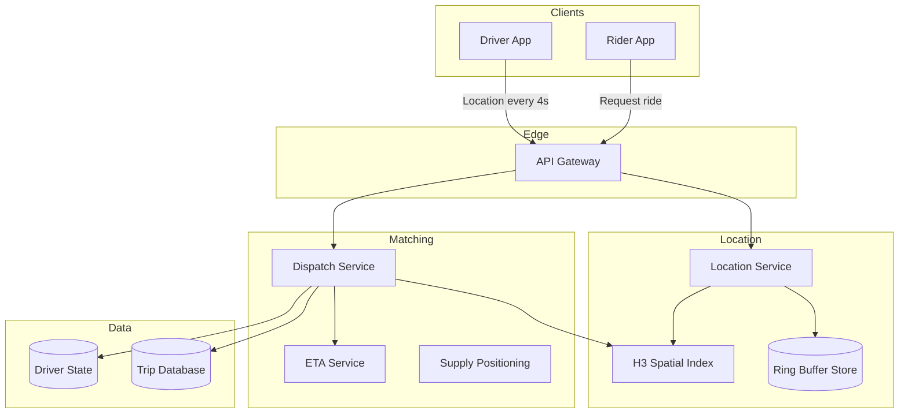
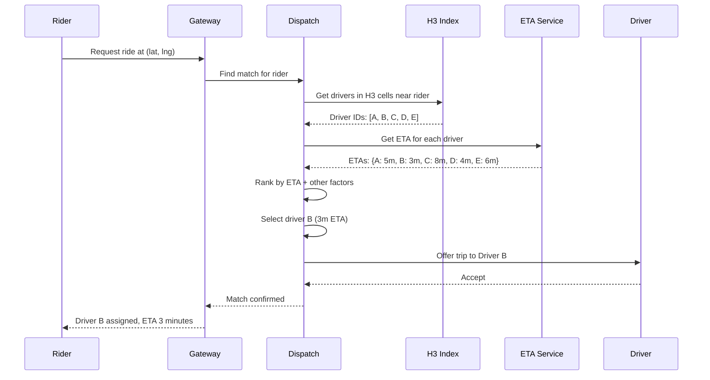
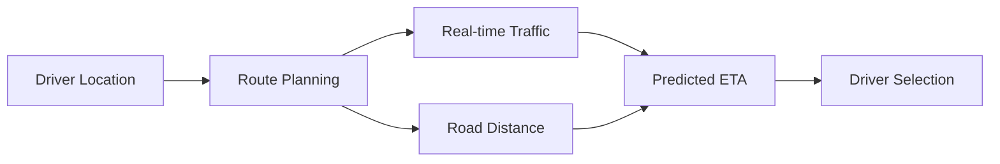
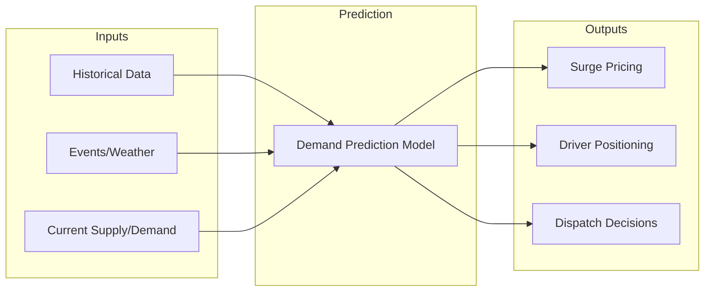

# Chapter 13: Uber - Finding Nearby Drivers in Real-Time

> *How do you match millions of riders with millions of drivers, in real-time, across every city in the world?*

---

## The Problem Statement

### The Business Problem

Uber's core promise:
- Tap a button
- See nearby drivers
- Get picked up in minutes

The technical requirements:
- Find drivers within X minutes of rider
- Update driver locations in real-time (every 4 seconds)
- Match rider to optimal driver (considering ETA, not just distance)
- Handle millions of concurrent requests globally

### The Naive Implementation

```sql
SELECT driver_id, location
FROM drivers
WHERE status = 'available'
  AND ST_Distance(location, rider_location) < 5_miles
ORDER BY ST_Distance(location, rider_location)
LIMIT 10
```

**Why this breaks:**

1. **Constant location updates**: Drivers update location every 4 seconds. At 1 million active drivers, that's 250,000 location writes/second.

2. **Real-time matching**: Rider requests match NOW. Query must return in <200ms. Geospatial queries at this scale are too slow.

3. **ETA ≠ Distance**: A driver 2 miles away on the other side of a river might have 15-minute ETA. A driver 4 miles away on the same road might be 5 minutes. You need routing, not just distance.

4. **Global scale**: This happens in 10,000+ cities simultaneously. Each city has different road networks, traffic patterns, supply/demand.

### Uber's Scale (estimated, 2024)

| Metric | Value |
|--------|-------|
| Active drivers (peak) | 5+ million globally |
| Trips per day | 25+ million |
| Location updates/second (peak) | 10+ million |
| Cities served | 10,000+ |

---

## Core Architecture

### High-Level View



### H3: Uber's Hexagonal Grid

Uber created **H3**, a hexagonal hierarchical spatial indexing system. We touched on it in the Tinder chapter—here's the deeper dive.

**Why hexagons?**

```
Squares:         Hexagons:
+---+---+        / \ / \
| A | B |       | A | B |
+---+---+       \ / \ / \
| C | D |        | C | D |
+---+---+         \ / \ /

Squares: Neighbors can be adjacent or diagonal (distance varies)
Hexagons: All 6 neighbors are equidistant (consistent distance)
```

**H3 resolution levels:**

| Resolution | Avg. Hex Area | Use Case |
|------------|---------------|----------|
| 0 | 4,357,449 km² | Continent |
| 4 | 1,770 km² | Large city |
| 7 | 5.16 km² | City district |
| 9 | 0.105 km² | Neighborhood |
| 11 | 0.0016 km² | City block |
| 15 | 0.0000009 km² | Meter-level |

**For driver lookup:**
- Use resolution 7-8 for nearby driver queries
- Get the hex containing rider
- Get all hexes within radius
- Query each hex for drivers

### Location Updates: The Ring Buffer

**The problem:**
10 million location updates/second. Can't write to disk fast enough.

**Solution: Ring buffer in memory**

```
Per-driver buffer:
[loc_t-4s] [loc_t-3s] [loc_t-2s] [loc_t-1s] [loc_t]
   ↑         ↑          ↑          ↑          ↑
   |______ Ring buffer (fixed size, overwrites oldest) _____|
```

**Properties:**
- Fixed memory per driver (e.g., 10 positions = 200 bytes)
- No disk writes during normal operation
- Query returns most recent location
- Old locations automatically discarded

**Durability tradeoff:**
- Location data is ephemeral (stale in seconds anyway)
- If server crashes, drivers re-send location
- No need to persist every update

### Request Flow: Request a Ride



### Infrastructure Details

**Location service:**
- Stateless compute (horizontally scaled)
- Receives 10M+ updates/second
- Updates in-memory H3 index
- Ring buffer for recent locations

**H3 index:**
- Sharded by H3 cell
- Each shard: Set of driver IDs in that cell
- When driver moves cells: Update both old and new cell
- Could be Redis or custom in-memory store

**ETA service:**
- Road network graph per city
- Dijkstra/A* for shortest path
- Precomputed "ETA tiles" for common routes
- Real-time traffic adjustments

**Memory requirements:**
```
5 million active drivers
Per-driver:
  - Ring buffer (10 positions): 200 bytes
  - Driver state: 500 bytes
  - H3 cell membership: 100 bytes
Total per driver: 800 bytes

5M × 800 bytes = 4 GB

Fits comfortably on a single large server,
but sharded for availability and latency.
```

---

## Deep Dive: The Clever Bits

### 1. ETA vs. Distance: Why Routing Matters

**The false assumption:**
"Closer driver = faster pickup."

**Reality:**

```
Rider: X

Driver A:  2 miles away
           On other side of river
           Bridge traffic: 12 minutes

Driver B:  4 miles away
           Same road as rider
           No traffic: 4 minutes
```

Driver B is faster despite being farther.

**Uber's ETA calculation:**



**Real-time traffic sources:**
- GPS traces from drivers (millions of data points)
- Historical patterns (rush hour, events)
- External traffic data (when available)

**The "ETA tile" optimization:**
For common areas, precompute ETAs from every cell to every other cell. Query is O(1) lookup instead of route calculation.

### 2. Supply Positioning: Predicting Demand

**The problem:**
Riders want instant pickup. But drivers might all be in the wrong area.

**Solution: Surge + Positioning suggestions**



**Demand prediction:**
- Concert ending → surge in that area
- Airport flight arrivals → surge at airport
- Rain starting → surge everywhere

**Driver positioning:**
- App suggests "higher demand in area X"
- Drivers incentivized to reposition
- Balance supply across city

### 3. Dispatch Optimization

**Simple dispatch:**
Send the closest available driver.

**Problems:**
- What if that driver is about to drop off nearby? Wait 2 minutes, they're closer.
- What if sending Driver A to this ride leaves a gap in coverage?
- What if Driver B is better for a ride that's about to come in?

**Uber's "batched matching":**

Instead of matching one ride at a time:
1. Collect ride requests over 2-second window
2. Collect available drivers
3. Find optimal assignment (minimize total wait time)
4. This is the "assignment problem" (solvable with Hungarian algorithm)

**The tradeoff:**
- Better global outcomes (less total waiting)
- Slightly higher latency (2-second batch window)
- Worth it when there's significant demand

### 4. Handling High-Demand Events

**The scenario:**
Taylor Swift concert ends. 50,000 people want rides simultaneously.

**Normal dispatch:**
- 50,000 requests
- 500 nearby drivers
- 98% of requests unmatched immediately
- Chaos

**Event mode:**

```python
if detected_high_demand_event:
    enable_surge_pricing(area)  # Attract more drivers
    enable_queuing()             # "You're #1,234 in queue"
    pre_position_drivers()       # Move drivers before event ends
    batch_matching_larger()      # Optimize across more requests
```

**Surge pricing economics:**
- Price increases → Demand decreases
- Price increases → Supply increases (drivers come)
- Market clears at higher price
- Controversial but mathematically sound

---

## Failure Modes & Recovery

### Scenario 1: Location Service Outage

**The scenario:**
The service receiving driver location updates goes down.

**Impact:**
- Driver locations become stale
- "Nearby" drivers might not actually be nearby
- Matches become unreliable

**Detection:**
- Driver apps notice update failures
- Rider apps see stale driver positions
- Matching failures increase

**Recovery:**
1. Failover to replica location service
2. Drivers re-send current location on reconnect
3. Stale drivers automatically expire from index

**Mitigation:**
- Multiple location service instances
- Drivers retry with exponential backoff
- Graceful degradation: Show "estimated" positions

### Scenario 2: ETA Service Overload

**The scenario:**
Massive spike in ride requests. ETA service can't calculate routes fast enough.

**Impact:**
- Dispatch slows down (waiting for ETAs)
- Rider wait times increase
- Timeouts for some requests

**Fallback:**
```python
try:
    eta = eta_service.calculate(driver, rider)
except Timeout:
    # Fall back to straight-line distance estimate
    distance = haversine(driver.location, rider.location)
    eta = distance / AVERAGE_SPEED

    # Flag as estimate, not accurate
    eta.is_estimate = True
```

**Trade-off:**
Less accurate matching, but system keeps working.

### Scenario 3: Driver GPS Spoofing

**The scenario:**
Drivers fake their location to appear in high-demand areas.

**Detection:**
- Impossible movements (100 miles in 1 minute)
- GPS location doesn't match trip trajectory
- IP geolocation mismatch

**Response:**
- Shadowban: Accept location but don't dispatch to them
- Warning: "Unusual location activity detected"
- Suspension for repeat offenders

**Why drivers spoof:**
- Get trips in surge areas
- Reduce dead miles (driving without passenger)
- Gaming incentive programs

---

## Scale Numbers & Mental Models

### Mental Model: The Taxi Dispatcher

Think of Uber's system as an automated taxi dispatcher:

| Human Dispatcher | Uber System |
|------------------|-------------|
| Radio check-ins | GPS location updates |
| Map on the wall | H3 spatial index |
| Knowledge of traffic | ETA service |
| Matching riders to taxis | Dispatch optimization |
| "Head to the airport" | Supply positioning |

The key insight: A human dispatcher can handle maybe 100 taxis mentally. Uber's system handles 5 million.

### Location Update Math

**Update frequency:**
```
5 million active drivers
Update every 4 seconds
= 1.25 million updates/second

Each update: 50 bytes (driver_id, lat, lng, timestamp, heading)
= 62.5 MB/second of location data
= 5.4 TB/day
```

**Spatial index updates:**
```
~10% of updates cross H3 cell boundaries
= 125,000 index updates/second
```

### Latency Budget

**Ride request to match:**
```
API Gateway:                 10ms
Find nearby H3 cells:        2ms
Query driver index:          10ms (parallel across cells)
Get driver states:           15ms
Calculate ETAs:              50ms (parallel per driver)
Rank and select:             10ms
Offer to driver:             50ms (network)
Driver accepts:              500-3000ms (human)
──────────────────────────────────────────
Total:                       ~650ms-3150ms
```

The human response time dominates.

---

## Historical Evolution

### 2010-2012: The Beginning

**v1 Stack:**
- MySQL for everything
- Simple geospatial queries
- Limited cities

**Architecture:**
- Monolithic Python app
- Single region
- Manual dispatch optimization

### 2013-2015: Rapid Scaling

**Growth challenges:**
- Monolith couldn't scale
- MySQL geospatial was too slow
- Need for real-time processing

**Responses:**
- Microservices adoption
- Custom geospatial indexing
- H3 development begins

### 2016-2018: The Real-Time Platform

**Key systems:**
- H3 open-sourced (2018)
- Real-time dispatch optimization
- Surge pricing automation
- Global expansion to 600+ cities

**Infrastructure:**
- Multi-region deployment
- Custom real-time data infrastructure (streaming)
- Machine learning for ETAs

### 2020+: Efficiency Era

**Focus:**
- Cost efficiency (profitability)
- Delivery (Uber Eats) integration
- Autonomous vehicle prep
- Advanced ML for predictions

**Architecture:**
- Cloud-native (multiple providers)
- Unified platform for rides + eats
- Sophisticated demand forecasting

---

## Key Takeaways

1. **H3 makes geospatial tractable**: Hexagonal indexing with O(1) cell lookup transforms million-scale location queries into simple hash lookups.

2. **ETA beats distance**: For ride matching, travel time is what matters. This requires real-time routing with traffic awareness.

3. **Location is a stream, not state**: With millions of updates/second, location must be processed as ephemeral streaming data, not persisted state.

4. **Batched matching wins globally**: Matching one ride at a time is locally optimal. Batching rides and drivers together finds better global solutions.

5. **Surge pricing is an algorithm, not greed**: Price as a signal to balance supply and demand. Without it, high-demand events would have no drivers.

---

## Further Reading

- [H3: Uber's Hexagonal Hierarchical Spatial Index](https://eng.uber.com/h3/) - Official documentation
- [How Uber Scales Dispatch](https://www.youtube.com/watch?v=XRYN2xt11Ek) - Conference talk
- [Uber's Real-Time Data Infrastructure](https://eng.uber.com/uber-big-data-platform/) - Engineering blog
- [Market Design at Uber](https://www.uber.com/blog/uber-marketplace/) - Economics of matching

---

*Next chapter: [Stock Exchange - Sub-Millisecond Trading](../../part-6-financial-systems/14-stock-exchange/README.md)*
