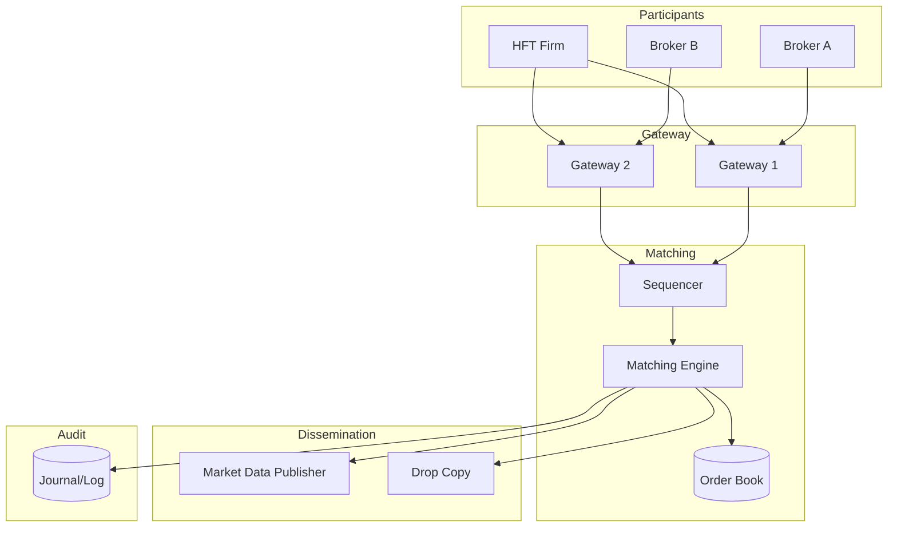
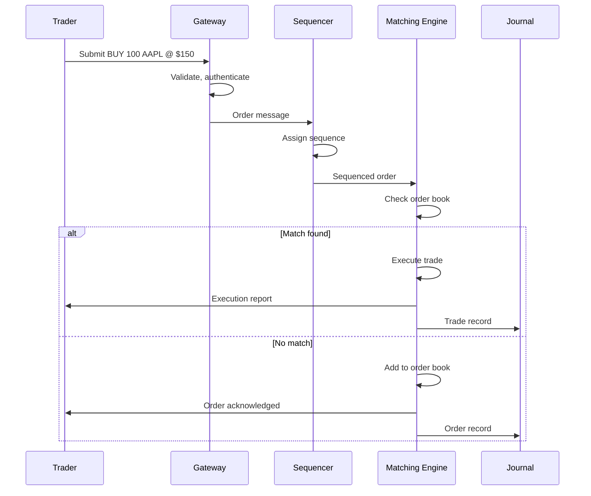
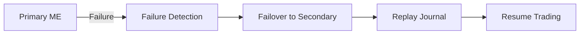

# Chapter 14: Stock Exchange - Sub-Millisecond Trading

> *Where microseconds mean millions of dollars, and the hardware is as important as the software.*

---

## The Problem Statement

### The Business Problem

A stock exchange must:
- Match buyers with sellers fairly
- Execute trades in microseconds (literally)
- Never lose an order
- Provide a complete audit trail
- Handle market panics (10x normal volume)

**The latency imperative:**
In high-frequency trading (HFT), being 1 microsecond faster means getting better prices. Exchanges compete on latency. Traders pay millions for microsecond advantages.

### The Naive Implementation

```python
def process_order(order):
    db.begin_transaction()
    matching_orders = db.query("SELECT * FROM orders WHERE ...")
    if matching_orders:
        execute_trade(order, matching_orders[0])
        db.update(...)
    else:
        db.insert(order)
    db.commit()
```

**Why this breaks:**

1. **Database latency**: Database round-trip is milliseconds. HFT needs microseconds.

2. **Locking**: Transaction locks create contention. At 1 million orders/second, everything waits.

3. **No determinism**: Multi-threaded database has non-deterministic order. Traders demand fair ordering.

4. **Single point of failure**: If the database goes down, the exchange stops. Markets can't stop.

### Exchange Scale Reference (NYSE/NASDAQ)

| Metric | Value |
|--------|-------|
| Orders per second (peak) | 500,000+ |
| Messages per second | 10+ million |
| Matching latency | < 100 microseconds |
| Market hours | 6.5 hours (+ extended hours) |
| Stocks listed | 3,000+ |

---

## Core Architecture

### High-Level View



### The Sequencer: Fairness Through Ordering

**The problem:**
Two orders arrive "at the same time" from different gateways. Which was first?

**The sequencer's job:**
1. Receive orders from all gateways
2. Assign a **sequence number** to each order
3. Forward to matching engine in sequence order

```
Gateway 1: Order A arrives at 09:30:00.000001
Gateway 2: Order B arrives at 09:30:00.000001

Sequencer assigns:
  Order A → Sequence #1000001
  Order B → Sequence #1000002

Order A is processed first (deterministic).
```

**Why this matters:**
At nanosecond scales, "simultaneous" is common. The sequencer creates a canonical, auditable order.

### The Matching Engine

**Core data structure: The Order Book**

```
AAPL Order Book:

BUY SIDE                    SELL SIDE
Price   | Qty  | Orders     Price   | Qty  | Orders
--------|------|-------     --------|------|-------
$150.00 | 500  | [A,B]      $150.05 | 200  | [X]
$149.95 | 1000 | [C,D,E]    $150.10 | 500  | [Y,Z]
$149.90 | 300  | [F]        $150.15 | 1000 | [W]

Best Bid: $150.00          Best Ask: $150.05
Spread: $0.05
```

**Price-Time Priority:**
Orders are matched by:
1. Price (best price first)
2. Time (earlier orders at same price first)

**Matching logic:**

```
New Order: BUY 300 shares AAPL @ $150.10 (market willing to pay up to $150.10)

Check sell side:
  - Sell order X: 200 @ $150.05 → MATCH 200 shares @ $150.05
  - Sell order Y: 100 (of 500) @ $150.10 → MATCH 100 shares @ $150.10

Trade reports:
  - 200 shares @ $150.05
  - 100 shares @ $150.10

Remaining buy: 0 (fully filled)
Remaining sell Y: 400 shares (partial fill)
```

### Request Flow: Order Submission to Execution



### Infrastructure Details

**Hardware optimization:**
Modern exchanges use extreme hardware:

- **Kernel bypass networking**: DPDK or custom NICs that skip the OS kernel
- **FPGA-based matching**: Field-programmable gate arrays for nanosecond matching
- **Shared memory**: No serialization overhead between components
- **Clock synchronization**: PTP (Precision Time Protocol) for nanosecond-accurate timestamps

**Server specs (typical matching engine):**
- 2+ high-frequency CPUs (turbo boost disabled for consistency)
- 256+ GB RAM (entire order book in memory)
- No disk I/O in critical path
- 10-25 Gbps networking with direct memory access

**Colocation:**
Traders pay millions to place their servers in the same data center as the exchange. Even 1 meter of cable adds nanoseconds.

---

## Deep Dive: The Clever Bits

### 1. Kernel Bypass: Shaving Microseconds

**Normal network path:**
```
NIC → Kernel → Socket buffer → User space → Application
    ~10 microseconds
```

**Kernel bypass path:**
```
NIC → Direct Memory Access → Application
    ~1 microsecond
```

**Technologies:**
- **DPDK** (Data Plane Development Kit): Intel library for kernel bypass
- **Solarflare OpenOnload**: NIC with user-space networking
- **Custom NICs**: Some exchanges build their own hardware

**The tradeoff:**
You lose kernel protections (security, isolation). But in a controlled exchange environment, this is acceptable.

### 2. FPGA Matching: The Hardware Approach

**Why FPGA?**
Software, no matter how optimized, has overhead:
- Instruction fetch
- Branch prediction
- Cache misses

FPGAs implement matching logic directly in hardware.

**FPGA matching latency:**
```
Traditional software: 10-100 microseconds
Optimized software:   1-10 microseconds
FPGA:                 100 nanoseconds - 1 microsecond
```

**The tradeoff:**
- FPGAs are harder to program (Verilog/VHDL)
- Harder to update (new features require reprogramming)
- More expensive

**Who uses FPGAs:**
- Major exchanges (NYSE, NASDAQ, LSE)
- High-frequency trading firms
- Critical infrastructure where nanoseconds matter

### 3. Clock Synchronization: When Nanoseconds Matter

**The problem:**
You have two orders from two traders. Who was first?

If clocks differ by 1 microsecond, you might record the wrong order.

**PTP (Precision Time Protocol):**
- Synchronizes clocks across a network
- Achieves sub-microsecond accuracy
- Used by all major exchanges

**MiFID II requirements (Europe):**
- Orders must be timestamped to 1 microsecond accuracy
- Clocks must be synchronized to 100 microseconds of UTC
- Audit trail must prove timestamp accuracy

**Hardware timestamping:**
Network cards can timestamp packets as they arrive, before they reach the CPU. This eliminates software timestamp variability.

### 4. Market Data Distribution

**The problem:**
Every trade must be broadcast to all participants. At 100,000 trades/second, that's a lot of data.

**Multicast:**
Instead of unicast (one-to-one):
```
Exchange → Trader A
Exchange → Trader B
Exchange → Trader C
... (100,000 connections)
```

Use multicast (one-to-many):
```
Exchange → Multicast address → All subscribers
```

**The math:**
- 100,000 messages/second
- 100 bytes/message
- 10,000 subscribers

Unicast: 10 TB/second of traffic
Multicast: 10 MB/second of traffic

**The catch:**
Multicast requires special network infrastructure. Not available on public internet.

---

## Failure Modes & Recovery

### Scenario 1: Matching Engine Failure

**The scenario:**
Primary matching engine crashes mid-day.

**Impact:**
- Trading halts for that exchange
- Traders route to other exchanges
- Potential market impact

**Recovery:**



**Hot standby:**
- Secondary matching engine processes same sequence
- Stays synchronized with primary
- Takes over within milliseconds of failure

**Journal replay:**
- Every order and trade is journaled
- Secondary can rebuild state by replaying journal
- Ensures no orders are lost

**Typical failover time: 1-10 seconds**

### Scenario 2: Flash Crash

**The scenario:**
A trading algorithm malfunctions. Sells 1 million shares in 1 second. Price drops 10% instantly.

**Circuit breakers:**
```python
if price_change > 5% in 5 minutes:
    pause_trading(stock, 5 minutes)

if market_index_drops > 7%:
    pause_entire_market(15 minutes)

if market_index_drops > 20%:
    halt_market_for_day()
```

**Kill switches:**
Exchanges can immediately halt trading for a symbol if something looks wrong.

**Post-mortem:**
Every flash crash leads to:
- Rule changes
- New circuit breakers
- Algorithm audits

### Scenario 3: Timestamp Dispute

**The scenario:**
Two traders claim they submitted orders first. Both claim the other got unfair execution.

**Resolution:**
- Exchange produces journaled sequence
- Every order has hardware timestamp
- Sequence number is canonical

**Why sequence numbers exist:**
Even with perfect clocks, two orders can arrive at "the same" nanosecond. The sequencer breaks ties deterministically.

---

## Scale Numbers & Mental Models

### Mental Model: The Auction House

Think of an exchange like a lightning-fast auction:

| Traditional Auction | Stock Exchange |
|--------------------|----------------|
| Auctioneer | Matching engine |
| Paddle raise | Order submission |
| "Going once..." | Order book queue |
| "SOLD!" | Trade execution |
| Auction record | Journal |

The key insight: An exchange runs millions of auctions per second, all deterministically.

### Latency Budget

**Order-to-execution (exchange internal):**
```
Gateway receive:             1 μs
Network to sequencer:        5 μs
Sequencer processing:        1 μs
Network to matching:         5 μs
Matching engine lookup:     10 μs
Execution report:            5 μs
───────────────────────────────
Total:                      ~27 μs
```

**End-to-end (trader to trader):**
```
Trader A to exchange:       100 μs (depends on location)
Exchange processing:         30 μs
Exchange to Trader B:       100 μs
───────────────────────────────
Total:                      ~230 μs
```

### Throughput Math

**Peak capacity planning:**
```
Normal trading: 50,000 orders/second
Peak (market stress): 500,000 orders/second
Capacity headroom: 10x normal = 500,000+

Messages per order: ~5 (order, ack, match, trade report, market data)
Message throughput: 2.5 million messages/second at peak
```

---

## Historical Evolution

### 1970s-1980s: Open Outcry

**The era:**
- Traders shouting on trading floors
- Hand signals for buy/sell
- Paper tickets for orders

**Latency:**
Seconds to minutes. Human speed.

### 1990s: Electronic Trading Begins

**The shift:**
- NASDAQ: First fully electronic market
- ECNs (Electronic Communication Networks)
- Beginnings of algorithmic trading

**Latency:**
Hundreds of milliseconds to seconds.

### 2000s: The Speed Race

**Key developments:**
- Decimalization (2001): Prices in cents, not fractions
- Reg NMS (2005): Required best execution across exchanges
- HFT emergence: Algorithms competing on speed

**Latency:**
Milliseconds.

### 2010s: Microsecond Era

**Technologies:**
- FPGA matching engines
- Kernel bypass networking
- Colocation services
- Microwave networks (faster than fiber!)

**Latency:**
Microseconds.

### 2020s: Nanoseconds and Regulation

**Current state:**
- Sub-microsecond matching
- Heavy regulation (MiFID II, audit requirements)
- Debate over "speed bumps" (intentional delays for fairness)
- Cryptocurrency exchanges (24/7, different regulations)

---

## Key Takeaways

1. **Sequence numbers create fairness**: In a world of nanosecond races, deterministic ordering is the only fair approach.

2. **Memory is the database**: For microsecond latency, everything must be in RAM. Disk is only for durability.

3. **Hardware matters as much as software**: Kernel bypass, FPGAs, and custom NICs are standard in exchange architecture.

4. **Failover must be seamless**: Markets can't stop. Hot standbys and journal replay ensure continuous operation.

5. **Regulation drives architecture**: Audit requirements, timestamp accuracy, and fairness rules shape technical decisions.

---

## Further Reading

- [How the NASDAQ Market Simulation Works](https://www.youtube.com/watch?v=b1e4t2k2KJY) - Conference talk
- [The LMAX Exchange Architecture](https://martinfowler.com/articles/lmax.html) - Martin Fowler
- [Designing Data-Intensive Applications, Ch. 11](https://www.oreilly.com/library/view/designing-data-intensive-applications/9781491903063/) - Event sourcing patterns
- [Flash Boys by Michael Lewis](https://www.amazon.com/Flash-Boys-Wall-Street-Revolt/dp/0393351599) - Narrative on HFT (with caveats)

---

*Next chapter: [Stripe - Idempotent Payments](../15-stripe-idempotency/README.md)*
