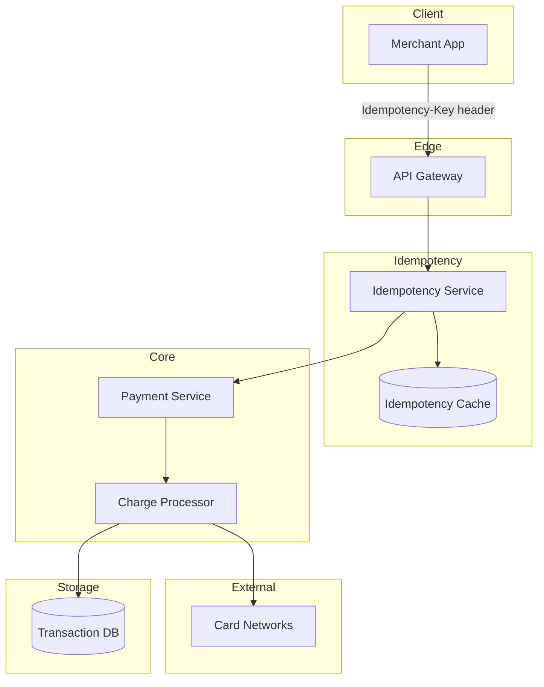
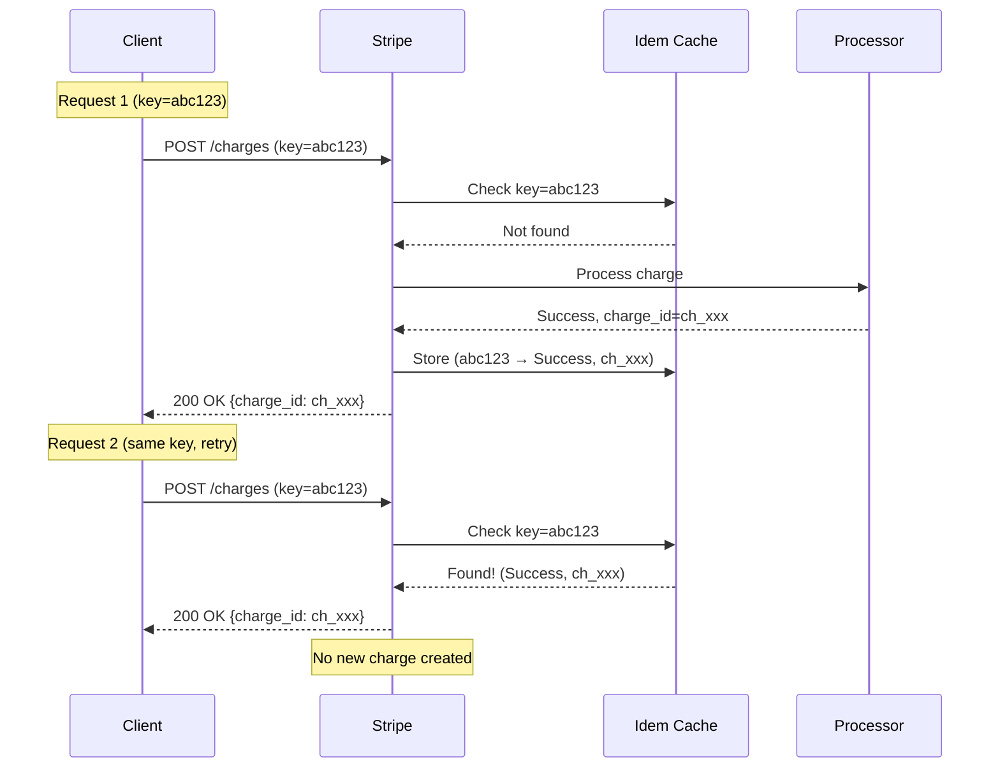
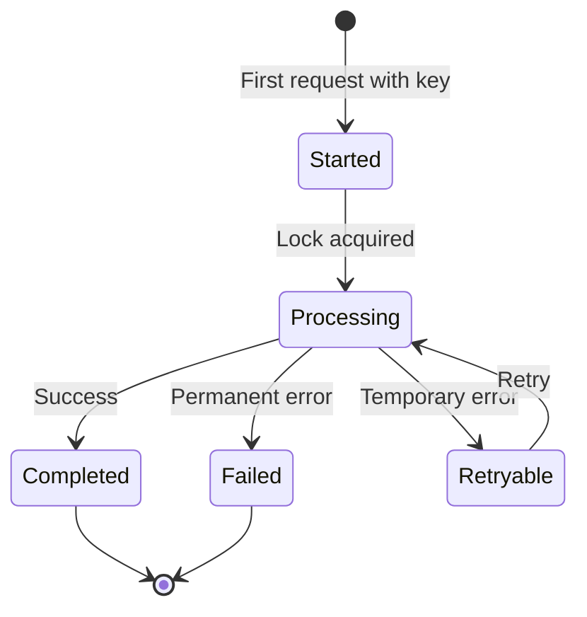
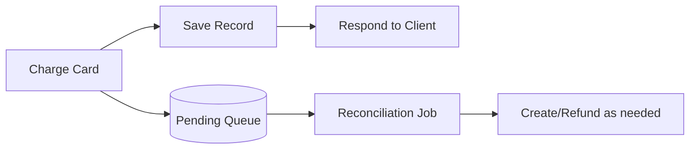

# Chapter 15: Stripe - Idempotent Payments

> *When money is on the line, "charge the card again" is not an acceptable error handling strategy.*

---

## The Problem Statement

### The Business Problem

Payment processing seems simple:
1. Customer clicks "Pay"
2. Charge their card
3. Show success

**What can go wrong:**

```
Customer clicks "Pay"
→ Request sent to server
→ Server calls Stripe
→ Stripe charges card
→ Network timeout before response
→ Customer sees "Error, please try again"
→ Customer clicks "Pay" again
→ Server calls Stripe again
→ Customer is charged twice
```

Double charging is:
- Terrible customer experience
- Potential chargeback and fraud
- Legal liability
- Business-ending at scale

### The Fundamental Problem

Payments involve **at-least-once semantics** by default:
- Request might be sent multiple times (retries)
- Each request might execute multiple times (server retries to Stripe)

We need **exactly-once semantics**:
- No matter how many times a request is sent, the payment happens exactly once

### Stripe's Scale (estimated, 2024)

| Metric | Value |
|--------|-------|
| API requests per day | 1+ billion |
| Payment volume (annual) | $800+ billion |
| Merchants | 1+ million |
| Success rate target | 99.999% |

---

## Core Architecture

### High-Level View



### The Idempotency Key

**Stripe's API:**
```http
POST /v1/charges
Idempotency-Key: unique-request-identifier-123
Content-Type: application/json

{
  "amount": 2000,
  "currency": "usd",
  "source": "tok_visa"
}
```

**How it works:**



**Key properties:**
- Same key + same request = same response
- Key is provided by client (they control uniqueness)
- Keys expire after 24 hours

### Request Lifecycle

**States an idempotent request can be in:**



**Critical insight:**
There's a window between "started" and "completed" where a retry arrives. The system must:
1. Recognize the request is in-flight
2. Wait for original to complete (or fail)
3. Return the same response

### Infrastructure Details

**Idempotency cache:**
- Redis or similar in-memory store
- Entry: `key → (status, response, timestamp)`
- TTL: 24 hours
- Must be highly available (loss = potential duplicates)

**Concurrency handling:**
```python
def process_with_idempotency(key, request):
    # Try to acquire lock
    if not cache.set_if_not_exists(key, PROCESSING, ttl=60):
        # Key exists - either in-flight or completed
        cached = cache.get(key)
        if cached.status == COMPLETED:
            return cached.response
        elif cached.status == PROCESSING:
            # Wait and retry lookup
            wait_for_completion(key)
            return cache.get(key).response

    try:
        response = actually_process(request)
        cache.set(key, (COMPLETED, response), ttl=24h)
        return response
    except PermanentError:
        cache.set(key, (FAILED, error), ttl=24h)
        raise
    except TemporaryError:
        cache.delete(key)  # Allow retry
        raise
```

---

## Deep Dive: The Clever Bits

### 1. Client-Generated Keys

**Why not server-generated?**

```
Option A: Server generates idempotency key
  Client: POST /charges
  Server: Here's your key: key123, now processing...
  [Network dies]
  Client: I never got a key, I'll try again
  Server: New request, new key: key456, processing...
  → Two charges, two keys, duplicate payment
```

```
Option B: Client generates idempotency key
  Client: POST /charges (key=my-key-123)
  [Network dies after request sent]
  Client: I'll retry with same key
  Server: Same key, return cached response
  → One charge, no duplicate
```

**Key generation best practices:**
- UUID v4 (random): Good default
- Deterministic from request content: Good for idempotent retries
- Include user ID or session: Prevents key collision across users

### 2. Handling Partial Failures

**The scenario:**
Stripe charged the card but crashed before saving to database.

**The distributed transaction problem:**
```
1. Deduct from card (Visa network)
2. Create charge record (Stripe DB)
3. Return success to client

If step 2 fails after step 1, money is charged but no record exists.
```

**Stripe's approach: Eventual consistency with reconciliation**



**Reconciliation:**
- Periodic job compares card network records with Stripe DB
- Missing DB records? Create them
- Orphaned charges? Refund them
- This runs continuously, catching all edge cases

### 3. Race Conditions: The Double-Request Problem

**The scenario:**
Two retries arrive simultaneously (1ms apart).

```
T=0ms: Request 1 starts processing
T=1ms: Request 2 arrives, checks cache, sees "processing"
T=50ms: Request 1 charges card
T=51ms: Request 2 checks again... still processing?

What does Request 2 do?
```

**Solution: Distributed locking with waiting**

```python
def wait_for_completion(key, timeout=30):
    deadline = now() + timeout
    while now() < deadline:
        cached = cache.get(key)
        if cached.status in [COMPLETED, FAILED]:
            return cached
        sleep(100ms)
    raise TimeoutError("Original request didn't complete")
```

**The tradeoff:**
Request 2 waits (latency) instead of duplicating (correctness). Correct choice for payments.

### 4. Key Expiration and Replay Attacks

**Why keys expire after 24 hours:**

```
Storage math:
  1 billion requests/day × 64 bytes/key = 64 GB/day
  Keep forever = unbounded storage growth
  24 hours = 64 GB max, constant
```

**But what about replays after 24 hours?**

Scenario: Attacker captures request with idempotency key. Waits 25 hours. Replays.

**Mitigations:**
- Request timestamp validation (reject if too old)
- Token expiration (one-time tokens instead of persistent keys)
- Source validation (card tokens expire)
- Monitoring for suspicious patterns

### 5. Idempotency vs. Exactly-Once

**Clarification:**
Idempotency doesn't guarantee the operation runs exactly once. It guarantees:
- **If it succeeds**: It ran once
- **If it fails permanently**: It ran zero times
- **If it's in a weird state**: Reconciliation will fix it

**True exactly-once is impossible** in distributed systems (see: FLP impossibility). Stripe achieves "effectively once" through:
- Idempotency keys (prevent duplicate requests)
- Reconciliation (detect and fix edge cases)
- Human support (final fallback)

---

## Failure Modes & Recovery

### Scenario 1: Idempotency Cache Failure

**The scenario:**
Redis cluster holding idempotency keys crashes.

**Impact:**
- New requests: Work normally (new keys)
- In-flight retries: Potential duplicates!

**Mitigation:**
```python
def charge_with_fallback(key, request):
    try:
        return process_with_idempotency(key, request)
    except CacheUnavailable:
        # Cache down - use database as fallback
        return process_with_db_idempotency(key, request)
```

**Database fallback:**
- Slower (disk instead of memory)
- Still correct (prevents duplicates)
- Graceful degradation

### Scenario 2: Request Body Mismatch

**The scenario:**
Client sends same key but different request body.

```
Request 1: POST /charges, key=abc, amount=100
Request 2: POST /charges, key=abc, amount=200
```

**Options:**
1. **Ignore body, return cached response**: Dangerous—client might not realize
2. **Return error**: "Key already used with different parameters"
3. **Hash body into key**: Forces new key for new request

**Stripe's approach:**
Return error 400. The key is tied to the first request's parameters.

### Scenario 3: Long-Running Requests

**The scenario:**
A charge takes 30 seconds (unusual but possible with certain banks). Client timeout at 10 seconds. Client retries.

**Problem:**
Original request still running. Retry arrives. What happens?

**Solution:**
```python
# Original request (still running at T=30s):
processing... charging card... saving...

# Retry at T=10s:
check cache → status=PROCESSING (since T=0s)
wait_for_completion(timeout=25s)
→ At T=30s, original completes
→ Retry returns same response
```

**The timeout must be longer than the longest possible processing time.** Stripe uses aggressive timeouts internally to keep this bounded.

---

## Scale Numbers & Mental Models

### Mental Model: The Post Office Receipt

Think of idempotency keys like certified mail receipts:

| Post Office | Stripe |
|-------------|--------|
| Certified mail # | Idempotency key |
| Receipt | Cached response |
| Tracking | Request status |
| "Already delivered" | Duplicate detection |

The key insight: The receipt is created when you send, not when delivery completes. Even if delivery fails, the receipt prevents you from accidentally sending twice.

### Request Volume

**Idempotency cache size:**
```
Requests/day: 1 billion
Key size: 64 bytes
Response cache: 1 KB average
Entry size: ~1 KB total

Daily storage: 1 billion × 1 KB = 1 TB
With 24-hour TTL: 1 TB max

Redis cluster: 10 nodes × 100 GB = easily sufficient
```

### Latency Budget

**Idempotent request (cache hit):**
```
API Gateway:               5ms
Idempotency lookup:        1ms (Redis)
Response serialization:    2ms
───────────────────────────────
Total:                     8ms
```

**Idempotent request (cache miss):**
```
API Gateway:               5ms
Idempotency check:         1ms
Payment processing:        200-2000ms (depends on card network)
Save to DB:                10ms
Update cache:              1ms
Response serialization:    2ms
───────────────────────────────
Total:                     220-2020ms
```

---

## Historical Evolution

### Early E-commerce (1990s)

**The problem:**
- Credit card forms
- Clicking "Submit" twice
- No idempotency

**Solutions:**
- "Please click only once" (lol)
- Disable button after click (client-side)
- Session-based duplicate detection (limited)

### Payment Gateways (2000s)

**Improvement:**
- Server-side duplicate detection
- Transaction IDs
- Basic idempotency

**Limitations:**
- Gateway-specific
- Often required manual integration
- Inconsistent across providers

### Stripe Era (2010s)

**Innovation:**
- Idempotency as first-class API feature
- Client-provided keys
- 24-hour retention
- Standardized patterns

**Impact:**
- Industry adoption
- Best practice documentation
- Copied by competitors

### Modern Best Practices

**Current state:**
- Idempotency keys are table stakes
- Extended to webhooks (webhook IDs for duplicate delivery)
- Combined with optimistic locking, sagas, event sourcing
- Tooling for testing idempotency

---

## Key Takeaways

1. **Client-generated keys are essential**: Server-generated keys can't protect against network failures before the key is received.

2. **Keys must be tied to request content**: Same key, different body should error—not silently return cached response.

3. **The in-flight state is the hardest**: Handling concurrent retries while the original is still processing requires careful locking and waiting.

4. **Reconciliation is the safety net**: No matter how good your idempotency, edge cases happen. Background reconciliation catches them all.

5. **24-hour TTL is a pragmatic choice**: Balancing storage costs against the realistic retry window for legitimate use cases.

---

## Further Reading

- [Stripe: Idempotent Requests](https://stripe.com/docs/api/idempotent_requests) - Official documentation
- [Designing Robust and Predictable APIs with Idempotency](https://stripe.com/blog/idempotency) - Stripe engineering blog
- [Distributed Systems Patterns: Idempotent Receiver](https://martinfowler.com/articles/patterns-of-distributed-systems/idempotent-receiver.html) - Martin Fowler
- [The Saga Pattern](https://microservices.io/patterns/data/saga.html) - Handling distributed transactions

---

*Next chapter: [ChatGPT - Inference at Scale](../../part-7-ai-serverless/16-chatgpt/README.md)*
