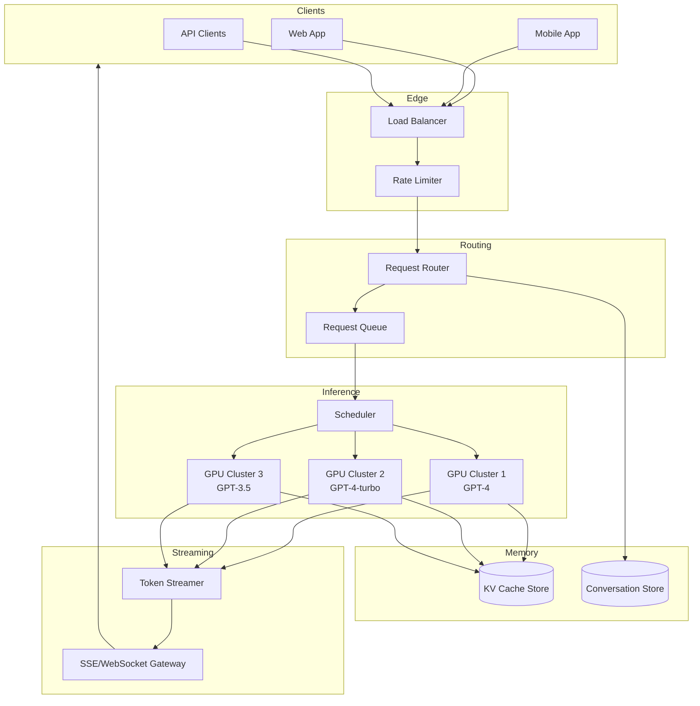
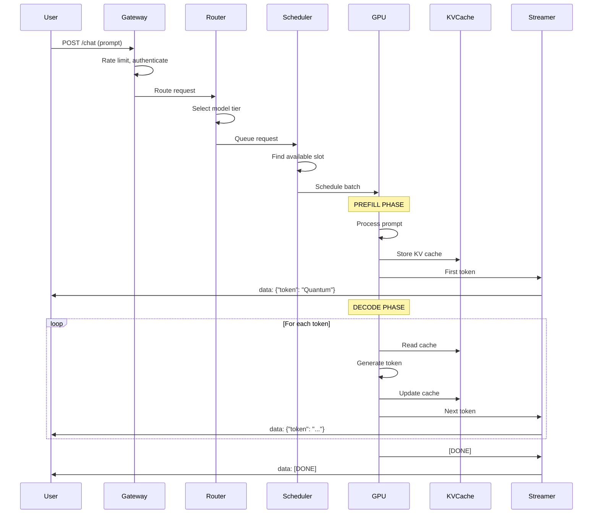

# Chapter 16: ChatGPT - Inference at Scale

> *How do you serve billions of tokens per day while keeping latency acceptable and costs manageable?*

---

## The Problem Statement

### The Business Problem

A large language model inference platform must:
- Serve hundreds of millions of users
- Generate billions of tokens per day
- Deliver streaming responses in real-time
- Keep costs sustainable (GPUs are expensive)
- Handle variable-length inputs and outputs

**The latency imperative:**
Users expect near-instant responses. A 10-second wait for the first token feels broken. But LLMs are computationally intensive—generating a single token can require billions of operations.

### The Naive Implementation

```python
def generate_response(prompt):
    # Load model onto GPU
    model = load_model("gpt-4")  # 100GB+ model

    # Tokenize input
    tokens = tokenize(prompt)

    # Generate one token at a time
    output = []
    for _ in range(max_tokens):
        next_token = model.forward(tokens + output)
        output.append(next_token)
        if next_token == END_TOKEN:
            break

    return detokenize(output)
```

**Why this breaks:**

1. **Model loading time**: Loading 100GB+ from disk takes seconds. You can't load per-request.

2. **GPU underutilization**: One request uses the GPU at ~30% capacity. The rest is wasted.

3. **Memory explosion**: Long conversations accumulate context. A 100K token context consumes massive GPU memory.

4. **No batching**: Processing one request at a time wastes expensive GPU compute.

5. **Full recomputation**: For each new token, recomputing attention over all previous tokens is O(n²).

### ChatGPT Scale Reference (Estimated)

| Metric | Value |
|--------|-------|
| Weekly active users | 200+ million |
| Tokens generated per day | 100+ billion |
| Requests per second (peak) | 50,000+ |
| Average response length | 200-500 tokens |
| Model parameters | 175B - 1.8T |
| GPU memory per model copy | 40-320 GB |

---

## Core Architecture

### High-Level View



### The Two Phases: Prefill vs. Decode

LLM inference has two distinct phases with different characteristics:

**Prefill Phase (Prompt Processing):**
```
Input: "Explain quantum computing in simple terms"
       ↓
[Process all input tokens in parallel]
       ↓
Output: KV cache + first token prediction
```
- Compute-bound
- Processes all input tokens simultaneously
- Generates the KV (Key-Value) cache
- Duration: proportional to prompt length
- Highly parallelizable

**Decode Phase (Token Generation):**
```
Input: KV cache + "Quantum"
       ↓
[Generate one token using cached attention]
       ↓
Output: "computing"
       ↓
[Update KV cache, repeat]
```
- Memory-bound
- Generates one token at a time
- Reads from KV cache
- Duration: number of output tokens × time per token
- Sequential (each token depends on previous)

### Request Flow: From Prompt to Streaming Response



### Infrastructure: GPU Cluster Layout

**A typical inference server:**
- 8× H100 GPUs (80GB VRAM each = 640GB total)
- 2TB system RAM
- 200 Gbps network (for distributed inference)
- NVLink interconnect (900 GB/s GPU-to-GPU)

**Model placement:**
```
                    ┌──────────────────────────────────────┐
                    │           Inference Node             │
                    │                                      │
┌────────┐ NVLink ┌────────┐ NVLink ┌────────┐ NVLink ┌────────┐
│ GPU 0  │◄──────►│ GPU 1  │◄──────►│ GPU 2  │◄──────►│ GPU 3  │
│Layer 0 │        │Layer 1 │        │Layer 2 │        │Layer 3 │
│  -15   │        │  -31   │        │  -47   │        │  -63   │
└────────┘        └────────┘        └────────┘        └────────┘
    ↕                 ↕                 ↕                 ↕
    ↕                 ↕                 ↕                 ↕
┌────────┐        ┌────────┐        ┌────────┐        ┌────────┐
│ GPU 4  │◄──────►│ GPU 5  │◄──────►│ GPU 6  │◄──────►│ GPU 7  │
│Layer 64│        │Layer 65│        │Layer 66│        │Layer 67│
│  -79   │        │  -95   │        │  -111  │        │  -127  │
└────────┘        └────────┘        └────────┘        └────────┘
```

---

## Deep Dive: The Clever Bits

### 1. KV Cache: Trading Memory for Compute

**The problem:**
In the attention mechanism, for each new token, we compute:
```
Attention(Q, K, V) = softmax(QK^T / √d) × V
```

Without caching, generating token N requires recomputing attention over all N-1 previous tokens. This is O(n²) over the sequence.

**The KV cache solution:**
Store the Key and Value matrices for all previous tokens:

```
Token 1: Compute K₁, V₁ → Store
Token 2: Compute K₂, V₂ → Store, Attention uses [K₁,K₂], [V₁,V₂]
Token 3: Compute K₃, V₃ → Store, Attention uses [K₁,K₂,K₃], [V₁,V₂,V₃]
...
Token N: Compute only Kₙ, Vₙ → Attention uses cached K and V
```

**Memory cost:**
```
KV cache size = 2 × num_layers × num_heads × head_dim × seq_length × dtype_size

For a 70B model with 8K context:
= 2 × 80 layers × 64 heads × 128 dim × 8192 tokens × 2 bytes (fp16)
= 2.7 GB per sequence!
```

**The tradeoff:**
With large context windows (100K+ tokens), KV cache can exceed model weights in memory usage.

### 2. Continuous Batching: Dynamic Request Batching

**Static batching problem:**
```
Batch of 4 requests:
Request A: 100 tokens output
Request B: 50 tokens output  ← Finishes early, GPU idle
Request C: 200 tokens output
Request D: 75 tokens output  ← Finishes early, GPU idle
```

With static batching, the GPU waits for the longest request. Massive inefficiency.

**Continuous batching solution:**
```
Time T0: Batch [A, B, C, D] starts
Time T1: B finishes → Insert new request E into batch
Time T2: D finishes → Insert new request F into batch
Time T3: A finishes → Insert new request G into batch
...
GPU always processing a full batch!
```

**Implementation:**
```python
class ContinuousBatcher:
    def __init__(self, max_batch_size=32):
        self.active_requests = []
        self.waiting_queue = Queue()

    def step(self):
        # Generate one token for all active requests
        outputs = self.model.forward(self.active_requests)

        # Remove completed requests
        completed = [r for r in self.active_requests if r.is_done()]
        self.active_requests = [r for r in self.active_requests if not r.is_done()]

        # Fill empty slots from waiting queue
        while len(self.active_requests) < self.max_batch_size:
            if self.waiting_queue.empty():
                break
            new_request = self.waiting_queue.get()
            self.active_requests.append(new_request)

        return completed
```

**Impact:**
- Increases GPU utilization from 30% to 80%+
- Reduces average latency by removing head-of-line blocking
- Crucial for production systems (vLLM, TensorRT-LLM use this)

### 3. PagedAttention: Virtual Memory for KV Cache

**The fragmentation problem:**
KV caches have unpredictable sizes. Memory fragmentation leads to:
- 20-30% memory wasted
- Limits batch size
- Out-of-memory errors

**The insight:**
Treat KV cache memory like OS virtual memory. Use paging!

```
Physical GPU Memory:
┌──────┬──────┬──────┬──────┬──────┬──────┬──────┬──────┐
│Page 0│Page 1│Page 2│Page 3│Page 4│Page 5│Page 6│Page 7│
└──────┴──────┴──────┴──────┴──────┴──────┴──────┴──────┘
    ↑      ↑      ↑      ↑      ↑      ↑
    │      │      │      │      │      │
┌───┴───┐  │  ┌───┴───┐  │  ┌───┴──────┴───┐
│ Seq A │  │  │ Seq B │  │  │    Seq C     │
│Pages  │  │  │Pages  │  │  │   Pages      │
│0,2    │  │  │1,3    │  │  │   5,6        │
└───────┘     └───────┘     └──────────────┘

Page Table (Seq A): [0, 2]
Page Table (Seq B): [1, 3]
Page Table (Seq C): [5, 6]
```

**Benefits:**
- Near-zero memory fragmentation
- Dynamic memory allocation per sequence
- Enables sharing (e.g., common system prompts)
- 2-4x higher throughput through better batching

### 4. Token Streaming: Server-Sent Events

**Why streaming matters:**
- Users see immediate progress (first token in <1 second)
- Perceived latency drops dramatically
- Long responses feel faster

**SSE (Server-Sent Events) implementation:**

```http
GET /v1/chat/completions HTTP/1.1
Accept: text/event-stream

HTTP/1.1 200 OK
Content-Type: text/event-stream
Cache-Control: no-cache

data: {"choices":[{"delta":{"content":"Quantum"}}]}

data: {"choices":[{"delta":{"content":" computing"}}]}

data: {"choices":[{"delta":{"content":" uses"}}]}

data: [DONE]
```

**Backpressure handling:**
```python
class TokenStreamer:
    async def stream_tokens(self, request_id, websocket):
        token_queue = self.get_queue(request_id)

        while True:
            token = await token_queue.get()
            if token == DONE_SENTINEL:
                break

            try:
                await websocket.send(json.dumps({"token": token}))
            except ConnectionClosed:
                # Client disconnected, cancel generation
                self.cancel_generation(request_id)
                break
```

### 5. Model Parallelism: Distributing Giant Models

**The challenge:**
A 175B parameter model in FP16 requires 350GB of memory. No single GPU has this.

**Tensor Parallelism (within a layer):**
```
                    ┌─────────────────┐
                    │   Input X       │
                    └────────┬────────┘
                             │
           ┌─────────────────┼─────────────────┐
           │                 │                 │
           ▼                 ▼                 ▼
    ┌──────────┐      ┌──────────┐      ┌──────────┐
    │  GPU 0   │      │  GPU 1   │      │  GPU 2   │
    │  W[:,0:n]│      │W[:,n:2n] │      │W[:,2n:3n]│
    │ Y₀ = XW₀ │      │ Y₁ = XW₁ │      │ Y₂ = XW₂ │
    └────┬─────┘      └────┬─────┘      └────┬─────┘
         │                 │                 │
         └─────────────────┼─────────────────┘
                           │ AllReduce
                           ▼
                    ┌─────────────────┐
                    │  Y = [Y₀,Y₁,Y₂] │
                    └─────────────────┘
```

**Pipeline Parallelism (across layers):**
```
GPU 0: Layers 0-31    GPU 1: Layers 32-63    GPU 2: Layers 64-95
      │                     ▲                      ▲
      │    Activation       │     Activation       │
      └─────────────────────┴──────────────────────┘
                    Micro-batching
```

**Hybrid approach for largest models:**
- Tensor parallel within a node (8 GPUs with NVLink)
- Pipeline parallel across nodes
- Used for 1T+ parameter models

---

## Failure Modes & Recovery

### Scenario 1: GPU Out-of-Memory

**The scenario:**
A batch includes a request with 100K token context. KV cache allocation exceeds available memory. CUDA OOM error.

**Prevention:**
```python
def can_allocate(request, current_memory_usage):
    estimated_kv_cache = estimate_kv_size(request.context_length)
    return (current_memory_usage + estimated_kv_cache) < MEMORY_LIMIT * 0.9

def schedule_request(request):
    if not can_allocate(request, get_current_memory()):
        if request.context_length > MAX_CONTEXT:
            return reject_with_error("Context too long")
        else:
            return queue_for_later(request)
```

**Recovery:**
1. Evict completed sequences' KV caches
2. Preempt lower-priority requests
3. Swap KV cache to CPU memory (last resort, high latency)

### Scenario 2: Cascade Timeout

**The scenario:**
Backend latency increases. Clients retry. More load. More latency. System overwhelmed.

**Protection layers:**
```
┌─────────────────────────────────────────────────────┐
│                                                     │
│  Layer 1: Rate limiting (per user, per org)        │
│                                                     │
│  Layer 2: Request timeout (60s total)              │
│                                                     │
│  Layer 3: Queue depth limits (reject if full)      │
│                                                     │
│  Layer 4: Circuit breaker (fail fast if degraded)  │
│                                                     │
│  Layer 5: Load shedding (drop % of requests)       │
│                                                     │
└─────────────────────────────────────────────────────┘
```

### Scenario 3: Hot Partition (Viral Prompt)

**The scenario:**
A prompt goes viral. Millions of users send nearly identical requests within minutes.

**Optimizations:**
1. **Prompt caching**: Hash the prompt, return cached response for exact matches
2. **Prefix sharing**: Share KV cache for common prefixes (system prompts)
3. **Semantic deduplication**: Similar prompts get queued behind the first

```python
def handle_request(prompt):
    prompt_hash = hash(prompt)

    # Check exact cache
    if prompt_hash in response_cache:
        return response_cache[prompt_hash]

    # Check if duplicate in-flight
    if prompt_hash in in_flight_requests:
        return await in_flight_requests[prompt_hash].wait()

    # Process normally
    in_flight_requests[prompt_hash] = AsyncEvent()
    response = await generate(prompt)
    response_cache[prompt_hash] = response
    in_flight_requests[prompt_hash].set(response)
    return response
```

---

## Scale Numbers & Mental Models

### Mental Model: The Factory Assembly Line

Think of LLM inference like a manufacturing plant:

| Factory Concept | LLM Inference |
|----------------|---------------|
| Raw materials | Input prompt |
| Assembly line | GPU pipeline |
| Work-in-progress inventory | KV cache |
| Finished product | Generated response |
| Batch production | Continuous batching |
| Just-in-time inventory | PagedAttention |
| Quality control | Output filtering |

The key insight: Like manufacturing, throughput optimization is about minimizing idle resources (GPU utilization) and maximizing flow (tokens per second).

### Latency Budget

**Time-to-first-token (TTFT):**
```
Network latency (edge):              10 ms
Load balancing + routing:             5 ms
Queue wait time (P50):              100 ms
Prefill (1000 token prompt):        200 ms
First token generation:              20 ms
──────────────────────────────────────────
Total TTFT:                        ~335 ms
```

**Inter-token latency (ITL):**
```
Decode step:                         20 ms
Streaming overhead:                   2 ms
──────────────────────────────────────────
Total per token:                    ~22 ms
(~45 tokens/second per stream)
```

### Throughput Math

**Per-GPU throughput:**
```
Model: 70B parameter, H100 GPU
Batch size: 32 concurrent sequences
Tokens per second per request: 50
──────────────────────────────────────────
Total tokens/second: 32 × 50 = 1,600

With 8 GPUs tensor parallel (one model):
Tokens/second per model instance: 1,600

With 1000 GPUs (125 model instances):
Total capacity: 125 × 1,600 = 200,000 tokens/second
                           = 17.3 billion tokens/day
```

### Cost Analysis

**GPU cost per token:**
```
H100 cloud cost: ~$3/hour
Tokens per hour: 1,600 × 3,600 = 5.76M tokens
Cost per 1M tokens: $3 / 5.76 = $0.52

With optimizations (batching, caching):
Effective cost: $0.10 - $0.20 per 1M tokens
```

---

## Advanced Topics

### Speculative Decoding

**The idea:**
Use a small, fast "draft" model to guess N tokens ahead. Verify with the large model in parallel.

```
Draft model (7B): Predicts "The cat sat on the mat"
                           ↓
Large model (70B): Verifies in one forward pass
                           ↓
Result: Accepts "The cat sat on the" (4 tokens)
        Rejects "mat" → Large model provides "rug"
                           ↓
Output: "The cat sat on the rug" (5 tokens in 1 large model step)
```

**Speedup:**
- 2-3x faster decoding when draft and target models agree often
- Best for deterministic outputs (code, factual answers)

### Quantization

**The tradeoff:**
```
Precision    | Memory | Speed   | Quality
-------------|--------|---------|----------
FP32 (32-bit)| 4x     | 1x      | Best
FP16 (16-bit)| 2x     | 1.5x    | Excellent
INT8 (8-bit) | 1x     | 2x      | Good
INT4 (4-bit) | 0.5x   | 3x      | Acceptable
```

Modern inference uses INT8 or INT4 with minimal quality loss (1-2% on benchmarks).

### Disaggregated Serving

**Traditional:** Prefill and decode on same GPU
**Disaggregated:** Separate prefill and decode clusters

```
┌─────────────────┐     ┌─────────────────┐
│  Prefill Cluster │     │  Decode Cluster  │
│  (High compute)  │────►│  (High memory)   │
│  Large batches   │     │  Low latency     │
│  GPU-optimized   │     │  Memory-optimized│
└─────────────────┘     └─────────────────┘
```

**Benefits:**
- Prefill: Optimize for throughput (large batches)
- Decode: Optimize for latency (quick token generation)
- Better resource utilization overall

---

## Key Takeaways

1. **Two-phase inference**: Prefill is compute-bound, decode is memory-bound. Optimize each differently.

2. **KV cache is everything**: Managing attention cache is the key to efficient inference. PagedAttention revolutionized this.

3. **Continuous batching is essential**: Static batching wastes 70%+ of GPU compute. Continuous batching keeps GPUs busy.

4. **Streaming changes UX**: First-token latency matters more than total latency. Stream tokens as they're generated.

5. **Parallelism is mandatory**: Models don't fit on one GPU. Tensor and pipeline parallelism distribute the load.

---

## Further Reading

- [Efficient Memory Management for Large Language Model Serving with PagedAttention](https://arxiv.org/abs/2309.06180) - vLLM paper
- [Orca: A Distributed Serving System for Transformer-Based Language Models](https://www.usenix.org/conference/osdi22/presentation/yu) - Continuous batching
- [FlashAttention: Fast and Memory-Efficient Exact Attention](https://arxiv.org/abs/2205.14135) - Efficient attention algorithm
- [Efficiently Scaling Transformer Inference](https://arxiv.org/abs/2211.05102) - Google's PaLM inference
- [TensorRT-LLM](https://github.com/NVIDIA/TensorRT-LLM) - NVIDIA's production inference engine

---

*Next chapter: [Meta Serverless - 11.5 Million Functions per Second](../17-meta-serverless/README.md)*
