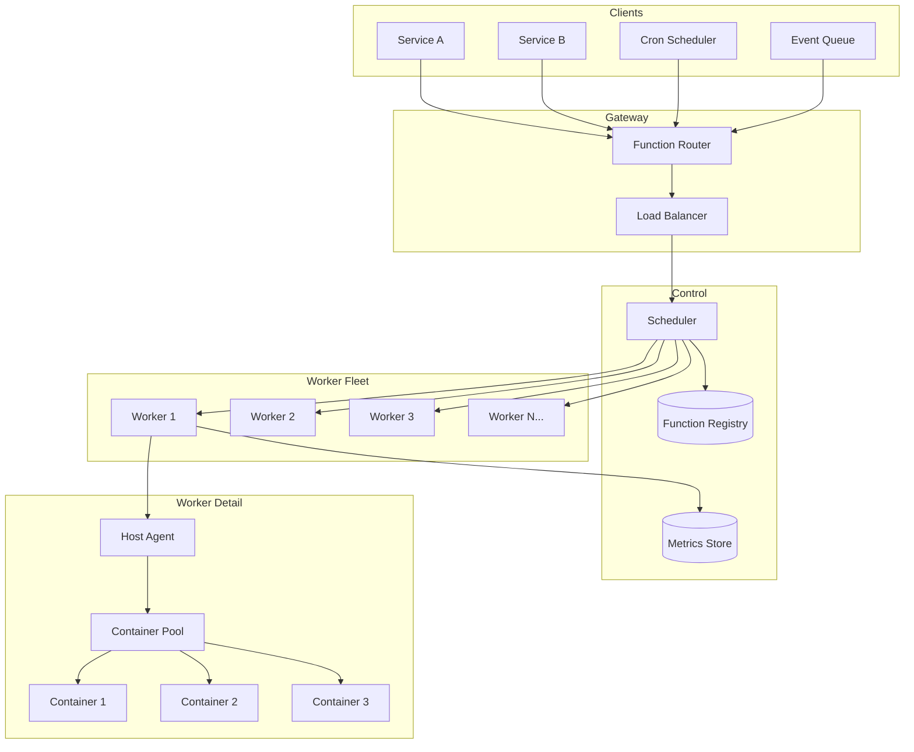
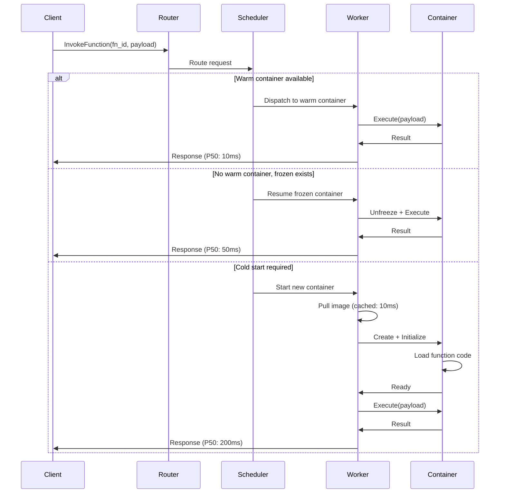
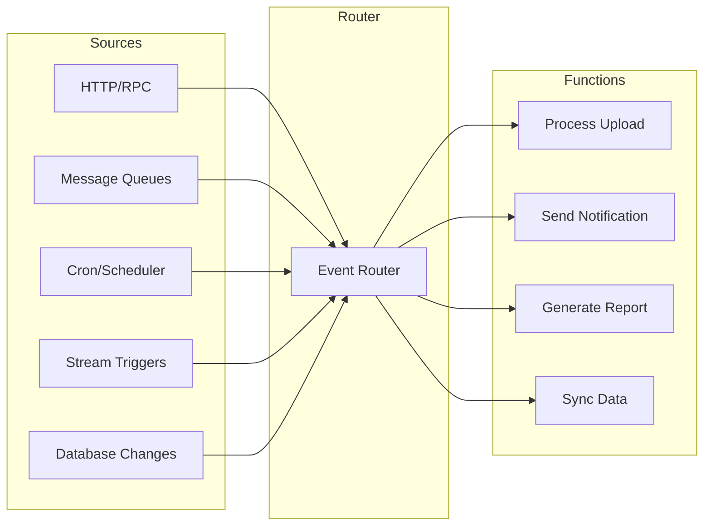
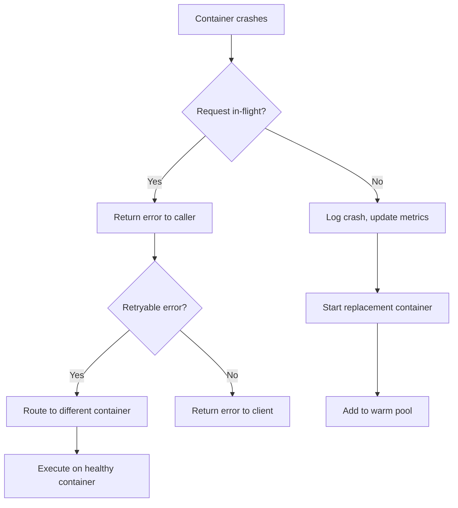

# Chapter 17: Meta Serverless - 11.5 Million Functions per Second

> *What does it take to run a serverless platform at the scale of Meta's internal infrastructure?*

---

## The Problem Statement

### The Business Problem

Meta's internal infrastructure must:
- Execute 11.5 million function invocations per second
- Support thousands of internal teams with different workloads
- Minimize cold start latency (developers expect instant responses)
- Maximize resource efficiency (data center costs are enormous)
- Handle extreme traffic spikes (Super Bowl, elections, viral moments)

**The efficiency imperative:**
At Meta's scale, a 1% improvement in resource utilization saves millions of dollars per year. But developers want simplicity—they don't want to manage servers.

### The Naive Implementation

```python
def handle_function_request(function_id, payload):
    # Find or create container
    container = find_idle_container(function_id)
    if not container:
        # Cold start: pull image, start container
        image = pull_image(function_id)  # 500ms - 5s
        container = start_container(image)  # 100ms - 1s
        initialize_runtime(container)  # 100ms - 500ms

    # Execute function
    result = container.execute(payload)

    # Tear down container
    container.stop()  # Wasted work!

    return result
```

**Why this breaks:**

1. **Cold starts everywhere**: Starting a container for each request takes 1-10 seconds. Unacceptable latency.

2. **Wasted resources**: Starting and stopping containers constantly wastes CPU and memory.

3. **No reuse**: Container initialization (loading code, warming JIT, establishing connections) is repeated.

4. **Poor bin packing**: Random scheduling leaves servers half-empty while requests queue.

5. **No isolation**: One runaway function can consume all resources on a host.

### Meta Serverless Scale Reference

| Metric | Value |
|--------|-------|
| Function invocations per second | 11.5 million |
| Unique functions | Hundreds of thousands |
| Hosts in fleet | Tens of thousands |
| Peak memory per function | 1-16 GB |
| P99 cold start target | < 200 ms |
| Container density per host | 50-200 functions |

---

## Core Architecture

### High-Level View



### Container Lifecycle States

Understanding container states is fundamental to serverless efficiency:

```
┌──────────────────────────────────────────────────────────────────┐
│                     Container Lifecycle                          │
│                                                                  │
│  ┌─────────┐    ┌─────────┐    ┌─────────┐    ┌─────────┐      │
│  │  Cold   │───►│ Warming │───►│  Warm   │───►│  Hot    │      │
│  │ (none)  │    │(loading)│    │ (idle)  │    │(running)│      │
│  └─────────┘    └─────────┘    └─────────┘    └─────────┘      │
│       │              │              │              │            │
│       │              │              │              │            │
│       │              │              ▼              │            │
│       │              │        ┌─────────┐         │            │
│       │              │        │ Frozen  │         │            │
│       │              │        │(paused) │         │            │
│       │              │        └─────────┘         │            │
│       │              │              │              │            │
│       ▼              ▼              ▼              ▼            │
│  ┌─────────────────────────────────────────────────────────┐   │
│  │                    Terminated                           │   │
│  └─────────────────────────────────────────────────────────┘   │
└──────────────────────────────────────────────────────────────────┘

Cold → Warming: Pull image, create container, load runtime
Warming → Warm: Initialization complete, ready for requests
Warm → Hot: Executing a request
Hot → Warm: Request complete, awaiting next request
Warm → Frozen: Idle too long, checkpoint to save resources
Frozen → Warm: Resume from checkpoint (fast)
Any → Terminated: Eviction, error, or timeout
```

### Request Flow: Function Invocation



### Infrastructure: Worker Host Layout

```
┌────────────────────────────────────────────────────────────────────┐
│                         Worker Host (128 cores, 512GB RAM)          │
├────────────────────────────────────────────────────────────────────┤
│                                                                    │
│  ┌──────────────────────────────────────────────────────────────┐  │
│  │                        Host Agent                            │  │
│  │  - Container lifecycle management                            │  │
│  │  - Resource accounting                                       │  │
│  │  - Health monitoring                                         │  │
│  │  - Metrics collection                                        │  │
│  └──────────────────────────────────────────────────────────────┘  │
│                                                                    │
│  ┌──────────────┐ ┌──────────────┐ ┌──────────────┐ ┌──────────┐  │
│  │ Container 1  │ │ Container 2  │ │ Container 3  │ │   ...    │  │
│  │ fn: resize   │ │ fn: notify   │ │ fn: validate │ │          │  │
│  │ mem: 512MB   │ │ mem: 1GB     │ │ mem: 256MB   │ │          │  │
│  │ cpu: 0.5     │ │ cpu: 1.0     │ │ cpu: 0.25    │ │          │  │
│  │ state: HOT   │ │ state: WARM  │ │ state: FROZEN│ │          │  │
│  └──────────────┘ └──────────────┘ └──────────────┘ └──────────┘  │
│                                                                    │
│  ┌──────────────────────────────────────────────────────────────┐  │
│  │                    Image Cache Layer                         │  │
│  │  [resize:v2.1] [notify:v1.0] [validate:v3.2] [...]          │  │
│  └──────────────────────────────────────────────────────────────┘  │
│                                                                    │
│  ┌──────────────────────────────────────────────────────────────┐  │
│  │                    cgroup Resource Pools                     │  │
│  │  CPU: ████████████████░░░░░░░░░░░░░░░░░░ (45% used)         │  │
│  │  MEM: ████████████░░░░░░░░░░░░░░░░░░░░░░ (35% used)         │  │
│  └──────────────────────────────────────────────────────────────┘  │
└────────────────────────────────────────────────────────────────────┘
```

---

## Deep Dive: The Clever Bits

### 1. Cold Start Elimination: The Three-Pronged Approach

**Prong 1: Predictive Pre-warming**

```python
class PredictiveWarmer:
    def __init__(self):
        self.invocation_history = TimeSeries()
        self.predictor = load_ml_model("warm_predictor")

    def predict_and_warm(self):
        for function_id in get_all_functions():
            # Predict invocations in next 5 minutes
            predicted_load = self.predictor.predict(
                function_id,
                self.invocation_history[function_id],
                current_time=now(),
                horizon_minutes=5
            )

            current_warm = count_warm_containers(function_id)
            needed = predicted_load - current_warm

            if needed > 0:
                warm_containers(function_id, count=needed)
```

**Prong 2: Snapshot/Restore (CRIU)**

Checkpoint/Restore In Userspace (CRIU) freezes a running container and restores it later:

```
Container running with initialized state
         │
         ▼ CRIU Checkpoint
┌─────────────────────────────────────┐
│  Memory pages  │  Open files       │
│  TCP connections│ Process state    │
│  Environment   │  Stack/heap       │
└─────────────────────────────────────┘
         │
         ▼ Store to disk/memory
    snapshot.img (50-500MB)
         │
         ▼ CRIU Restore (50-100ms)
Container running exactly where it left off
```

**Prong 3: Container Pooling**

Keep generic containers warm, specialize on demand:

```
┌─────────────────────────────────────────────────────────────┐
│                    Container Pool Strategy                   │
├─────────────────────────────────────────────────────────────┤
│                                                              │
│  Tier 1: Language Runtime Pools (always warm)               │
│  ┌────────┐ ┌────────┐ ┌────────┐ ┌────────┐               │
│  │Python  │ │Node.js │ │ Java   │ │  Go    │               │
│  │pool:100│ │pool:100│ │pool:50 │ │pool:50 │               │
│  └────────┘ └────────┘ └────────┘ └────────┘               │
│                                                              │
│  Tier 2: Popular Function Pools (based on traffic)          │
│  ┌────────────┐ ┌────────────┐ ┌────────────┐              │
│  │ image_resize│ │ send_notif │ │ auth_check │              │
│  │  pool: 500  │ │  pool: 200 │ │  pool: 150 │              │
│  └────────────┘ └────────────┘ └────────────┘              │
│                                                              │
│  Tier 3: Frozen Pool (CRIU snapshots)                       │
│  ┌────────────────────────────────────────────┐             │
│  │ 10,000 frozen functions, restore in <100ms │             │
│  └────────────────────────────────────────────┘             │
│                                                              │
└─────────────────────────────────────────────────────────────┘
```

### 2. Scheduling at Scale: The Bin Packing Problem

**The challenge:**
Pack millions of functions onto thousands of servers. Each function has different CPU/memory requirements. Servers have different capacities.

**Two-level scheduling:**

```
┌─────────────────────────────────────────────────────────────┐
│                     Global Scheduler                         │
│  - Maintains cluster-wide view                               │
│  - Coarse-grained placement decisions                        │
│  - Routes to least-loaded region/rack                        │
└───────────────────────┬─────────────────────────────────────┘
                        │
          ┌─────────────┼─────────────┐
          ▼             ▼             ▼
┌──────────────┐ ┌──────────────┐ ┌──────────────┐
│ Local Sched 1│ │ Local Sched 2│ │ Local Sched 3│
│ (per-rack)   │ │ (per-rack)   │ │ (per-rack)   │
│ Fine-grained │ │ Fine-grained │ │ Fine-grained │
│ bin packing  │ │ bin packing  │ │ bin packing  │
└──────────────┘ └──────────────┘ └──────────────┘
```

**Bin packing algorithm (simplified):**

```python
def schedule_function(function_spec, candidate_hosts):
    scored_hosts = []

    for host in candidate_hosts:
        if not can_fit(host, function_spec):
            continue

        score = (
            0.4 * memory_fit_score(host, function_spec) +
            0.3 * cpu_fit_score(host, function_spec) +
            0.2 * locality_score(host, function_spec) +  # Same host as deps
            0.1 * warm_container_bonus(host, function_spec)
        )

        scored_hosts.append((host, score))

    # Best-fit decreasing: prefer tighter fits
    return max(scored_hosts, key=lambda x: x[1])

def memory_fit_score(host, spec):
    # Prefer hosts where function fills remaining memory well
    remaining = host.free_memory - spec.memory_limit
    if remaining < 0:
        return 0
    # Score higher for tighter fits (less waste)
    return 1.0 - (remaining / host.total_memory)
```

**Defragmentation:**
Over time, small gaps accumulate. Periodically consolidate:

```
Before defrag:
Host A: [F1][   ][F2][   ][F3]  (60% utilized, fragmented)
Host B: [F4][   ][   ][F5]      (50% utilized)

After defrag:
Host A: [F1][F2][F3][F4][F5]    (95% utilized)
Host B: [   empty - power off  ] (0% - saved power)
```

### 3. Resource Isolation: Preventing Noisy Neighbors

**cgroups v2 for resource limits:**

```bash
# Create function container cgroup
mkdir /sys/fs/cgroup/function_12345

# Set memory limit (hard cap)
echo "536870912" > /sys/fs/cgroup/function_12345/memory.max  # 512MB

# Set CPU limit (50% of one core)
echo "50000 100000" > /sys/fs/cgroup/function_12345/cpu.max

# Set I/O weight (lower priority)
echo "100" > /sys/fs/cgroup/function_12345/io.weight  # 1-10000 scale
```

**Multi-layer isolation:**

```
┌──────────────────────────────────────────────────────────────┐
│                    Isolation Layers                          │
├──────────────────────────────────────────────────────────────┤
│                                                              │
│  Layer 1: cgroups - Resource limits                         │
│    Memory: Hard limit with OOM kill                          │
│    CPU: CFS bandwidth control                                │
│    I/O: Proportional weight                                  │
│                                                              │
│  Layer 2: namespaces - Visibility isolation                  │
│    PID: Can't see other processes                            │
│    Network: Separate network stack                           │
│    Mount: Separate filesystem view                           │
│                                                              │
│  Layer 3: seccomp - System call filtering                    │
│    Block dangerous syscalls (ptrace, mount, etc.)            │
│                                                              │
│  Layer 4: User namespaces - Privilege isolation              │
│    Root in container != root on host                         │
│                                                              │
└──────────────────────────────────────────────────────────────┘
```

**Noisy neighbor detection:**

```python
class NoisyNeighborDetector:
    def monitor_host(self, host):
        for container in host.containers:
            metrics = get_metrics(container)

            # Detect CPU throttling
            if metrics.cpu_throttled_periods > THRESHOLD:
                alert("CPU noisy neighbor", container)

            # Detect memory pressure
            if metrics.memory_pressure_stall_time > THRESHOLD:
                alert("Memory pressure", container)

            # Detect I/O bandwidth hogging
            if metrics.io_bandwidth > container.io_limit * 0.9:
                throttle_io(container)
```

### 4. Event-Driven Architecture: Beyond Request/Response

**Event sources at Meta's scale:**



**Event batching for efficiency:**

```python
class EventBatcher:
    def __init__(self, batch_size=100, max_wait_ms=50):
        self.batch_size = batch_size
        self.max_wait_ms = max_wait_ms
        self.pending = defaultdict(list)

    async def add_event(self, function_id, event):
        self.pending[function_id].append(event)

        if len(self.pending[function_id]) >= self.batch_size:
            await self.flush(function_id)
        else:
            # Start timer for max wait
            asyncio.create_task(self.delayed_flush(function_id))

    async def flush(self, function_id):
        events = self.pending.pop(function_id, [])
        if events:
            # Invoke function with batch of events
            await invoke_function(function_id, {"events": events})
```

### 5. Observability at Scale: Tracing 11.5M Invocations/Second

**Sampling strategy:**

```python
def should_sample(request):
    # Always sample errors
    if request.is_error:
        return True

    # Always sample slow requests
    if request.latency_ms > P99_LATENCY:
        return True

    # Always sample specific high-value functions
    if request.function_id in HIGH_VALUE_FUNCTIONS:
        return True

    # Head-based sampling for trace continuity
    if request.trace_id and request.parent_sampled:
        return True

    # Otherwise, probabilistic sampling
    # Adjust rate based on traffic (target 1M samples/hour)
    target_samples_per_second = 1_000_000 / 3600  # ~278/sec
    current_rate = get_current_traffic()
    sample_probability = target_samples_per_second / current_rate

    return random.random() < sample_probability
```

**Metrics aggregation:**

```
┌─────────────────────────────────────────────────────────────┐
│                   Metrics Pipeline                           │
├─────────────────────────────────────────────────────────────┤
│                                                              │
│  Worker Hosts (1000s)                                        │
│  ┌─────────────────────────────────────────────────────┐    │
│  │ Local aggregation every 10 seconds                   │    │
│  │ - Histogram buckets for latency                      │    │
│  │ - Counters for invocations, errors                   │    │
│  │ - Gauges for container count, memory                 │    │
│  └─────────────────────┬───────────────────────────────┘    │
│                        ▼                                     │
│  Regional Aggregators (10s)                                  │
│  ┌─────────────────────────────────────────────────────┐    │
│  │ Combine metrics from 100 hosts                       │    │
│  │ Downsample to 1-minute resolution                    │    │
│  └─────────────────────┬───────────────────────────────┘    │
│                        ▼                                     │
│  Global Time-Series DB                                       │
│  ┌─────────────────────────────────────────────────────┐    │
│  │ Query: p50, p99, error_rate by function, region      │    │
│  │ Retention: 30 days full, 1 year aggregated           │    │
│  └─────────────────────────────────────────────────────┘    │
│                                                              │
└─────────────────────────────────────────────────────────────┘
```

---

## Failure Modes & Recovery

### Scenario 1: Container Crash

**The scenario:**
A function throws an unhandled exception or segfaults. Container terminates.

**Recovery flow:**



**Crash budget:**
```python
class CrashBudget:
    def __init__(self, function_id, max_crashes_per_minute=10):
        self.function_id = function_id
        self.max_crashes = max_crashes_per_minute
        self.recent_crashes = deque(maxlen=100)

    def record_crash(self):
        self.recent_crashes.append(time.time())

        recent_count = sum(
            1 for t in self.recent_crashes
            if time.time() - t < 60
        )

        if recent_count > self.max_crashes:
            disable_function(self.function_id)
            alert_oncall("Function disabled due to crash loop")
```

### Scenario 2: Cascade Failure

**The scenario:**
A downstream service is slow. Functions time out waiting. Queue backs up. More timeouts.

**Protection mechanisms:**

```
┌─────────────────────────────────────────────────────────────┐
│                  Cascade Prevention                          │
├─────────────────────────────────────────────────────────────┤
│                                                              │
│  1. Timeout at every boundary                                │
│     Function timeout: 30s                                    │
│     Downstream call timeout: 5s                              │
│     Queue wait timeout: 10s                                  │
│                                                              │
│  2. Circuit breakers per dependency                          │
│     Open after 50% error rate                                │
│     Half-open after 30s                                      │
│     Close after 5 successful requests                        │
│                                                              │
│  3. Bulkhead isolation                                       │
│     Each function type gets separate thread pool             │
│     Slow function can't exhaust workers for fast ones        │
│                                                              │
│  4. Load shedding                                            │
│     Queue depth > threshold → reject new requests            │
│     Prefer completing in-flight over accepting new           │
│                                                              │
└─────────────────────────────────────────────────────────────┘
```

### Scenario 3: Host Failure

**The scenario:**
A worker host loses power. 100 containers disappear instantly.

**Recovery:**

1. **Detection** (< 10s): Heartbeat timeout from host agent
2. **Request rerouting** (immediate): Pending requests sent to other hosts
3. **Container recreation** (< 30s): Warm pools replenished on other hosts
4. **State recovery** (if stateful): Replay from durable storage

```python
class HostFailureHandler:
    async def handle_host_down(self, host_id):
        # 1. Mark host as dead
        mark_host_unavailable(host_id)

        # 2. Get list of affected functions
        affected_functions = get_functions_on_host(host_id)

        # 3. Redistribute immediately
        for function_id in affected_functions:
            # Find alternative hosts
            alt_hosts = find_hosts_with_capacity(function_id)

            # Warm containers on alternatives
            await warm_containers(function_id, hosts=alt_hosts)

        # 4. Drain pending requests to new hosts
        await reroute_pending_requests(host_id)
```

---

## Scale Numbers & Mental Models

### Mental Model: The Restaurant Kitchen

Think of serverless like a restaurant kitchen at peak hours:

| Restaurant Concept | Serverless Equivalent |
|-------------------|----------------------|
| Prep cook stations | Pre-warmed containers |
| Expediter | Scheduler |
| Station assignments | Bin packing |
| Mise en place | Container initialization |
| Dish ready | Function response |
| Kitchen capacity | Host resources |
| Menu specials | Popular functions |

The key insight: Just as restaurants pre-prep popular dishes, serverless platforms pre-warm popular functions. The expediter (scheduler) routes orders to the right station (host) to maximize throughput.

### Throughput Math

**Single host capacity:**
```
Host specs: 128 cores, 512 GB RAM

Average function: 256MB memory, 0.5 CPU
Max containers per host: min(512GB/256MB, 128/0.5) = min(2000, 256) = 256

At 100ms average execution time:
Throughput per container: 10 req/sec
Throughput per host: 256 × 10 = 2,560 req/sec
```

**Fleet capacity:**
```
Fleet size: 10,000 hosts
Raw capacity: 10,000 × 2,560 = 25.6M req/sec

With headroom (40% utilization target):
Sustained capacity: 25.6M × 0.4 = 10.2M req/sec

Actual: 11.5M req/sec (45% utilization, efficient bin packing)
```

### Cold Start Latency Budget

**Worst case (cold start):**
```
Image pull (if not cached):      0 ms (always cached)
Container creation:             50 ms
Runtime initialization:         80 ms
Function code loading:          50 ms
Connection warm-up:             20 ms
───────────────────────────────────
Total cold start:              200 ms (P99 target)
```

**Best case (hot container):**
```
Request routing:                 2 ms
Function execution:             10 ms
Response serialization:          1 ms
───────────────────────────────────
Total:                          13 ms (P50)
```

### Memory Efficiency

**Container overhead analysis:**
```
Base container (runtime):        50 MB
Function code:                   10 MB (average)
Runtime heap:                    50 MB (average)
Warm connection pools:           20 MB
───────────────────────────────────
Per-container overhead:         130 MB

With 50 containers per host:
Total overhead: 50 × 130MB = 6.5 GB (1.3% of 512GB)
```

---

## Advanced Topics

### Workload-Aware Scheduling

**Function profiles:**
```python
class FunctionProfile:
    cpu_bound: bool           # True = compute heavy
    memory_bound: bool        # True = large heap
    io_bound: bool            # True = lots of network/disk
    latency_sensitive: bool   # True = SLA < 100ms
    burst_pattern: str        # "steady", "spiky", "cron"
    avg_duration_ms: int
    memory_mb: int
    cpu_cores: float
```

**Profile-aware placement:**
- CPU-bound functions: Spread across hosts
- Memory-bound functions: Avoid memory-pressure hosts
- I/O-bound functions: Co-locate on same host (they don't compete)
- Latency-sensitive: Reserve capacity, avoid noisy neighbors

### Serverless Containers vs. VMs

**Why containers, not VMs?**

| Factor | Container | VM |
|--------|-----------|-----|
| Start time | 50-200ms | 5-30 seconds |
| Memory overhead | 50-100MB | 256MB-1GB |
| Density | 100+ per host | 10-50 per host |
| Isolation | Process-level | Hardware-level |
| Security | Moderate | Strong |

Meta uses containers because startup time and density matter more than VM-level isolation for internal functions.

### Firecracker: The Middle Ground

AWS Lambda uses Firecracker microVMs for customer workloads:
- VM-level isolation
- Container-like startup (< 125ms)
- Low memory overhead (~5MB per microVM)

For multi-tenant serverless (like AWS Lambda), this provides the security of VMs with the speed of containers.

---

## Key Takeaways

1. **Cold starts are the enemy**: Predictive warming, CRIU snapshots, and container pooling eliminate cold starts for hot paths.

2. **Bin packing drives efficiency**: Smart scheduling can improve utilization from 30% to 45%+. At scale, that's millions of dollars.

3. **Isolation is non-negotiable**: cgroups, namespaces, and seccomp prevent noisy neighbors from affecting other functions.

4. **Two-level scheduling scales**: Global schedulers handle coarse routing; local schedulers handle fine-grained bin packing.

5. **Observability must be sampled**: At 11.5M req/sec, you can't store everything. Smart sampling captures what matters.

---

## Further Reading

- [Firecracker: Lightweight Virtualization for Serverless Applications](https://www.usenix.org/conference/nsdi20/presentation/agache) - AWS Lambda's microVM
- [SOCK: Rapid Task Provisioning with Serverless-Optimized Containers](https://www.usenix.org/conference/atc18/presentation/oakes) - Container optimization
- [Catalyzer: Sub-millisecond Startup for Serverless Computing](https://www.usenix.org/conference/asplos20/presentation/du) - CRIU-based fast startup
- [Serverless in the Wild](https://www.microsoft.com/en-us/research/publication/serverless-in-the-wild-characterizing-and-optimizing-the-serverless-workload-at-a-large-cloud-provider/) - Azure Functions workload analysis
- [Meta's Tupperware](https://engineering.fb.com/2019/06/06/data-center-engineering/twine/) - Container platform (predecessor)

---

*Next chapter: [Scaling to 10 Million Users](../../part-8-capstone/18-scaling-to-10-million-users/README.md)*
