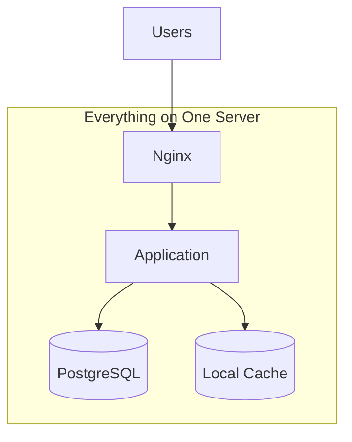
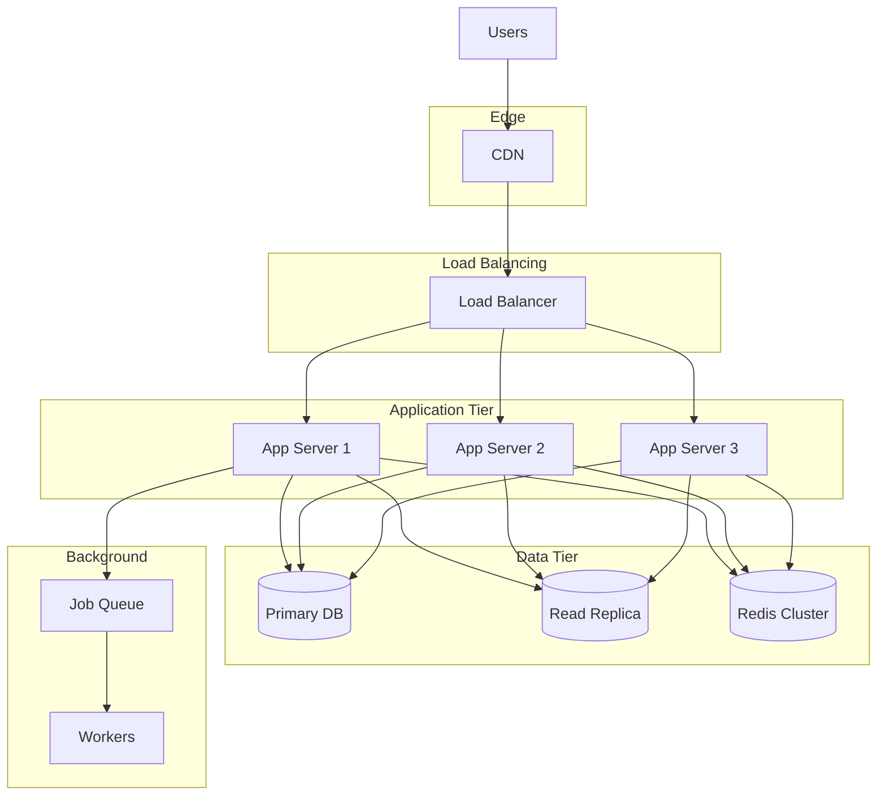
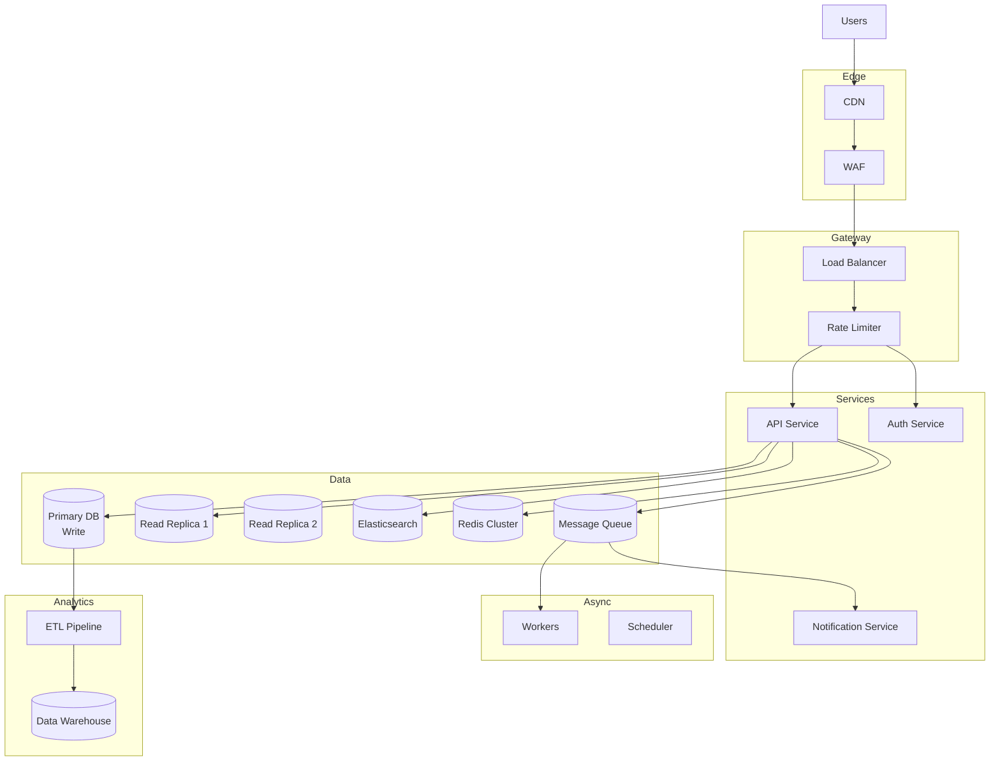
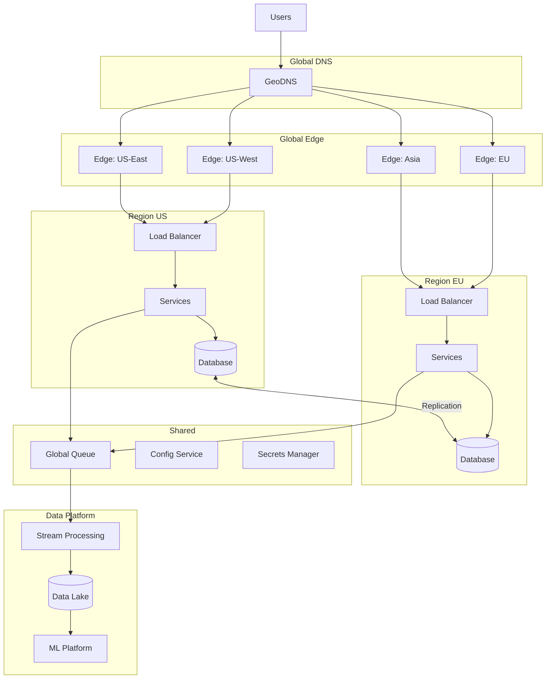

# Chapter 18: Scaling to 10 Million Users - A Progressive Journey

> *Every system starts with zero users. How do you evolve architecture as you grow from 0 to 10 million?*

---

## The Problem Statement

### The Business Problem

A growing startup must:
- Start small (validate quickly, minimize costs)
- Scale smoothly (no rewrites during growth spurt)
- Make the right decisions at the right time
- Balance technical debt against velocity
- Know when to over-engineer vs. when to keep it simple

**The scaling paradox:**
Over-engineering at 1,000 users wastes time and money. Under-engineering at 100,000 users causes outages and churn. The art is knowing when to make each transition.

### The Naive Approaches

**Approach 1: "We'll scale when we need to"**
```
Month 1: Ship fast, single server
Month 6: Product-market fit, users growing 20%/week
Month 7: Database overloaded, 2-hour outage
Month 8: Emergency rewrite while losing users
```

**Approach 2: "Let's build for Google scale from day one"**
```
Month 1-6: Building Kubernetes, microservices, sharding
Month 7: Product doesn't work, pivot required
Month 8: All that infrastructure is irrelevant
Result: $500K spent, zero users
```

**The right approach:**
Plan for the next 10x, build for the current 2x, and know the decision points.

### The Scaling Journey Overview

```
┌─────────────────────────────────────────────────────────────────────────┐
│                     The Scaling Journey                                  │
├─────────────────────────────────────────────────────────────────────────┤
│                                                                          │
│  Users:     1        1K        10K       100K       1M        10M       │
│             │         │          │          │         │          │       │
│  Stage:   [MVP]   [Validate] [Traction] [Growth] [Scale]  [Mature]      │
│             │         │          │          │         │          │       │
│  Focus:   Speed    Feedback   Stability  Perf    Efficiency  Global    │
│             │         │          │          │         │          │       │
│  Pain:    None     Slight      Real     Urgent   Strategic  Ongoing    │
│                                                                          │
└─────────────────────────────────────────────────────────────────────────┘
```

---

## Stage 1: 0 to 1,000 Users

### The Goal

**Validate the idea with minimal investment.**

At this stage, you're not building for scale—you're building to learn. The biggest risk isn't technical failure; it's building something nobody wants.

### The Architecture



**The stack:**
```
┌────────────────────────────────────────┐
│           Single Server ($20/month)     │
├────────────────────────────────────────┤
│                                        │
│  Nginx          → Reverse proxy, SSL   │
│  Rails/Django   → Application          │
│  PostgreSQL     → Database             │
│  Redis          → Sessions, cache      │
│  Sidekiq/Celery → Background jobs      │
│                                        │
│  Ubuntu on DigitalOcean/Render/Railway │
│                                        │
└────────────────────────────────────────┘
```

### Key Decisions

| Decision | Choice | Rationale |
|----------|--------|-----------|
| Database | PostgreSQL | Full-featured, won't need to migrate |
| Framework | Rails/Django | Batteries included, fast development |
| Hosting | Simple PaaS | Deploy in minutes, managed SSL |
| Auth | Third-party (Auth0, Clerk) | Don't build auth, it's solved |
| Payments | Stripe | Industry standard, excellent docs |
| Monitoring | Free tier (Sentry, LogSnag) | Enough for now |

### What NOT to Do

- Don't use microservices. You don't have the team to maintain them.
- Don't shard your database. You have 1,000 users.
- Don't build a custom auth system. You'll get it wrong.
- Don't optimize for performance. Your site handles 10 concurrent users.
- Don't set up Kubernetes. You have one server.

### Metrics That Matter

```
Response time:    < 500ms (nobody notices)
Uptime:           99% (occasional deploys are fine)
Deploy frequency: Multiple times per day
Recovery time:    30 minutes (you can SSH in and fix it)
```

### When to Move to Stage 2

**Signals:**
- Database CPU consistently > 50%
- Response times creeping over 1 second
- You've found product-market fit
- Team growing beyond 3 developers

---

## Stage 2: 1,000 to 100,000 Users

### The Goal

**Handle real traffic without heroics.**

You've validated the product. Now you need to make it reliable. Users are paying you money—they expect it to work.

### The Architecture



### What Changes

```
┌──────────────────────────────────────────────────────────────────────────┐
│                    Stage 2 Infrastructure                                 │
├──────────────────────────────────────────────────────────────────────────┤
│                                                                           │
│  NEW: CDN (Cloudflare)                                                   │
│    - Static assets served from edge                                       │
│    - DDoS protection included                                             │
│    - Easy SSL                                                             │
│                                                                           │
│  NEW: Load Balancer                                                       │
│    - Health checks                                                        │
│    - SSL termination                                                      │
│    - Round-robin distribution                                             │
│                                                                           │
│  NEW: Multiple App Servers (2-5)                                         │
│    - Horizontal scaling                                                   │
│    - Zero-downtime deploys                                                │
│    - Redundancy for failures                                              │
│                                                                           │
│  NEW: Database Read Replica                                               │
│    - Offload read queries (70%+ of traffic)                              │
│    - Reporting without impacting production                               │
│    - Failover capability                                                  │
│                                                                           │
│  NEW: Managed Redis                                                       │
│    - Session storage (stateless apps)                                     │
│    - Caching hot data                                                     │
│    - Rate limiting                                                        │
│                                                                           │
│  UPGRADED: Proper Monitoring                                              │
│    - APM (Datadog, New Relic)                                            │
│    - Log aggregation (Papertrail, Logtail)                               │
│    - Alerting (PagerDuty)                                                │
│                                                                           │
└──────────────────────────────────────────────────────────────────────────┘
```

### Key Decisions

| Decision | Choice | Rationale |
|----------|--------|-----------|
| CDN | Cloudflare (free tier) | Instant global edge, DDoS protection |
| App servers | 2-5 instances | Redundancy + capacity |
| Database | Managed PostgreSQL | Let AWS/GCP handle backups and failover |
| Caching | Redis for sessions + hot data | Reduces DB load by 50%+ |
| Deploys | CI/CD (GitHub Actions) | No more manual deploys |
| Monitoring | APM + alerting | Know before users complain |

### Database Optimization

**Before adding infrastructure, optimize queries:**

```sql
-- Add indexes for common queries
CREATE INDEX idx_orders_user_id ON orders(user_id);
CREATE INDEX idx_orders_created_at ON orders(created_at);

-- Add composite index for common filter + sort
CREATE INDEX idx_orders_user_status ON orders(user_id, status, created_at DESC);

-- Use EXPLAIN ANALYZE to find slow queries
EXPLAIN ANALYZE SELECT * FROM orders WHERE user_id = 123 ORDER BY created_at DESC LIMIT 20;
```

**Caching strategy:**

```python
def get_user_profile(user_id):
    # Check cache first
    cache_key = f"user_profile:{user_id}"
    cached = redis.get(cache_key)
    if cached:
        return json.loads(cached)

    # Cache miss: query database
    profile = db.query("SELECT * FROM users WHERE id = %s", user_id)

    # Cache for 5 minutes
    redis.setex(cache_key, 300, json.dumps(profile))
    return profile
```

### Cost at This Stage

```
App servers (3x):           $150/month
Managed PostgreSQL:         $100/month
Redis:                      $50/month
Load balancer:              $20/month
CDN:                        Free (Cloudflare)
Monitoring:                 $50/month
───────────────────────────────────────
Total:                      ~$400/month

At 50,000 users paying $10/month:
Revenue: $500,000/month
Infrastructure: 0.08% of revenue ✓
```

### When to Move to Stage 3

**Signals:**
- Read replica at capacity
- Single PostgreSQL instance hitting limits
- Need for specialized data stores (search, analytics)
- Team > 10 engineers, coordination overhead increasing

---

## Stage 3: 100,000 to 1,000,000 Users

### The Goal

**Specialize and distribute.**

The monolith is getting unwieldy. Some parts of the system have different scaling needs. You need specialized solutions for search, real-time features, and analytics.

### The Architecture



### What Changes

```
┌──────────────────────────────────────────────────────────────────────────┐
│                    Stage 3: Specialization                                │
├──────────────────────────────────────────────────────────────────────────┤
│                                                                           │
│  NEW: Service Extraction (start small)                                   │
│    - Auth service (security boundary)                                     │
│    - Notification service (different scaling pattern)                     │
│    - Keep core as monolith (don't over-split)                            │
│                                                                           │
│  NEW: Elasticsearch                                                       │
│    - Full-text search                                                     │
│    - Faceted filtering                                                    │
│    - Type-ahead suggestions                                               │
│                                                                           │
│  NEW: Message Queue (RabbitMQ/SQS)                                       │
│    - Async processing                                                     │
│    - Decoupling services                                                  │
│    - Retry handling                                                       │
│                                                                           │
│  NEW: Data Warehouse (BigQuery/Snowflake)                                │
│    - Analytics separated from production                                  │
│    - Heavy queries don't impact users                                     │
│    - Historical data retention                                            │
│                                                                           │
│  UPGRADED: Multiple Read Replicas                                         │
│    - Geographic distribution                                              │
│    - Specialized replicas (reporting, search indexing)                   │
│                                                                           │
│  UPGRADED: Security                                                       │
│    - WAF (Web Application Firewall)                                      │
│    - Rate limiting per endpoint                                           │
│    - DDoS mitigation                                                      │
│                                                                           │
└──────────────────────────────────────────────────────────────────────────┘
```

### Service Extraction: When and What

**Extract services based on:**
1. Different scaling requirements (notifications spike during events)
2. Different team ownership (security team owns auth)
3. Different deployment frequencies (move fast on features, slow on auth)
4. Technical boundaries (real-time vs. batch)

**Don't extract:**
- Just because "microservices are modern"
- CRUD operations that are tightly coupled
- Before you have the team to maintain them

### Database: To Shard or Not to Shard?

**At 1M users, you probably don't need sharding yet.**

**First, try:**
- More read replicas
- Query optimization
- Aggressive caching
- Archiving old data

**Sharding checklist (if you must):**
```
□ Single table > 1TB
□ Write throughput > 10,000/sec
□ Read replicas can't keep up
□ Already optimized everything else
□ Have a clear sharding key
□ Team understands the complexity
```

**If sharding is needed, shard by:**
- User ID (most common)
- Tenant ID (for B2B SaaS)
- Geographic region

### Caching Layers

```
┌─────────────────────────────────────────────────────────────────────────┐
│                         Caching Strategy                                 │
├─────────────────────────────────────────────────────────────────────────┤
│                                                                          │
│  Layer 1: CDN (static assets, API responses)                            │
│    TTL: 1 hour for static, 60 seconds for dynamic                        │
│    Hit rate target: 80%+                                                 │
│                                                                          │
│  Layer 2: Application cache (Redis)                                      │
│    - User sessions                                                       │
│    - Frequently accessed objects                                         │
│    - Computed aggregations                                               │
│    TTL: 5-60 minutes                                                     │
│    Hit rate target: 90%+                                                 │
│                                                                          │
│  Layer 3: Query cache (database level)                                   │
│    - Identical query results                                             │
│    TTL: 1-5 minutes                                                      │
│                                                                          │
│  Layer 4: Connection pooling                                             │
│    - Reuse database connections                                          │
│    - Reuse HTTP connections                                              │
│                                                                          │
└─────────────────────────────────────────────────────────────────────────┘
```

### When to Move to Stage 4

**Signals:**
- Single region latency issues for global users
- Database write capacity is the bottleneck
- Need for more than 2-3 services
- Operational complexity requires dedicated platform team

---

## Stage 4: 1,000,000 to 10,000,000 Users

### The Goal

**Go global. Build platform capabilities.**

You're no longer a startup—you're a scale-up. You need global presence, specialized teams, and platform-level thinking.

### The Architecture



### What Changes

```
┌──────────────────────────────────────────────────────────────────────────┐
│                    Stage 4: Global Scale                                  │
├──────────────────────────────────────────────────────────────────────────┤
│                                                                           │
│  NEW: Multi-Region Deployment                                            │
│    - US, EU, Asia presence                                               │
│    - Data residency compliance (GDPR)                                    │
│    - < 100ms latency for all users                                       │
│                                                                           │
│  NEW: Database Replication Strategy                                       │
│    - Primary in main region, replicas globally                           │
│    - OR: Multi-primary for geo-distributed writes                        │
│    - Conflict resolution for concurrent writes                           │
│                                                                           │
│  NEW: Event-Driven Architecture                                          │
│    - Kafka/Kinesis for event streaming                                   │
│    - Services communicate via events                                      │
│    - Enables real-time analytics                                          │
│                                                                           │
│  NEW: Platform Teams                                                      │
│    - Developer platform (CI/CD, observability)                           │
│    - Data platform (pipelines, ML)                                       │
│    - Infrastructure platform (Kubernetes)                                 │
│                                                                           │
│  NEW: Feature Flags & Experimentation                                    │
│    - Gradual rollouts                                                    │
│    - A/B testing at scale                                                │
│    - Kill switches for incidents                                          │
│                                                                           │
│  UPGRADED: Observability                                                  │
│    - Distributed tracing (Jaeger, Honeycomb)                             │
│    - Custom metrics and dashboards                                        │
│    - SLO tracking and error budgets                                       │
│                                                                           │
└──────────────────────────────────────────────────────────────────────────┘
```

### Multi-Region Strategies

**Option 1: Active-Passive**
```
US (Primary)        EU (Hot Standby)
┌─────────┐         ┌─────────┐
│   RW    │────────►│   RO    │
│ Primary │  Async  │ Replica │
└─────────┘  Repli  └─────────┘

Pros: Simple, consistent
Cons: EU latency, failover complexity
Best for: Apps with mostly US users
```

**Option 2: Active-Active (Read)**
```
US (Primary)        EU (Read Replica)
┌─────────┐         ┌─────────┐
│   RW    │────────►│   RO    │
│ Primary │  Async  │ Replica │
└─────────┘         └─────────┘
     ↑                   ↑
 US writes           EU reads

Pros: Low read latency everywhere
Cons: Writes still go to US
Best for: Read-heavy apps (80%+ reads)
```

**Option 3: Active-Active (Multi-Primary)**
```
US (Primary)        EU (Primary)
┌─────────┐         ┌─────────┐
│   RW    │◄───────►│   RW    │
│ Primary │ Bi-dir  │ Primary │
└─────────┘         └─────────┘

Pros: Low latency everywhere
Cons: Conflict resolution, complexity
Best for: Truly global apps with high write volume
```

### Data Platform

**At this scale, data becomes a product:**

```python
# Example: Real-time event streaming
class EventPipeline:
    def __init__(self):
        self.kafka = KafkaClient()
        self.flink = FlinkClient()
        self.warehouse = BigQueryClient()

    def process_event(self, event):
        # 1. Publish to Kafka
        self.kafka.publish("user-events", event)

        # 2. Real-time processing (Flink)
        # - Update live dashboards
        # - Trigger alerts
        # - Feed ML models

        # 3. Batch load to warehouse (hourly)
        # - Historical analysis
        # - Business reporting
```

### Team Structure at This Scale

```
┌─────────────────────────────────────────────────────────────────────────┐
│                    Engineering Organization (~100 engineers)             │
├─────────────────────────────────────────────────────────────────────────┤
│                                                                          │
│  Product Teams (70%)                                                     │
│  ├── Growth Team (signup, onboarding)                                   │
│  ├── Core Product Team (main features)                                  │
│  ├── Payments Team (billing, subscriptions)                             │
│  ├── Mobile Team (iOS, Android)                                         │
│  └── Enterprise Team (B2B features)                                     │
│                                                                          │
│  Platform Teams (30%)                                                    │
│  ├── Developer Experience (CI/CD, tooling)                              │
│  ├── Infrastructure (Kubernetes, cloud)                                 │
│  ├── Data Platform (pipelines, ML)                                      │
│  └── SRE (reliability, on-call)                                         │
│                                                                          │
└─────────────────────────────────────────────────────────────────────────┘
```

---

## Synthesis: Lessons from Previous Chapters

### From Chapter 1 (S3): Durability and Availability

**Lesson:** Design for failure from the start.

**Application:**
- Stage 1: Automated backups, not just for "later"
- Stage 2: Health checks, automatic failover
- Stage 3: Multi-AZ deployment
- Stage 4: Multi-region with RTO < 1 hour

### From Chapter 2 (Kafka): Event-Driven Architecture

**Lesson:** Decouple through events.

**Application:**
- Stage 2: Simple job queue (Sidekiq, Celery)
- Stage 3: Message broker for service communication
- Stage 4: Full event streaming platform

### From Chapter 3 (URL Shortener): Caching Everywhere

**Lesson:** Reads should rarely hit the database.

**Application:**
- Stage 2: Redis for sessions and hot data
- Stage 3: CDN for API responses
- Stage 4: Multi-level caching with invalidation

### From Chapter 13 (Uber): Location Awareness

**Lesson:** Geography matters for latency.

**Application:**
- Stage 3: CDN edges globally
- Stage 4: Multi-region deployment with geo-routing

### From Chapter 15 (Stripe): Idempotency

**Lesson:** Design for exactly-once semantics.

**Application:**
- Stage 2: Idempotency keys for payment endpoints
- Stage 3: Idempotent event processing
- Stage 4: Distributed transactions with saga patterns

---

## Decision Framework

### When to Add Complexity

```
┌─────────────────────────────────────────────────────────────────────────┐
│                    Complexity Decision Matrix                            │
├─────────────────────────────────────────────────────────────────────────┤
│                                                                          │
│  Add it when:                     Don't add it when:                     │
│  ─────────────                    ──────────────────                     │
│  ✓ Current solution at limit      ✗ "Might need it someday"             │
│  ✓ Clear, measurable benefit      ✗ "Best practices say so"             │
│  ✓ Team can maintain it           ✗ Résumé-driven development           │
│  ✓ Reversible if wrong            ✗ Premature optimization              │
│                                                                          │
│  Cost of complexity:                                                     │
│  - Engineering time to build                                             │
│  - Ongoing maintenance                                                   │
│  - Operational overhead                                                  │
│  - Debugging distributed systems                                         │
│  - Onboarding new team members                                           │
│                                                                          │
└─────────────────────────────────────────────────────────────────────────┘
```

### Infrastructure Checklist by Stage

```
Stage 1 (0-1K users):
□ Automated backups
□ Basic monitoring (uptime)
□ SSL/HTTPS
□ Version control + CI

Stage 2 (1K-100K users):
□ Load balancer + multiple servers
□ Database read replica
□ Redis caching
□ CDN for static assets
□ APM + alerting
□ Automated deploys

Stage 3 (100K-1M users):
□ Search infrastructure
□ Message queue
□ 2-3 extracted services
□ Data warehouse
□ Rate limiting
□ Security audit

Stage 4 (1M-10M users):
□ Multi-region deployment
□ Event streaming platform
□ Feature flags
□ Distributed tracing
□ SLOs and error budgets
□ Platform teams
```

---

## Common Mistakes and How to Avoid Them

### Mistake 1: Scaling Prematurely

**Symptom:** Building microservices at 100 users.

**Reality:** Most startups fail because nobody wants the product, not because of scaling issues.

**Fix:** Ship fast, measure, scale only when you see bottlenecks.

### Mistake 2: Not Planning for Scale

**Symptom:** Hardcoded assumptions that don't scale.

**Reality:** Some decisions are hard to reverse (database choice, authentication model).

**Fix:** Use battle-tested components from the start. PostgreSQL scales further than MySQL. Auth0 scales infinitely.

### Mistake 3: Ignoring Observability

**Symptom:** "I don't know why it's slow."

**Reality:** You can't optimize what you can't measure.

**Fix:** Add APM from Stage 2. It's cheap and pays for itself.

### Mistake 4: Manual Operations

**Symptom:** "Let me SSH in and check the logs."

**Reality:** This doesn't scale and causes outages.

**Fix:** Automate everything: deploys, backups, alerts, runbooks.

### Mistake 5: Underestimating Data Growth

**Symptom:** "We'll figure out data retention later."

**Reality:** 10M users generate terabytes of data. Storage costs compound.

**Fix:** Archive aggressively. Define retention policies early.

---

## Key Takeaways

1. **Start simple, add complexity incrementally**: Every additional component has maintenance cost. Add when needed, not when imagined.

2. **Know your decision points**: Database replicas at 50K users, search at 100K, multi-region at 1M. These aren't arbitrary—they're where common systems hit limits.

3. **Optimize before scaling**: 10x improvement from query optimization is cheaper than 10x more servers.

4. **Build for 10x, plan for 100x**: Your architecture should handle 10x growth without changes. Have a plan (not implementation) for 100x.

5. **The team scales with the system**: At 1K users, one person can run everything. At 10M users, you need specialized teams. Hire ahead of the curve.

---

## Further Reading

- [High Scalability Blog](http://highscalability.com/) - Real-world architecture case studies
- [The Twelve-Factor App](https://12factor.net/) - Principles for scalable web apps
- [Designing Data-Intensive Applications](https://dataintensive.net/) - Martin Kleppmann's essential book
- [AWS Well-Architected Framework](https://aws.amazon.com/architecture/well-architected/) - Cloud architecture best practices
- [Google SRE Books](https://sre.google/books/) - Site Reliability Engineering practices

---

*Appendix: [Glossary](../../appendix/glossary.md) | [Further Reading](../../appendix/further-reading.md) | [Interview Questions](../../appendix/interview-questions-per-chapter.md)*
